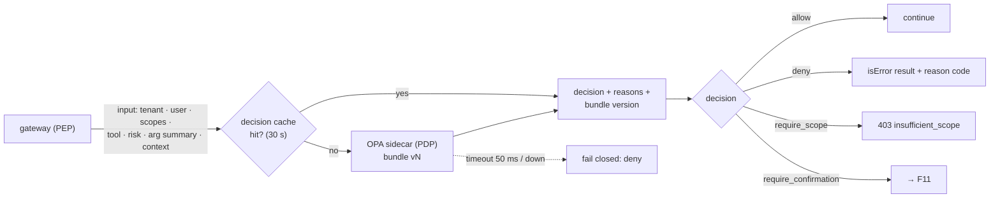
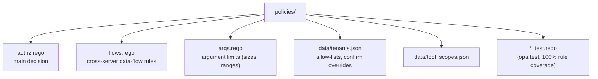

# F10: Policy Engine (OPA)

| Milestone | Priority | Depends on | Effort | Unblocks |
|---|---|---|---|---|
| M3 | Must | F8 | 4 h | F11, F12 |

**Goal:** Every `tools/call` gets a decision (**allow / deny / require_confirmation / require_scope**) from
OPA, based on tenant, user, scopes, tool risk and arguments, with policies that are versioned and tested
separately from the gateway code.

## Diagram: decision flow



## Diagram: policy bundle layout



## Deliverables / files
```
policies/authz.rego, flows.rego, args.rego, *_test.rego
policies/data/tenants.json, tool_scopes.json
gateway/src/mcphub/policy/client.py     # OPA HTTP client, timeout, fail-closed
gateway/src/mcphub/policy/input.py      # builds the input document (args summarised, not raw)
.github/workflows/ci.yml                # + opa test --coverage
```

## Tasks
- [ ] Input builder: argument **summary** (types, sizes, IDs), not raw values, so policies don't see PII
- [ ] Rules: default deny, tenant allow-list, scope → step-up, destructive → confirm, argument limits
- [ ] Flow rule: in one task, data from `portfolio_*` may not be sent to tools on other servers (uses a task ID from `_meta`)
- [ ] Decision cache; bundle version in every audit event
- [ ] Fail closed on OPA errors (except `server/discover` and `tools/list`)
- [ ] **Attack cases:** scope escalation, IDOR-style argument, disallowed tool for tenant, OPA down

## Acceptance criteria
- `opa test` passes with full rule coverage
- Changing `tenants.json` changes decisions without a gateway redeploy (bundle reload)
- OPA down → writes and reads are denied, and the denial reason says so

## Tests
- Rego unit tests; gateway integration tests with a real OPA container

**Interview talking point:** *"The gateway enforces, OPA decides. Policies are code with their own tests
and version numbers, and every audit event records which policy version made the decision."*
