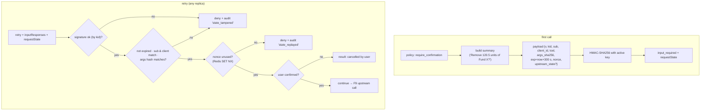
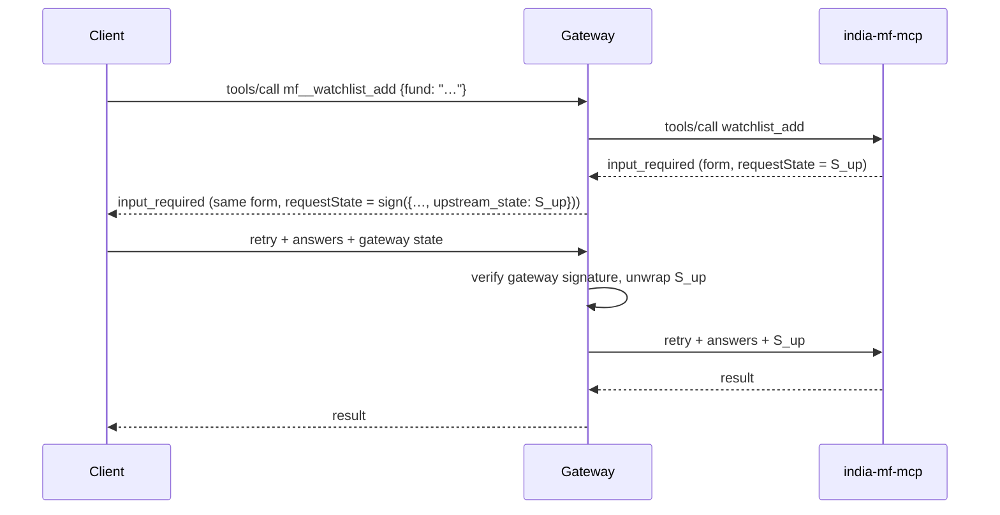

# F11: Stateless Confirmations (signed MRTR state)

| Milestone | Priority | Depends on | Effort | Unblocks |
|---|---|---|---|---|
| M3 | Must | F10, F5 | 4 h | F16, F18 |

**Goal:** When policy says `require_confirmation`, return `input_required` with a human-readable summary
and a **signed** `requestState`, so any replica can complete the call on retry, and nothing can be
replayed, altered or used by another user. Also pass upstream `input_required` requests through safely.

## Diagram: issuing and verifying the state



## Diagram: wrapping an upstream's own `input_required`



## Deliverables / files
```
gateway/src/mcphub/confirm/state.py     # sign / verify (pure, key ring with kid)
gateway/src/mcphub/confirm/summary.py   # per-tool human-readable summaries
gateway/src/mcphub/confirm/flow.py      # issue, verify, nonce, upstream wrapping
```

## Tasks
- [ ] Key ring with `kid`, two active keys, rotation without breaking in-flight confirmations
- [ ] Canonical args hash (same canonicalisation as F8)
- [ ] Human-readable summaries from tool arguments (looked up: fund name, units), never raw IDs only
- [ ] Nonce store in Redis with TTL; refuse confirmations when Redis is down
- [ ] Upstream `input_required` wrapping and unwrapping
- [ ] **Attack cases:** replay, changed args, other user's state, expired state, forged signature, state from a different tool

## Acceptance criteria
- 1,000 confirmation flows across two replicas (round-robin) all succeed
- Every tampering case is denied and audited with the right reason
- The disambiguation flow from F5 still works through the gateway

## Tests
- Unit (hypothesis): any single-byte change to payload or signature fails verification
- Integration: two replicas, Redis, real upstream `input_required`

**Interview talking point:** *"A pending confirmation isn't stored on the server. It travels with the
retry, signed and bound to the user, the tool and a hash of the exact arguments, so any replica can finish
it and nobody can reuse or alter it."*
