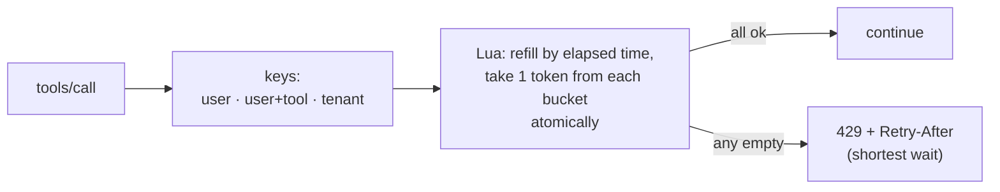
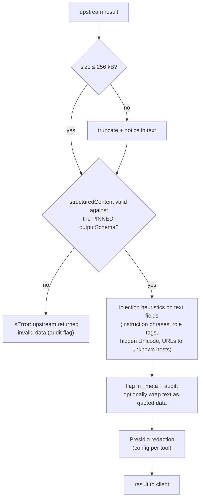
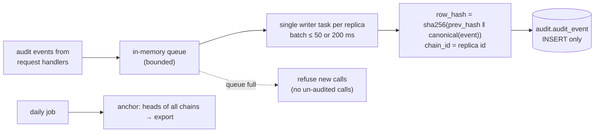

# F12: Rate Limits, Response Filters & Audit Chain

| Milestone | Priority | Depends on | Effort | Unblocks |
|---|---|---|---|---|
| M3 | Must | F9, F10 | 7 h | F14, F18, F19, F21 |

**Goal:** Limit how fast anyone can call tools, clean up what comes back from upstreams, and record every
call in a **hash-chained** audit log that reviewers can verify.

## Diagram: token buckets (Redis, one Lua script)



| Bucket | Default |
|---|---|
| Per user | 60 calls/min |
| Per user + write tool | 20 calls/min |
| Per tenant | 600 calls/min |
| Anonymous (public server) | 30 calls/min per IP |

## Diagram: response filters



## Diagram: audit writer



## Deliverables / files
```
gateway/src/mcphub/ratelimit.py + ratelimit.lua
gateway/src/mcphub/filters/size.py, schema.py, injection.py, pii.py
gateway/src/mcphub/audit/event.py       # event model, redaction, args digest
gateway/src/mcphub/audit/writer.py      # queue, batching, hash chain
gateway/src/mcphub/audit/verify.py      # recompute chain, compare anchors
gateway/src/mcphub/admin/api.py         # /admin/api/audit, /audit/verify (hub:admin)
migrations/versions/0005_audit.py       # table, INSERT-only grants
```

## Tasks
- [ ] Rate limiter as one Lua script (atomic across buckets); in-memory fallback for reads if Redis is down
- [ ] Filters in the order above; each filter adds span attributes and metrics
- [ ] Injection heuristics: a small, documented rule set (tuned later with F18's false-positive numbers)
- [ ] Audit events for **every** exit path (including 401/403/429 and denials)
- [ ] Chain per replica; verification endpoint; daily anchor export
- [ ] Log scanner test: no tokens or raw arguments in logs
- [ ] **Attack cases:** injected tool result, oversized result, invalid structured content, audit tampering (edit a row → verify fails)

## Acceptance criteria
- `/admin/api/audit/verify` passes on a clean log and fails at the exact edited row after a manual edit
- Rate limits hold across two replicas (shared Redis)
- Whole gateway overhead p95 ≤ 25 ms at 50 concurrent users (checked properly in F19)

## Tests
- Unit: bucket maths, chain hashing, verification, redaction
- Integration: two replicas writing chains concurrently; Redis outage behaviour

**Interview talking point:** *"Every exit path writes an audit event, including denials, and each event is
chained to the previous one. If the audit queue fills up, the gateway refuses calls rather than letting
un-audited ones through."*
