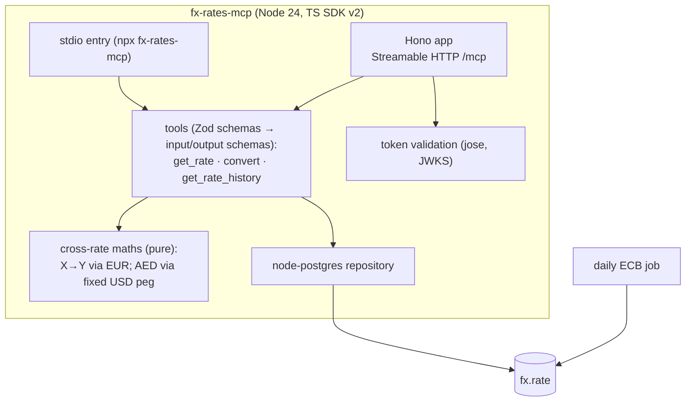
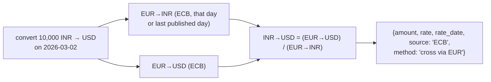

# F13: fx-rates-mcp (TypeScript)

| Milestone | Priority | Depends on | Effort | Unblocks |
|---|---|---|---|---|
| M4 | Must | F4, F8 | 5 h | F17 (cross-server tasks), F21 |

**Goal:** A second open-source server in **TypeScript** with official reference exchange rates, published
to npm and the MCP Registry, and registered behind the gateway so agents can combine fund and currency
tools.

## Diagram: server structure



## Diagram: cross-rate calculation



## Deliverables / files
```
servers/fx-rates-mcp/src/index.ts          # stdio + HTTP entry points
servers/fx-rates-mcp/src/tools.ts          # tool definitions with Zod
servers/fx-rates-mcp/src/rates.ts          # cross-rate maths (pure)
servers/fx-rates-mcp/src/auth.ts           # JWT validation (jose)
servers/fx-rates-mcp/src/ingest.ts         # ECB daily job
servers/fx-rates-mcp/server.json
.github/workflows/release-fx.yml           # npm publish with provenance + registry publish
```

## Tasks
- [ ] ECB ingestion (daily + history backfill), weekends/holidays → last published rate, with `rate_date` shown
- [ ] Tools with output schemas; `source` and `method` in every result
- [ ] AED via the fixed USD peg, clearly labelled as derived
- [ ] Token validation (`aud = fx`); anonymous read allowed on the public endpoint
- [ ] npm publish with provenance; registry entry; register behind the gateway (`fx__` prefix) and approve
- [ ] Cross-server task demo: "What's my portfolio worth in USD?"

## Acceptance criteria
- `npx fx-rates-mcp` works in Claude Desktop
- The cross-server task works through the gateway with both tools pinned and approved
- Cross rates match a manual calculation on 5 examples

## Tests
- vitest: cross-rate maths (including property tests with fast-check), holiday fallback
- Contract: same MCP contract tests as the Python server

**Interview talking point:** *"I built one server in each official SDK. The TypeScript one uses Zod
schemas as the single source for validation and for the tool's input and output schemas."*
