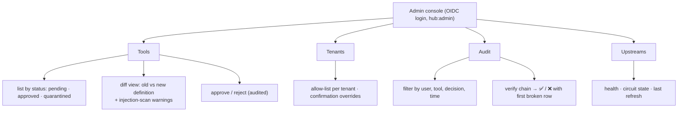
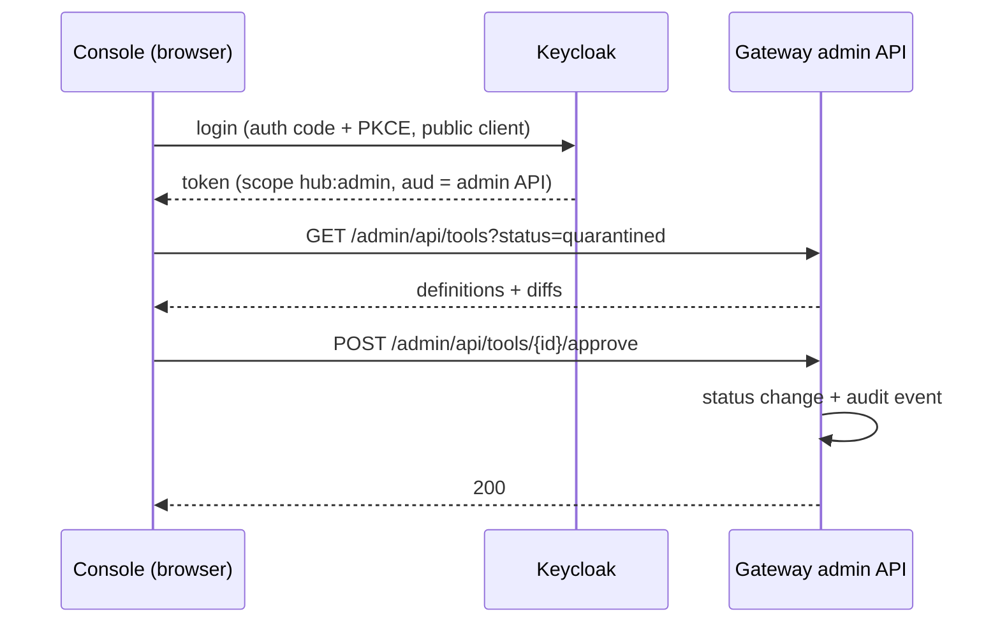

# F14: Admin Console

| Milestone | Priority | Depends on | Effort | Unblocks |
|---|---|---|---|---|
| M4 | Should (full plan) | F12 | 7 h | Demo video, screenshots |

**Goal:** A small React + TypeScript app for admins: review and approve tool definitions with a
**side-by-side diff**, manage tenant allow-lists, and browse and **verify** the audit log.

In the **core plan** this feature is replaced by the `hubctl` CLI from F8 (approvals) and the admin API
(audit), and the console moves to "later".

## Diagram: pages



## Diagram: data flow



## Deliverables / files
```
console/src/pages/Tools.tsx, Tenants.tsx, Audit.tsx, Upstreams.tsx
console/src/components/DefinitionDiff.tsx
console/src/api/client.ts            # typed client (OpenAPI-generated types)
console/src/auth.ts                  # OIDC PKCE (oidc-client-ts)
console/e2e/approve.spec.ts          # Playwright
```

## Tasks
- [ ] OIDC login with PKCE; tokens kept in memory, not local storage
- [ ] Typed API client generated from the admin API's OpenAPI schema
- [ ] Diff view (JSON, with description text highlighted)
- [ ] Tenant allow-list editor (writes policy data → OPA bundle reload)
- [ ] Audit browser + verify button
- [ ] CSP headers and CSRF-safe design (bearer tokens, no cookies for the API)

## Acceptance criteria
- A quarantined tool from a rug-pull test can be reviewed and approved in the console, and the approval appears in the audit log
- A tenant change takes effect on the next `tools/list` without a redeploy

## Tests
- vitest for components; Playwright end-to-end for the approval flow against the compose stack

**Interview talking point:** *"The console turns the security model into something an admin can operate:
you see exactly what changed in a tool's description before you let agents use it again."*
