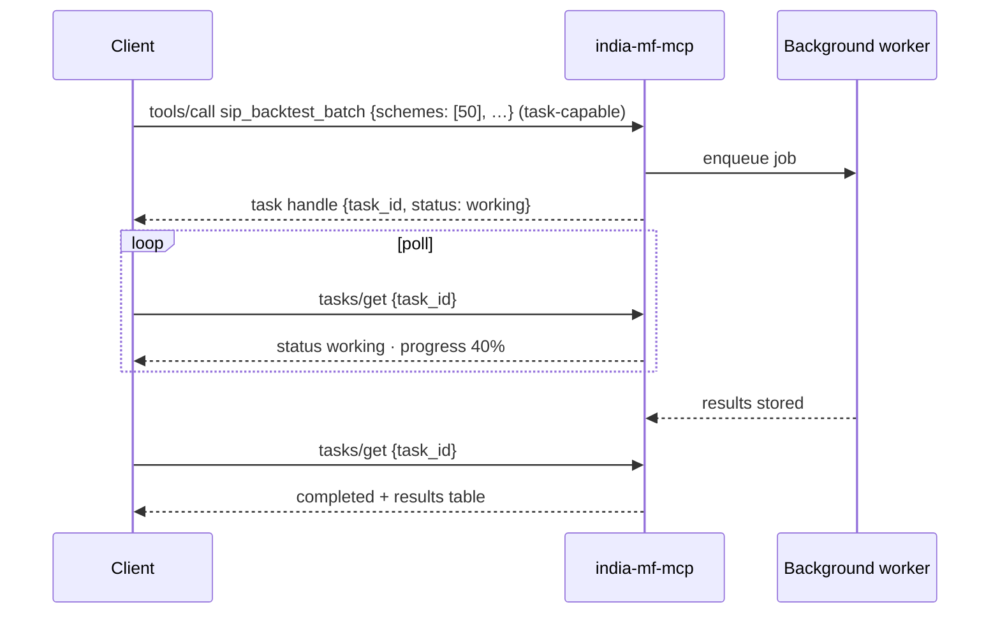
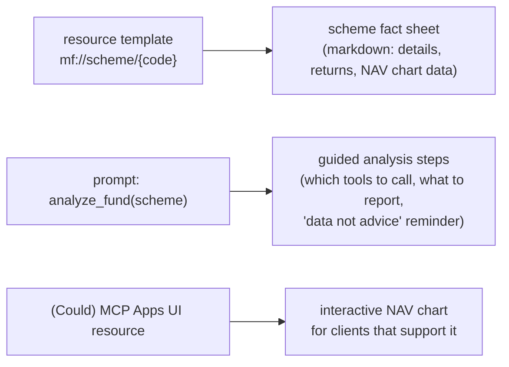

# F15: Tasks, Resources & Prompts

| Milestone | Priority | Depends on | Effort | Unblocks |
|---|---|---|---|---|
| M4 | Should (full plan) | F2 | 3 h | — |

**Goal:** Use the rest of the protocol surface in india-mf-mcp: a long-running tool through the **Tasks
extension**, a **resource template**, and a **prompt**. Optionally an **MCP Apps** chart (Could).

## Diagram: `sip_backtest_batch` as a task



## Diagram: other surfaces



## Deliverables / files
```
servers/india-mf-mcp/src/india_mf/tools/batch.py      # task-capable tool
servers/india-mf-mcp/src/india_mf/resources.py
servers/india-mf-mcp/src/india_mf/prompts.py
servers/india-mf-mcp/src/india_mf/apps/nav_chart/     # optional
```

## Tasks
- [ ] Tasks extension via FastMCP 4; job storage in Postgres so any replica can answer `tasks/get`
- [ ] Resource template + cacheable listing
- [ ] Prompt template
- [ ] Gateway: pass task handles through; task IDs bound to the user (another user can't poll them)
- [ ] (Could) MCP Apps chart

## Acceptance criteria
- A 50-scheme batch completes as a task and can be polled from a different replica
- Another user polling the same task ID gets "not found"

## Tests
- Integration: task lifecycle across two replicas; cross-user access denied

**Interview talking point:** *"Long-running work uses the Tasks extension with job state in Postgres, so
polling works from any replica, and task IDs are bound to the user who started them."*
