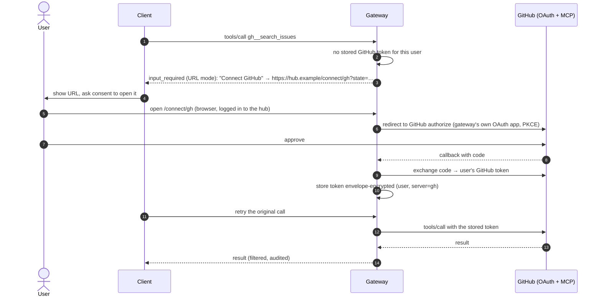
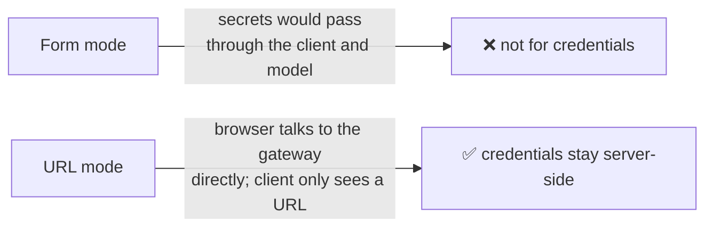

# F16: GitHub Upstream with URL-Mode Consent

| Milestone | Priority | Depends on | Effort | Unblocks |
|---|---|---|---|---|
| M4 | Could (full plan) | F9, F11 | 4 h | Demo of third-party upstream auth |

**Goal:** Put a **third-party** MCP server (GitHub's remote server, read-only tools) behind the gateway,
where each user authorizes the **gateway** to access GitHub through **URL-mode elicitation**. The client
and the model never see the GitHub token.

## Diagram: first use of a GitHub tool



## Diagram: why URL mode



## Deliverables / files
```
gateway/src/mcphub/connect/routes.py     # /connect/{server}, callback, state validation
gateway/src/mcphub/connect/github.py     # OAuth app config, token refresh
config/upstreams.yaml                    # gh upstream enabled for one test tenant
```

## Tasks
- [ ] GitHub OAuth app (read-only scopes); PKCE; `state` bound to the hub user and expiring
- [ ] Token storage with envelope encryption; revoke endpoint ("disconnect GitHub")
- [ ] Only read-only GitHub tools approved in the registry; tenant allow-list restricts who sees them
- [ ] Cross-server flow rule: portfolio data may not flow into `gh__*` arguments (F10)
- [ ] **Attack cases:** consent CSRF (wrong `state`), another user's stored token, exfiltration to `gh__*`

## Acceptance criteria
- A user connects GitHub once; later calls work without prompts; "disconnect" removes the token
- The GitHub token never appears in client traffic, logs or traces

## Tests
- Integration with a mock OAuth provider (GitHub itself only in a manual demo)

**Interview talking point:** *"For third-party servers the gateway is its own OAuth client. Users consent
through URL-mode elicitation, so credentials never pass through the client or the model."*
