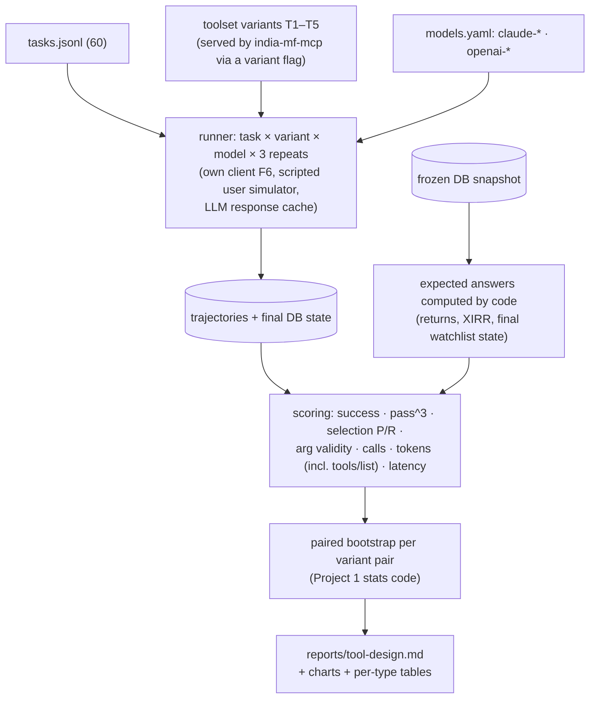
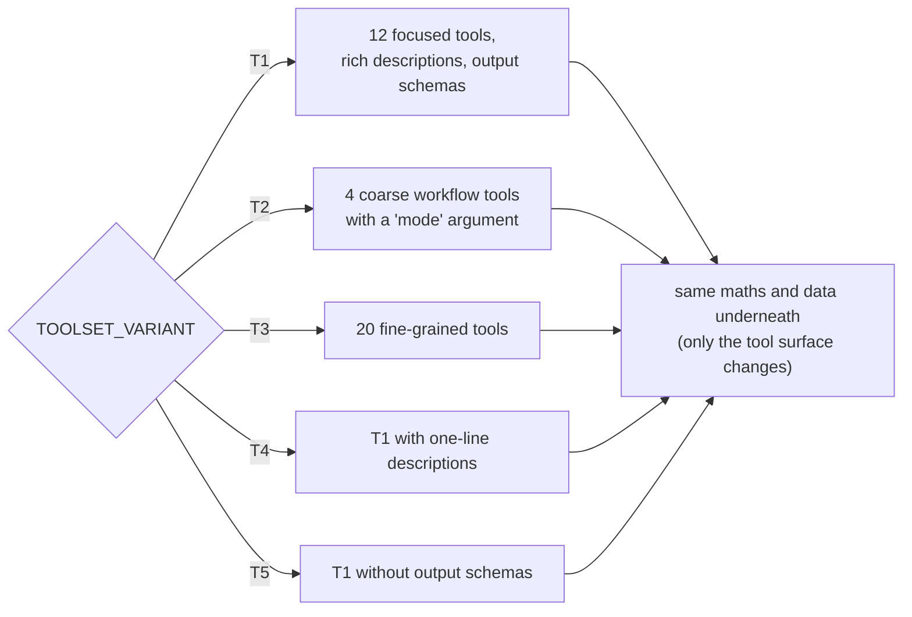

# F17: Tool-Design Evals

| Milestone | Priority | Depends on | Effort | Unblocks |
|---|---|---|---|---|
| M5 | Must | F6, F9, F13 | 9 h full · **6 h core (T1, T2, T4)** | F20, F22 |

**Goal:** Measure how **tool granularity, description style and output schemas** change agent task
success, reliability and token cost, for **two model families**, using the design in
[04 §4.3–4.5](../04-evaluation-design.md).

## Diagram: harness



## Diagram: how variants are served



## Deliverables / files
```
evals/tool_design/tasks.jsonl           # 60 tasks with types and expectations
evals/tool_design/expected.py           # computes expected values from the snapshot
evals/tool_design/simulator.py          # scripted answers for input_required
evals/tool_design/run.py                # matrix runner, concurrency, budget guard
evals/tool_design/score.py              # metrics (reuses Project 1 trajectory metrics)
evals/tool_design/report.py             # tables, charts
servers/india-mf-mcp/src/india_mf/variants/  # T2–T5 tool surfaces
reports/tool-design.md
```

## Tasks
- [ ] Freeze the snapshot; write `expected.py` so answers are never hand-typed
- [ ] Write the 60 tasks (7 types, [04 §4.3](../04-evaluation-design.md)); ≥ 50% hand-written
- [ ] Variant surfaces T2–T5 behind a flag (core plan: T1, T2, T4 only)
- [ ] Runner with cache, budget guard and resume; smoke set of 15 tasks
- [ ] Scoring incl. final-state checks (e.g. watchlist contents in the DB after the task)
- [ ] Report: overall and per task type, per model, with CIs; token cost of `tools/list` per variant

## Acceptance criteria
- Full matrix (or core subset) runs end to end; every run has a Langfuse trace
- The report states at least three findings, each backed by a significant paired difference (or honestly says "no difference")

## Tests
- Unit: expected-value computation, scoring on fixture trajectories
- A fake-LLM run of the whole pipeline in CI (no API cost)

**Interview talking point:** *"I measured tool design instead of guessing: for example, what minimal
descriptions or coarse tools do to multi-step success and tokens per task, for two model families."*
(Replace with your real findings.)
