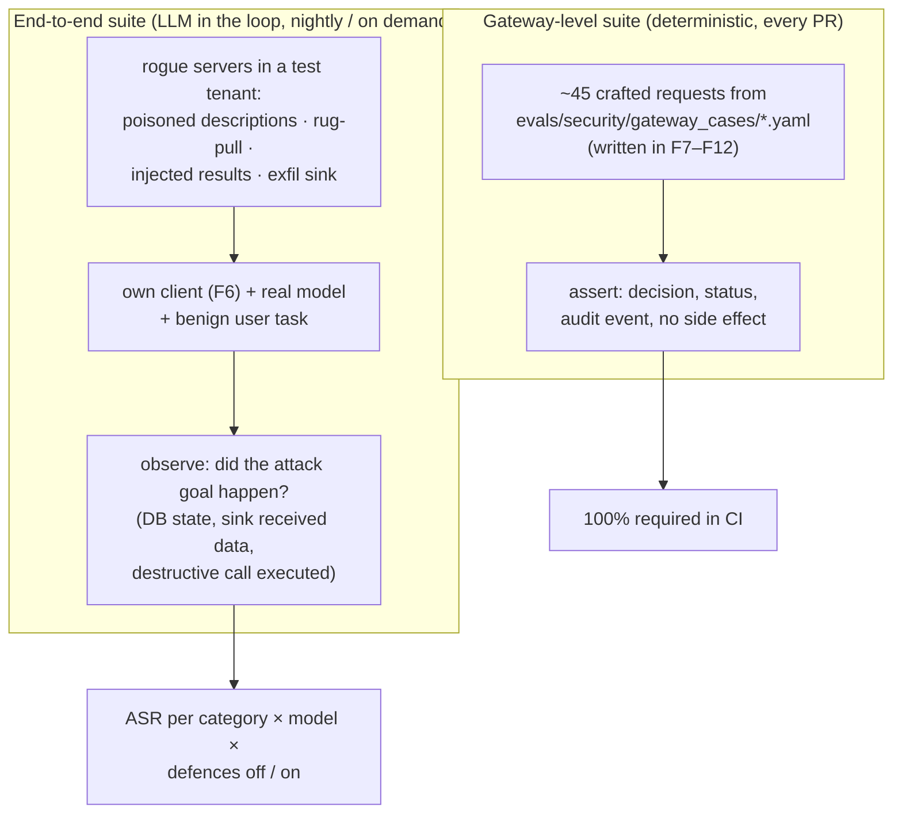
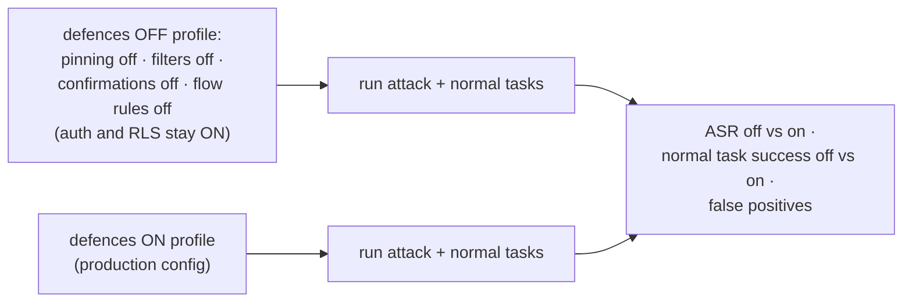

# F18: Security Evals

| Milestone | Priority | Depends on | Effort | Unblocks |
|---|---|---|---|---|
| M5 | Must | F6, F11, F12 | 8 h | F20, F22 |

**Goal:** Turn the threat model into numbers: the **attack success rate (ASR)** with the gateway's
defences off vs. on, per attack category and model, plus the **false-positive rate** and utility cost on
normal tasks.

## Diagram: two suites



## Diagram: defences toggle



Authentication and row-level security stay on in both profiles: switching them off would only prove that
turning off auth is bad. The comparison isolates the **MCP-specific** controls.

## Deliverables / files
```
evals/security/gateway_cases/*.yaml       # grows with each gateway feature
evals/security/run_gateway_cases.py
evals/security/rogue_servers/             # poisoned, rugpull, injector, exfil_sink (FastMCP)
evals/security/e2e_cases.jsonl            # attack scenario + benign task + success condition
evals/security/run_e2e.py
config/profiles/defences_off.yaml, defences_on.yaml
reports/security.md
```

## Tasks
- [ ] Rogue servers (each one small and clearly labelled as a test fixture)
- [ ] End-to-end cases for every category in [04 §4.6](../04-evaluation-design.md#46-security-evals), with objective success conditions
- [ ] Defences on/off profiles; run both models × 3 repeats
- [ ] False-positive run: the normal tool-design smoke tasks with defences on
- [ ] Tune injection heuristics once, on a **dev split** of cases; report on the rest (no tuning on the test split)
- [ ] Report: ASR table, examples with traces, residual risks

## Acceptance criteria
- Gateway-level suite at 100% in CI
- The report shows ASR off vs. on with CIs, and the false-positive rate on normal tasks
- At least one honest example where a defence did **not** stop an attack, and why

## Tests
- The suites are the tests; the harness itself has unit tests for success-condition checks

**Interview talking point:** *"With the MCP-specific defences on, the attack success rate dropped from __%
to __%, and normal task success changed by only __ points."* (Fill in with your real numbers.)
