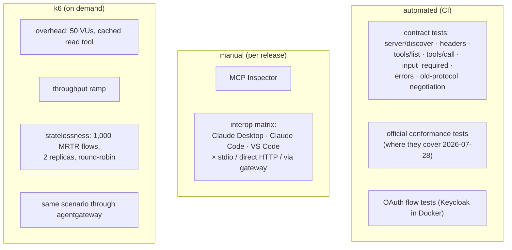
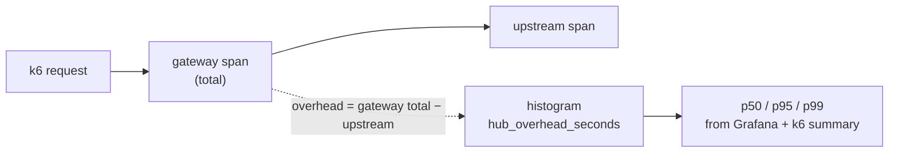

# F19: Conformance, Interoperability & Performance

| Milestone | Priority | Depends on | Effort | Unblocks |
|---|---|---|---|---|
| M5 | Must | F12 | 5 h | F20, F22 |

**Goal:** Show the servers and gateway follow the protocol, work with real clients, and meet the
performance targets: overhead p95 ≤ 25 ms, ≥ 200 calls/s per replica, true statelessness. Compare with
one existing gateway.

## Diagram: test layers



## Diagram: measuring overhead correctly



## Deliverables / files
```
tests/contract/                       # shared contract tests (run against each server + gateway)
evals/perf/overhead.js, throughput.js, stateless_mrtr.js
evals/perf/agentgateway/              # config to run the same upstreams behind agentgateway
docs/interop-matrix.md
reports/performance.md
```

## Tasks
- [ ] Contract suite parameterised by target (india-mf-mcp, fx-rates-mcp, gateway)
- [ ] Old-protocol client test
- [ ] Interop matrix filled in with versions and notes
- [ ] k6 scenarios with thresholds; overhead from spans, not just end-to-end time
- [ ] agentgateway comparison: same upstreams, same load; compare overhead and which controls exist
- [ ] Performance tuning pass if targets are missed (caches, OPA decision cache, audit batching)

## Acceptance criteria
- Contract + conformance tests green in CI
- Overhead p95 ≤ 25 ms, throughput ≥ 200 calls/s per replica (or an explained gap)
- 1,000/1,000 stateless MRTR flows succeed across replicas
- Comparison table: our gateway vs. agentgateway (overhead, features, what you'd choose and why)

## Tests
- These are the tests; k6 thresholds fail the job when targets are missed

**Interview talking point:** *"I measured the gateway's own overhead from trace spans, and compared it with
an existing open-source gateway, so I can argue build vs. buy with numbers."*
