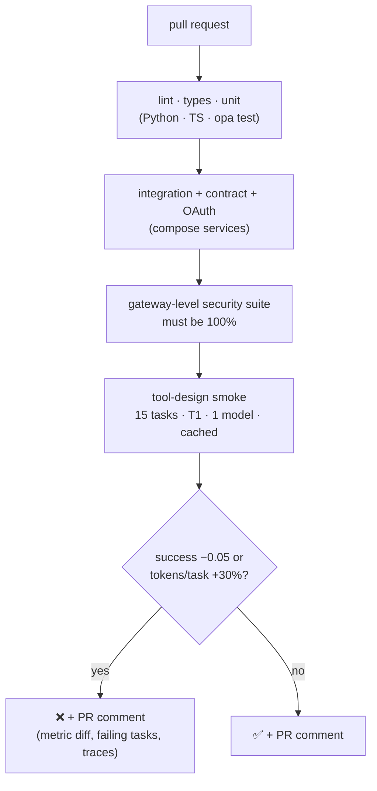
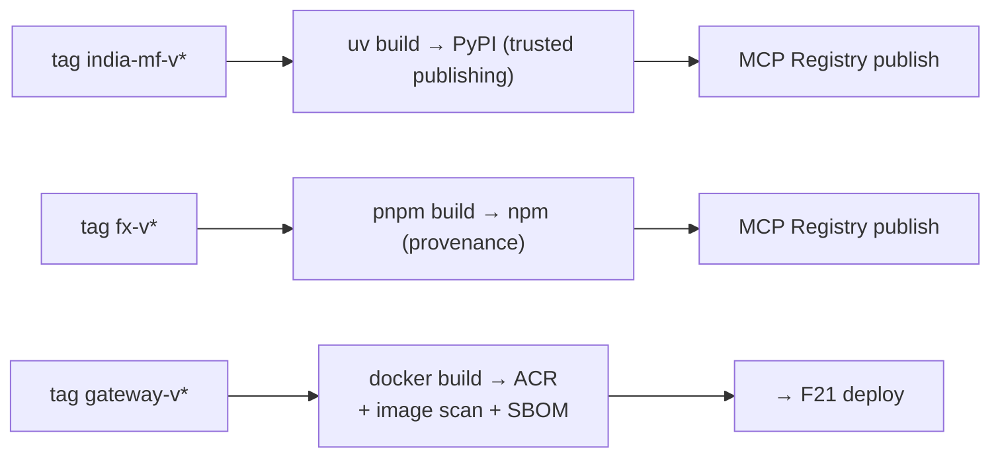

# F20: CI Gate & Release Pipeline

| Milestone | Priority | Depends on | Effort | Unblocks |
|---|---|---|---|---|
| M5 | Must | F17, F18, F19 | 3 h | F21, F22 |

**Goal:** One CI pipeline that blocks protocol, security and tool-quality regressions, and release
pipelines that publish both servers with signed provenance.

## Diagram: PR checks



## Diagram: releases



## Deliverables / files
```
.github/workflows/ci.yml, eval-smoke.yml, security.yml, release-india-mf.yml, release-fx.yml, release-gateway.yml
configs/gate.yaml                     # tool-design smoke thresholds
.github/pull_request_template.md      # checklist incl. security suite + interop notes
```

## Tasks
- [ ] Combine the checks above; cache dependencies and the LLM response cache
- [ ] PR comment with eval and security results
- [ ] Image scanning + SBOM for gateway images; Dependabot for all ecosystems
- [ ] Branch protection: all checks required on `main`
- [ ] **Demo PR:** weaken a tool description (T4-style) and show the gate blocking it

## Acceptance criteria
- An unchanged PR passes with ~0 LLM cost
- The demo PR is blocked with a readable comment
- Releases publish from tags without any stored registry tokens

**Interview talking point:** *"The CI gate covers three kinds of regression: protocol (contract tests),
security (attack suite must be 100%) and tool quality (eval smoke). Publishing uses OIDC trusted publishing,
so there are no long-lived registry tokens to leak."*
