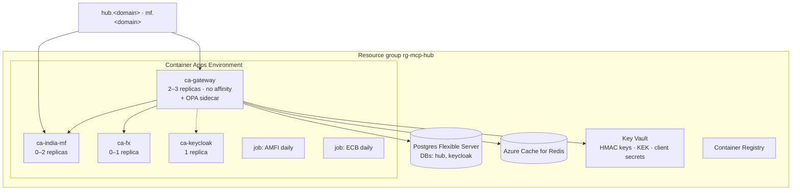
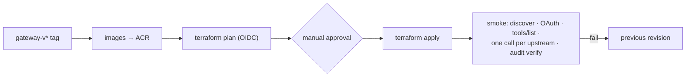

# F21: Azure Deployment

| Milestone | Priority | Depends on | Effort | Unblocks |
|---|---|---|---|---|
| M6 | Must | F12, F13 | 4 h | Public demo |

**Goal:** Deploy the gateway (2+ replicas, no session affinity), both servers, Keycloak, OPA and the
ingest jobs to Azure with Terraform, reusing Project 1's modules.

## Diagram: Azure resources



## Diagram: deploy pipeline



## Deliverables / files
```
infra/main.tf, variables.tf, envs/prod.tfvars
infra/modules/ (reused from Project 1: container_apps, postgres, redis, keyvault)
infra/modules/keycloak/
docs/runbook.md          # deploy, rollback, rotate HMAC keys, rotate KEK, disable an upstream fast
```

## Tasks
- [ ] Reuse Project 1 modules; add Keycloak and the OPA sidecar
- [ ] Session affinity **off** for the gateway (tests statelessness in the cloud)
- [ ] Secrets via Key Vault references; managed identity
- [ ] Public endpoints: gateway (auth) and india-mf-mcp (anonymous read-only, rate-limited)
- [ ] Budget alert; scale-to-zero where possible
- [ ] Runbook, including "an upstream is compromised: disable it in 1 minute"

## Acceptance criteria
- Claude Desktop connects to the public gateway URL, logs in, and uses tools from 3 upstreams
- The registry entry for india-mf-mcp points to the working public endpoint
- Rollback in < 2 minutes

**Interview talking point:** *"In the cloud the gateway runs without session affinity, the same as
locally, which is the practical proof that the design is stateless."*
