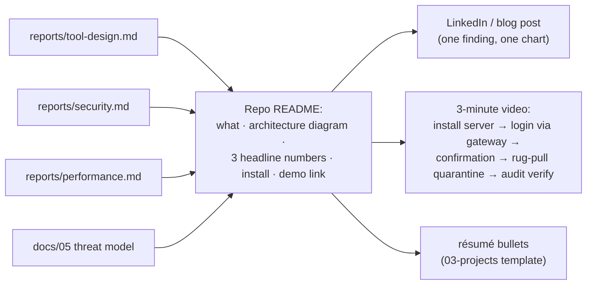
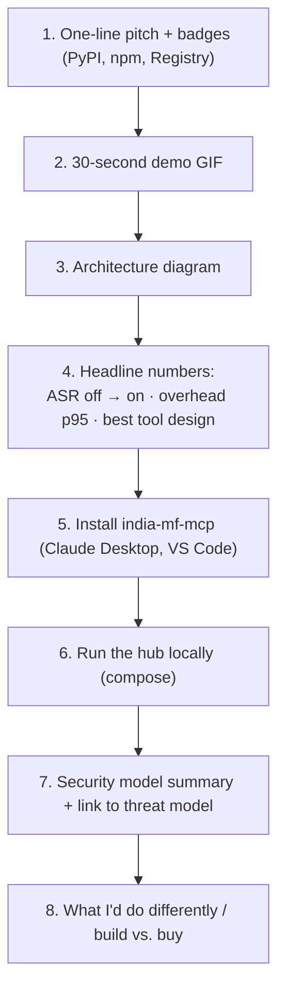

# F22: Reports, Blog & Video

| Milestone | Priority | Depends on | Effort | Unblocks |
|---|---|---|---|---|
| M6 | Must | F20, F21 | 3 h | Job applications |

**Goal:** Turn the work into things a hiring manager reads in five minutes: a strong README, three short
reports, a published threat model, a post and a video.

## Diagram: what gets published where

## Diagram: README structure

## Tasks
- [ ] Final runs of all three reports on the release commit
- [ ] README as above; demo GIF
- [ ] Blog/LinkedIn post: pick **one** finding (e.g. security ASR or tool-design result) with one chart
- [ ] 3-minute video
- [ ] Update the résumé bullet template in `03-projects.md` with real numbers

## Acceptance criteria
- A reader can install the server in under 2 minutes from the README
- Every number in the README links to the report and commit that produced it

**Interview talking point:** *"Every claim in the README links to a reproducible report, so the numbers
can be checked, not just trusted."*
