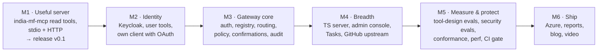
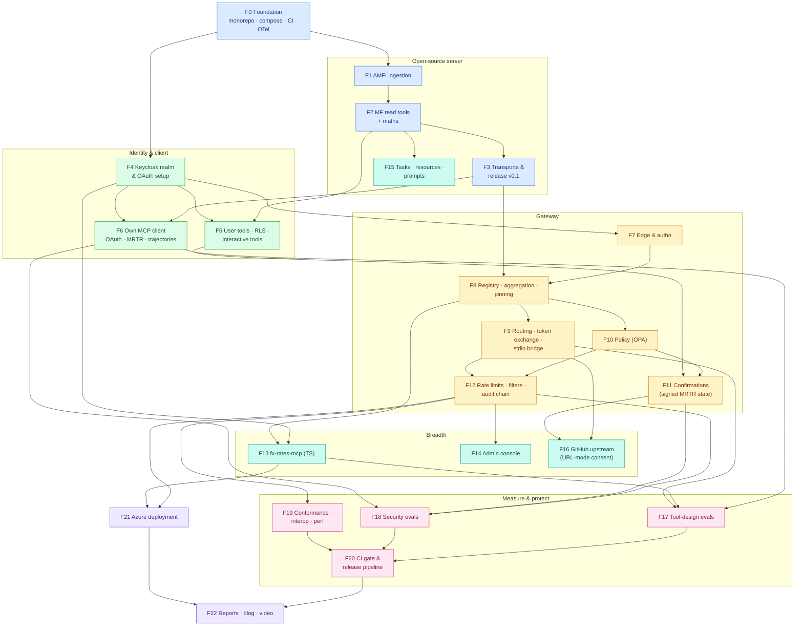
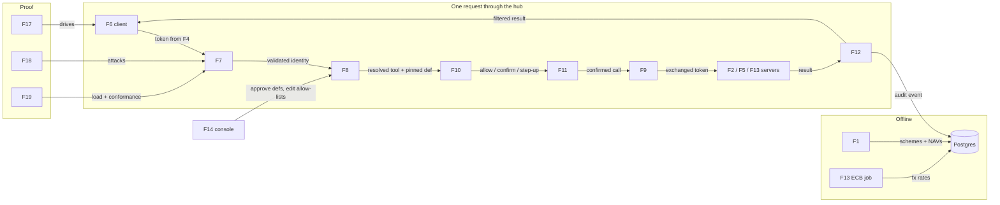
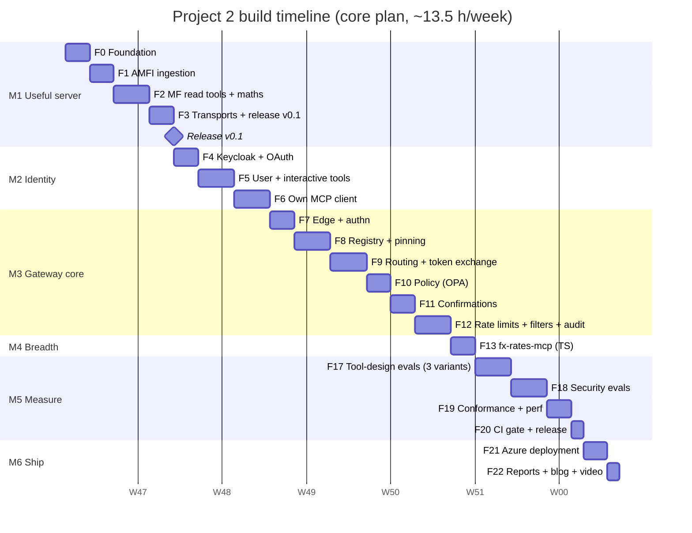

# 9. Build Plan: Feature by Feature

This plan splits Project 2 into **23 features** (F0–F22), grouped into **6 milestones**. Every feature
has its own page with diagrams, files, tasks, acceptance criteria, tests, an estimate and an interview
talking point.

## 9.1 Build strategy: a useful server first, then security, then breadth, then proof

Five rules:
1. **Ship something useful early.** `india-mf-mcp` v0.1 (read tools, stdio) goes to PyPI and the MCP
   Registry at the end of M1, so it can collect users and stars while the rest is built.
2. **Security before breadth.** The gateway's auth, policy, confirmations and audit (M3) come before more
   servers and the console (M4).
3. **Every control lands with its attack test.** Each gateway feature (F7–F12) adds its cases to the
   gateway-level security suite in the same PR. F18 then adds the end-to-end suite and the report.
4. **Two gateway replicas from the first gateway commit.** Statelessness bugs show up on day one.
5. **Each feature ends with a PR, green CI and a `CHANGELOG.md` entry.** From M3, the security suite must
   stay at 100%.

## 9.2 Master diagram: how the features connect

Arrows mean **"is required by"** (build the source first). Colours show milestones.

**Legend:** blue = M1 Useful server · green = M2 Identity · amber = M3 Gateway core · teal = M4 Breadth ·
pink = M5 Measure & protect · purple = M6 Ship.
**F14, F15 and F16 are deferred** in the chosen core plan (§9.5); they stay in the diagram so their
dependencies are clear when they're added later.

## 9.3 Runtime integration map: what flows between features

## 9.4 Feature index

| ID | Feature | Milestone | Priority | Depends on | Effort (h) | Page |
|---|---|---|---|---|---|---|
| F0 | Project foundation | M1 | Must | — | 4 | [F00](F00-foundation.md) |
| F1 | AMFI ingestion | M1 | Must | F0 | 5 | [F01](F01-amfi-ingestion.md) |
| F2 | MF read tools & maths | M1 | Must | F1 | 7 | [F02](F02-mf-read-tools.md) |
| F3 | Transports & release v0.1 | M1 | Must | F2 | 4 | [F03](F03-transports-release.md) |
| F4 | Keycloak realm & OAuth setup | M2 | Must | F0 | 5 | [F04](F04-keycloak-oauth.md) |
| F5 | User tools, RLS & interactive tools | M2 | Must | F2, F4 | 6 | [F05](F05-user-tools-interactive.md) |
| F6 | Own MCP client | M2 | Must | F3, F4 | 7 | [F06](F06-mcp-client.md) |
| F7 | Gateway edge & authn | M3 | Must | F4 | 5 | [F07](F07-gateway-edge-authn.md) |
| F8 | Registry, aggregation & pinning | M3 | Must | F7, F3 | 6 | [F08](F08-registry-pinning.md) |
| F9 | Routing, token exchange & stdio bridge | M3 | Must | F8 | 6 | [F09](F09-routing-token-exchange.md) |
| F10 | Policy engine (OPA) | M3 | Must | F8 | 4 | [F10](F10-policy-opa.md) |
| F11 | Stateless confirmations | M3 | Must | F10, F5 | 4 | [F11](F11-confirmations.md) |
| F12 | Rate limits, filters & audit chain | M3 | Must | F9, F10 | 7 | [F12](F12-ratelimit-filters-audit.md) |
| F13 | fx-rates-mcp (TypeScript) | M4 | Must | F4, F8 | 5 | [F13](F13-fx-rates-ts.md) |
| F14 | Admin console | M4 | Should · **deferred** | F12 | 7 | [F14](F14-admin-console.md) |
| F15 | Tasks, resources & prompts | M4 | Should · **deferred** | F2 | 3 | [F15](F15-tasks-resources.md) |
| F16 | GitHub upstream (URL-mode consent) | M4 | Could · **deferred** | F9, F11 | 4 | [F16](F16-github-upstream.md) |
| F17 | Tool-design evals | M5 | Must | F6, F9, F13 | 9 (6 in core: 3 variants) | [F17](F17-tool-design-evals.md) |
| F18 | Security evals | M5 | Must | F6, F11, F12 | 8 | [F18](F18-security-evals.md) |
| F19 | Conformance, interop & performance | M5 | Must | F12 | 5 | [F19](F19-conformance-perf.md) |
| F20 | CI gate & release pipeline | M5 | Must | F17, F18, F19 | 3 | [F20](F20-ci-release.md) |
| F21 | Azure deployment | M6 | Must | F12, F13 | 4 | [F21](F21-azure-deployment.md) |
| F22 | Reports, blog & video | M6 | Must | F20, F21 | 3 | [F22](F22-reports-blog.md) |
| | **Total: full plan / core plan (chosen)** | | | | **~121 h / ~103 h** | |

## 9.5 Timeline: Option B (core plan) chosen

The design was bigger than the roadmap's original 3-week estimate, so two options were compared:

| Option | Scope | Effort | Weeks at ~13.5 h/week |
|---|---|---|---|
| A. Full plan | All 23 features | ~121 h | 9 weeks |
| **B. Core plan ✅ chosen** | Must features only: F14 admin console, F15 Tasks/resources and F16 GitHub upstream are **deferred**; approvals use the `hubctl` CLI (F8); tool-design evals run **3 variants (T1, T2, T4)** instead of 5 | **~103 h** | **8 weeks** |

**Why B:** it keeps everything that makes the project stand out (current protocol, gateway security
controls, measured attack reduction, tool-design evals, a published server). Full-stack depth comes in
Project 6. The deferred features (~18 h) are listed below and can be added after the job search starts.

**Core plan, week by week** (roadmap weeks 8–15)

| Week | Roadmap week | Milestone | Features | Exit check |
|---|---|---|---|---|
| 1 | 8 | M1 | F0 Foundation · F1 AMFI ingestion · F2 read tools (start) | NAVs for all schemes in Postgres |
| 2 | 9 | M1 → M2 | F2 (finish) · F3 release v0.1 · F4 Keycloak | **india-mf-mcp v0.1 on PyPI + MCP Registry**, working in Claude Desktop |
| 3 | 10 | M2 | F5 user + interactive tools · F6 own client | Client logs in (CIMD/PKCE) and handles a disambiguation form |
| 4 | 11 | M3 | F7 edge & authn · F8 registry & pinning · F9 (start) | Two replicas serve a filtered `tools/list`; rug pull quarantined |
| 5 | 12 | M3 | F9 token exchange + stdio bridge · F10 OPA · F11 confirmations | Destructive tool needs confirmation; any replica completes it |
| 6 | 13 | M3 → M4 | F12 rate limits, filters, audit · F13 fx-rates-mcp | Audit chain verifies; cross-server task works |
| 7 | 14 | M5 | F17 tool-design evals (T1, T2, T4) · F18 security evals (start) | Tool-design report with CIs |
| 8 | 15 | M5 → M6 | F18 (finish) · F19 · F20 · F21 · F22 | ASR with vs. without defences; public demo; blog post |

*(Dates are illustrative: Project 2 starts after Project 1's 7 weeks. One "d" is one working session of
about 2–2.5 hours.)*

**Deferred (add later if time allows, ~18 h)**

| Feature | Effort | Value when added |
|---|---|---|
| F14 Admin console | 7 h | Visible full-stack piece; approvals with a diff view |
| F15 Tasks, resources & prompts | 3 h | Wider protocol coverage (Tasks extension) |
| F16 GitHub upstream (URL-mode consent) | 4 h | Third-party upstream auth demo |
| Tool-design variants T3 (fine-grained) and T5 (no output schemas) | ~3 h | Two more findings for the report |

## 9.6 Milestone exit criteria

| Milestone | Done when |
|---|---|
| **M1 Useful server** | `uvx india-mf-mcp` works in Claude Desktop over stdio; the HTTP transport passes MCP Inspector checks; v0.1 is on PyPI and listed in the MCP Registry; returns/XIRR maths pass property tests. |
| **M2 Identity** | The own client completes discovery → CIMD → PKCE → `iss` check → token with the right audience; user tools respect RLS; a disambiguation `input_required` round trip works end to end. |
| **M3 Gateway core** | Through **one URL and two replicas**: filtered `tools/list`, token exchange per upstream, OPA decisions, stateless confirmations, rate limits, filters, and a verifiable audit chain. Gateway-level security suite at 100%. |
| **M4 Breadth** | fx-rates-mcp on npm and behind the gateway; cross-server tasks work. (Deferred: console approvals, Tasks, GitHub via URL-mode consent.) |
| **M5 Measure & protect** | Tool-design report and security report committed with CIs; gateway overhead p95 ≤ 25 ms; interop matrix filled; CI gate blocks a deliberately bad PR. |
| **M6 Ship** | Public gateway + server endpoints on Azure; README with results and diagrams; threat model published; blog/LinkedIn post; 3-minute video. |

## 9.7 Definition of done (every feature)

- [ ] Code merged via PR; CI green (lint, types, tests, `opa test` where relevant)
- [ ] Unit tests for all pure logic; integration test for anything touching Postgres, Redis, Keycloak or OPA
- [ ] From M3: new gateway behaviour has **gateway-level attack cases** in the security suite
- [ ] OTel spans and metrics for new code paths
- [ ] No secrets or tokens in logs (checked by a log-scanning test)
- [ ] Docs updated (this plan's checkboxes, the setup guide, `CHANGELOG.md`)

## 9.8 Risk register

| Risk | Impact | Mitigation |
|---|---|---|
| The 2026-07-28 SDKs are new; bugs or missing features | Delays in F2, F7, F11 | Spikes in week 1 (see [08 §8.6](../08-tech-stack.md)); pin versions; fall back to the low-level SDK where FastMCP falls short |
| Keycloak lacks CIMD or resource-indicator support | OAuth design changes | Fallbacks documented in ADR-004: pre-registered client, audience via client scopes |
| Third-party clients don't support 2026-07-28 yet | Interop matrix gaps | Version negotiation; test old-protocol path; document client status |
| AMFI changes its file format or terms | Ingestion breaks / publishing blocked | Strict parser with alerts; check terms before v0.1; keep last good data |
| Eval LLM spend | Cost | Response cache from Project 1; smoke sets on PRs; full matrix on demand only |
| Security suite false positives block normal use | Utility drops | Measure false-positive rate in F18; tune heuristics; confirmations as the real backstop |
| Scope creep (MCP Apps, more upstreams, Kubernetes) | Timeline | Out-of-scope list in [01 §1.8](../01-requirements.md) is binding; MCP Apps stays "Could" |
| Plan is longer than the roadmap assumed | Later projects slip | **Option B chosen** (8 weeks); roadmap updated; deferred features added only after the job search starts |
