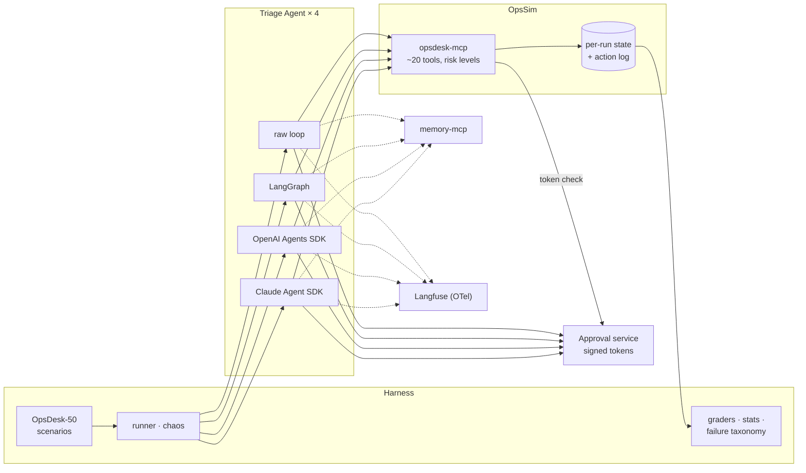

# Project 3: Agent Reliability Harness

> One incident-triage agent built **four ways** (raw loop, LangGraph, OpenAI Agents SDK, Claude Agent
> SDK) and measured on a simulated production system for **reliability, not just accuracy**: pass^k,
> safety violations, human-approval correctness, crash/resume without double actions, injection
> resistance and cost.

**Target roles:** Agent Engineer (primary), GenAI Engineer
**Gaps it closes:** agent SDK breadth, reliability evals (pass^k, calibration), HITL, durable
execution/crash recovery, long-term memory, guardrails, cross-framework tracing, a framework comparison
backed by numbers
**Status:** 🟡 System design, tech stack and build plan done (no code yet).
**Core plan (Option B) chosen: ~114 h, 8 weeks** (roadmap weeks 16–23); memory, multi-agent and the Azure demo deferred
**Checked against the 2026 market** ([review](docs/12-market-alignment-review.md)): E9 robustness, durability modes, session store, adaptive attacks and grader versioning added

> **New here?** Start with [0 · Start here](docs/00-start-here.md): the project in plain English, one
> run's journey, and which document to read next.

## Design documents

| # | Document | What it answers |
|---|---|---|
| 0 | [Start Here](docs/00-start-here.md) | The project in plain English, a run's journey, reading paths, FAQ |
| 1 | [Requirements](docs/01-requirements.md) | Why incident triage, components, functional and non-functional requirements, scenario categories, experiments, budget, success criteria |
| 2 | [High-Level Architecture](docs/02-architecture.md) | Context, containers, the agent flow, framework mapping, evaluated run, approval pause/resume, crash/resume, injection path, deployment |
| 3 | [Low-Level Design](docs/03-low-level-design.md) | OpsSim data and fault model, tool catalog with risk levels, scenario format, agent spec, adapter events, approval tokens, idempotency, graders, memory, APIs |
| 4 | [Evaluation Design](docs/04-evaluation-design.md) | Reliability dimensions, pass^k, statistics, experiments E1–E9, scenario QA, injection evals, failure taxonomy, CI gate, DX scorecard |
| 5 | [Safety & Threat Model](docs/05-safety-threat-model.md) | Agent-specific threats → controls → tests, lethal trifecta, OWASP Agentic Top 10 mapping, residual risks |
| 6 | [Non-Functional Design](docs/06-non-functional.md) | Throughput, determinism, cost, observability, harness failure modes, testing |
| 7 | [Architecture Decision Records](docs/07-decisions.md) | 19 decisions with alternatives and consequences |
| 8 | [Tech Stack](docs/08-tech-stack.md) | Every technology, why it was chosen, alternatives rejected, what it adds to your profile, versions, things to verify in week 1 |
| 9 | [Build Plan](docs/09-build-plan/README.md) | 23 features in 6 milestones (+3 optional): master dependency diagram, options A/B/C, 8-week core timeline, and a page per feature with diagrams, tasks and acceptance criteria |
| 10 | [Setup Guide](docs/10-setup-guide.md) | Accounts and keys (and when you need them), `.env`, first run, cost safety, troubleshooting |
| 11 | [Glossary](docs/11-glossary.md) | Plain-English definitions of agent, reliability, HITL, safety and incident terms |
| 12 | [Market Alignment Review](docs/12-market-alignment-review.md) | September 2026 check against frameworks, reliability research, benchmarks and jobs; 6 gaps fixed, backlog |

## The system at a glance

## Planned deliverables
1. **opssim + opsdesk-mcp**: a simulated production system as an MCP server (PyPI), with the
   **OpsDesk-50** scenarios and a **scoring CLI** anyone can run their agent against
2. The Triage Agent in **four implementations** sharing one spec, plus a LangGraph multi-agent variant
3. The **framework comparison report**: pass^k with CIs, safety by severity, HITL, crash/resume,
   injection, cost per resolved incident, failure-mode mix, DX scorecard
4. Guard, spotlighting, idempotency and memory experiments, each with effect **and** cost
5. A demo: LangGraph agent with a live approval inbox (Azure), and a 3-minute video
6. A blog/LinkedIn post with one headline finding

## Résumé bullet template
"Built an agent reliability harness (50 incident scenarios, pass^k + safety + HITL metrics) comparing the
same agent in LangGraph, OpenAI Agents SDK and Claude Agent SDK; guards and approval backstops cut
unsafe actions from __% to __% and failed runs from __% to __%."
