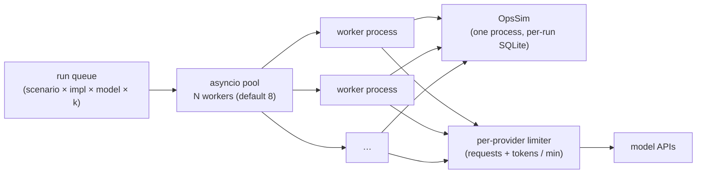
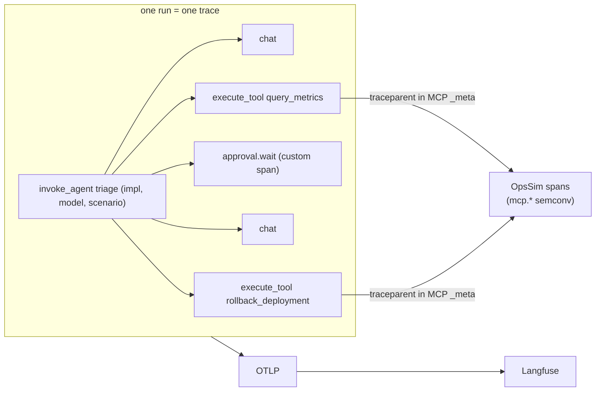

# 6. Non-Functional Design

## 6.1 Throughput and wall time

The experiments are the heaviest workload: about 2,500–3,000 runs in the core matrix plus reruns.

| Item | Estimate |
|---|---|
| Model time per run | 10–40 s (5–15 model calls) |
| Environment time per run | < 1 s total (tool p95 ≤ 50 ms, reset ≤ 200 ms) |
| E1 (800 runs) at 8 parallel | ≈ 800 × 30 s ÷ 8 ≈ **50 min** |
| Bottleneck | Provider rate limits, not the simulator. A per-provider token-bucket limiter keeps runs below the tier limit, and 429s back off and retry without counting as agent failures |

**Worker processes, not threads:**
- Chaos mode must be able to `SIGKILL` a run.
- Frameworks keep global state (tracing providers, event loops) that must not leak between runs.

## 6.2 Determinism and reproducibility

| Source of variation | Handling |
|---|---|
| Environment responses | Seeded generators; identical for the same scenario + seed (unit-tested by hashing responses) |
| Tool faults | Scheduled by call index from the scenario (`on_call: 1`), not random at run time |
| Model sampling | Temperature 0 where supported; still non-deterministic, which is **why k runs are needed** |
| Model version drift | Pin dated model IDs; record the model ID each provider returns; re-run the baseline if it changes |
| Framework versions | Lock files; version recorded in each result record |
| Prices | `prices.yaml` versioned; cost also recomputed from token counts |

**Result record → reproducible:** commit + config hash + scenario hashes + model IDs + framework versions
([03 §3.12](03-low-level-design.md#312-result-record)).

## 6.3 Cost model

| Item | Estimate | Control |
|---|---|---|
| Core matrix (E1, E3–E6, E9) | ≈ $110–165 | Runner **hard cap** per experiment (`--max-cost`), stops scheduling when reached |
| E2 + E7–E8 | ≈ $55–110 | Sized in the build plan; subsets allowed |
| Dev iterations | ≈ $1–3 per run of the dev smoke | Use the cheap model tier during development |
| CI smoke | ≤ $1 per PR | 20 runs on the cheap model |
| Demo | ≤ $10/month | Per-user daily cap, cheap model, auto-stop |
| Infra | ≈ $0 locally; Azure demo ≈ $15–30/month, scale to zero when idle | |

**Prompt caching** matters here: the system prompt + tool definitions (~6–8k tokens) repeat on every
model call. The adapters enable provider caching where the SDK allows it, and the report shows cached
token share per implementation, because a framework that breaks caching costs more.

## 6.4 Observability

- **OpenTelemetry GenAI semantic conventions** (`invoke_agent` → `chat` / `execute_tool`) for every
  implementation. These conventions are still "Development" status in 2026, so attribute names are
  pinned to one semconv version.
- Frameworks with their own tracing (OpenAI Agents SDK traces, LangGraph/LangSmith) are **routed to the
  same OTLP pipeline** so traces look the same regardless of framework.
- Trace attributes: `run_id`, `scenario`, `impl`, `model`, `k_index`, `variant flags`. Langfuse filters
  by any of them.
- Each result record stores its trace URL, and the report links failures to traces.

## 6.5 Failure modes of the harness itself

| Failure | Effect | Handling |
|---|---|---|
| Provider 429 / 5xx | Run stalls | Retry with backoff **outside** the agent's budget; a run that is still failing after 3 retries is marked `infra_error` and re-queued, never counted as an agent failure |
| Worker crash (not chaos) | Run lost | Marked `infra_error`, re-queued once; if it repeats, labelled F12 (framework/runtime error) |
| OpsSim crash | All runs fail | Health check; the runner pauses and resumes the queue |
| Runner crash | Experiment interrupted | Results store is append-only; `hctl run --resume` skips completed runs |
| Cost cap hit | Partial matrix | Report generator refuses partial matrices unless `--allow-partial`, and marks them |

**`infra_error` rate is reported.** Above 2%, the experiment is re-run, because infra failures hitting one
framework more than another would bias the comparison.

## 6.6 Scaling path (if this became a team tool)

| Now | Later |
|---|---|
| Local asyncio pool | Queue + workers on Kubernetes or Azure Container Apps jobs |
| SQLite per run | Same (it's the right tool); snapshot store on blob storage |
| DuckDB results | Same, or a warehouse table for many experiments |
| Scripted approver | Plus a real approval UI with Slack/Teams integration |
| Langfuse | Same; add sampling for large matrices |

## 6.7 Testing strategy

| Layer | Tests |
|---|---|
| Simulator | Rule unit tests (fix → recovery; harmful → outage), generator determinism, per-run isolation under parallel load |
| MCP server | Contract tests for every tool; approval-token and idempotency tests |
| Approval service | Token signing/verification, single use, args binding, expiry, merge of duplicate requests |
| Graders | Oracle policy passes every scenario; scripted bad policies fail the right predicates |
| Stats | pass^k estimator against brute-force enumeration; bootstrap on synthetic data with a known answer |
| Adapters | Each implementation passes 3 "golden" scenarios with a **stub model** (scripted tool calls), which tests wiring without model cost |
| End-to-end | CI smoke (§4.9) |
