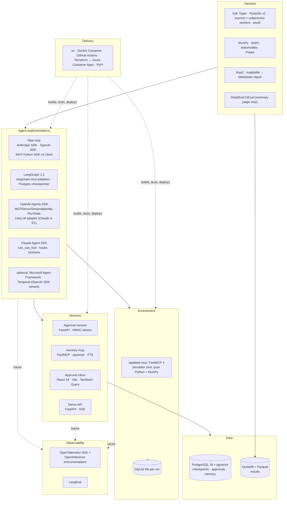

# 8. Tech Stack: What We Use and Why

For every technology in this project, this document answers five questions:
1. **What does it do in this system?**
2. **Why was it chosen?**
3. **What alternatives were considered, and why weren't they chosen?**
4. **What does it add to your profile?**
5. **When would we replace it?**

Selection criteria used throughout (same idea as Projects 1 and 2, adjusted for a measurement project):

| # | Criterion | Meaning |
|---|---|---|
| C1 | **Comparability** | Doesn't bias the framework comparison: same tools, same model, same tracing for every implementation |
| C2 | **Reproducibility** | Deterministic where possible; versions, seeds and configs recorded |
| C3 | **Market value** | Shows up in 2026 Agent / GenAI Engineer JDs (see [01-market-analysis](../../../01-market-analysis.md)) |
| C4 | **Gap-filling** | Covers something your résumé doesn't show yet (see [00-profile-gap-analysis](../../../00-profile-gap-analysis.md)) |
| C5 | **Low ops & cost** | Runs with `docker compose up`; thousands of runs for tens of dollars |
| C6 | **Reuse** | Reuses code and patterns from Projects 1 and 2 |

---

## 8.1 The stack at a glance

## 8.2 Summary table

| Layer | Choice | One-line reason | Main alternative (not chosen) |
|---|---|---|---|
| Language | **Python 3.12** | All four frameworks are first-class in Python; your strongest language | TypeScript (OpenAI/Claude SDKs exist in TS, but LangGraph.js lags and the harness is data-heavy) |
| Environment server | **FastMCP 4** (Streamable HTTP) | Same server stack as Project 2; typed tools, annotations, run-scoped routing | Low-level MCP SDK (more code); plain REST (loses the "same MCP tools" fairness) |
| Environment state | **SQLite, one file per run** | Millisecond reset, easy parallelism, final state kept as an artifact | Postgres schema per run (slower, more moving parts) |
| Simulator core | **Pure Python + NumPy** (seeded `Generator`) | Deterministic metric/log generation; no framework needed | SimPy (discrete-event engine is more than the simple clock needs) |
| Baseline agent | **Anthropic SDK + OpenAI SDK + MCP Python SDK v2 client** | Reuses Project 2's raw client loop; shows what frameworks add | — |
| Framework 1 | **LangGraph 1.2** + **langchain-mcp-adapters** + **langgraph-checkpoint-postgres** | Most-requested agent framework in JDs; interrupts, checkpoints, time travel | — (it's the anchor) |
| Framework 2 | **OpenAI Agents SDK** (+ LiteLLM adapter for Claude in E1) | Vendor SDK with native HITL (`RunState`), MCP, sessions, tracing | Swarm (retired), Assistants API (legacy) |
| Framework 3 | **Claude Agent SDK** (Python) | Anthropic's agent loop with permission callbacks and hooks; deepest MCP support | Claude API tool runner (simpler, but no hooks/sessions to compare) |
| Optional framework | **Microsoft Agent Framework 1.x** | Azure-aligned, GA since April 2026, HITL + checkpoints | Semantic Kernel / AutoGen (both folded into MAF) |
| Optional durability | **Temporal** (OpenAI Agents SDK integration) | GA March 2026; shows a durable-execution engine vs framework checkpoints | Restate, DBOS, Inngest |
| Models | **Claude Sonnet 5** (fixed model for E1), **an OpenAI mid-tier model** (E2), **Claude Haiku 4.5** + OpenAI mini tier (dev, CI) | Mid-tier = realistic production choice; cheap tiers for iteration | Frontier tier for all runs (3–5× cost, same comparisons) |
| Approval service | **FastAPI** + stdlib `hmac` | Small API; tokens are simple HMAC like Project 2's `requestState` | A workflow engine (overkill) |
| Memory service | **FastMCP + PostgreSQL 16 + pgvector + full-text search** | Same stack as Project 1; hybrid search; write policy we control | Mem0, LangMem, Zep (products; less control over the policy being measured) |
| Embeddings (memory) | **text-embedding-3-small** | Cheap, good enough for a few hundred memories; same client as Project 1 | Local Qwen3-Embedding (adds a model server) |
| Approval inbox | **React 19 + TypeScript + Vite + TanStack Query + Tailwind** | Your React strength; the full-stack piece Project 2's core plan deferred | HTMX/Jinja (less signal), Next.js (saved for Project 6) |
| Demo API | **FastAPI + SSE** | Streams agent events and approval prompts; same pattern as Project 1 | WebSockets (not needed for one-way events) |
| Results store | **DuckDB over Parquet/JSONL** | Append-only files + SQL analytics, zero server | Postgres table (fine, heavier), pandas pickles (fragile) |
| Dataframes | **Polars** | Fast group-bys over thousands of runs | pandas (fine; Polars chosen for speed and strictness) |
| Statistics | **NumPy + SciPy + statsmodels** | Bootstrap, McNemar, Holm correction; well-known | Custom code only (more bugs) |
| Charts / report | **matplotlib + Jinja2 → Markdown** | Static charts render on GitHub; reports are versioned files | Streamlit dashboard (not reviewable in a PR) |
| CLI | **Typer** | Typed commands (`hctl run/chaos/grade/report/score`) | argparse, Click |
| Schemas / config | **Pydantic v2 + JSON Schema** | Scenario, spec and result schemas validated on load | dataclasses + manual checks |
| Worker isolation / chaos | **asyncio + one subprocess per run + psutil** | `SIGKILL` of a whole process tree; no shared global state | Threads (can't be killed), Ray (overkill) |
| LLM judge | **DeepEval `GEval`** with a rubric | Reuses Project 1's eval tooling; only for the summary metric | Custom judge prompt (fine; GEval gives calibration tooling) |
| Tracing | **OpenTelemetry SDK + OpenInference instrumentations → Langfuse** | One backend for all four implementations; GenAI semantic conventions | LangSmith + OpenAI dashboard + … (split, not comparable) |
| Testing | **pytest, hypothesis, testcontainers, stub models, Playwright** | Each layer tested with its natural tool | — |
| Packaging / infra | **uv, Docker Compose, GitHub Actions, Terraform → Azure Container Apps, PyPI** | Same delivery stack as Projects 1 and 2 | Kubernetes (overkill) |

---

## 8.3 Detailed rationale

### Environment layer

#### FastMCP 4 (opsdesk-mcp)
- **Role:** Exposes the ~20 OpsSim tools with risk annotations. Routes `/runs/{run_id}/mcp` to the
  right state file. Checks approval tokens and idempotency keys before any write.
- **Why:** Identical tool definitions for every framework are the basis of a fair comparison (C1,
  [ADR-002](07-decisions.md)). You'll know FastMCP well after Project 2, so the time goes into the
  simulator, not plumbing (C6).
- **Not chosen:** Native function tools per framework (four copies that drift); a REST API with
  per-framework wrappers (same problem).
- **Profile:** "Published an MCP-based agent benchmark environment" is a rare, concrete artifact.
- **Revisit:** If one SDK's MCP client can't connect to the current protocol, put a tiny compatibility
  proxy in front, and log it as a DX finding.

#### SQLite per run + pure-Python simulator
- **Role:** Each run copies `seed.sqlite` (a few hundred kB) to `runs/{run_id}.sqlite`. The simulator
  applies fix/harm rules and generates metrics and logs from the fault model with a seeded NumPy
  `Generator`.
- **Why:** Reset in milliseconds, runs never share state, and the final file is kept for failure analysis
  (C2, C5; [ADR-011](07-decisions.md)).
- **Not chosen:**
  - Postgres schemas per run (setup cost, cleanup, connection limits under 8+ parallel runs).
  - SimPy (the simulator only needs a simple clock that moves forward when actions happen).
- **Revisit:** If scenarios ever need concurrent background processes (for example a cascading outage over
  time), switch the clock to SimPy.

### Agent layer

#### Raw loop: Anthropic SDK + OpenAI SDK + MCP Python SDK v2 client
- **Role:** The control group. It lists MCP tools, calls the model, executes tool calls, pauses for
  approval by saving messages to Postgres, and resumes from them.
- **Why:** Reuses Project 2's client (C6). Without it, there is no answer to "what does a framework
  actually add?"
- **Profile:** Shows you understand the loop underneath every framework, which interviewers probe.
- **Revisit:** Never. It's the baseline by design.

#### LangGraph 1.2 + langchain-mcp-adapters + langgraph-checkpoint-postgres
- **Role:**
  - Single-agent graph (agent ⇄ tools, approval node with `interrupt()`, guard node).
  - Supervisor + specialists variant for E7.
  - Postgres checkpointer for pause/resume, crash recovery and time travel.
- **Why:** The framework most often named in agent JDs (C3), and your strongest one. That makes it
  the natural first implementation, **but not** the one the prompt is tuned on
  ([ADR-019](07-decisions.md)).
- **Not chosen:** LangGraph Platform / LangSmith deployment (hosted features would muddy the
  comparison; open-source only).
- **Profile:** Moves "LangGraph at work" to "LangGraph durability and HITL measured in public".
- **Durability modes:** the default `async` mode writes the checkpoint while the next step runs; `sync`
  writes it first. E5 runs both, because the window between them is where duplicate actions come from.
- **Revisit:** If the checkpointer package's schema changes mid-project, pin it and note it. Temporal's
  LangGraph plugin (Public Preview, July 2026) is a backlog variant for E5.

#### OpenAI Agents SDK (+ LiteLLM adapter)
- **Role:**
  - One `Agent` with the opsdesk and memory MCP servers attached.
  - Risky tools require approval, which surfaces as run `interruptions`. The paused `RunState` is serialized to Postgres and resumed after the decision.
  - Sessions keep the conversation history.
- **Why:**
  - Its HITL model (pause → serialize state → resume anywhere) is different from LangGraph's, which is exactly what the comparison needs.
  - Common in JDs that mention "agent SDKs" (C3).
- **Model routing:**
  - E1 runs it on **Claude** through the SDK's LiteLLM (or Any-LLM) adapter, which the SDK labels **beta, best-effort**.
  - E2 runs it on OpenAI's own Responses model.
  - Whether the adapter behaves well with Claude (tool schemas, prompt caching, usage reporting) is itself a finding.
- **2026 status:** the April 2026 release added a model-native harness, **sandbox agents** and built-in HITL.
  Pin a release after that update and re-check the approval (`interruptions`) API in the F0 spike. Sandbox
  agents aren't used: this agent only calls MCP tools, and sandboxing is Project 5.
- **Not chosen:** OpenAI's hosted MCP tool (runs the tool call on OpenAI's side, so the approval and
  environment backstop can't be compared like for like).
- **Revisit:** If the LiteLLM route fails badly with Claude, E1 keeps the three other implementations on
  Claude and reports the OpenAI SDK only in E2, and says so.

#### Claude Agent SDK (Python)
- **Role:**
  - The Claude Code agent loop as a library.
  - Only the `mcp__opsdesk__*` and `mcp__memory__*` tools are allowed.
  - A `can_use_tool` callback asks the approval service and waits.
  - `PreToolUse` hooks run the guard lib.
  - Session resume after a crash, from a custom **`SessionStore`** in Postgres (supported by the SDK in 2026), so a replacement worker can resume anywhere.
- **Why:** Anthropic's official agent framework with the richest permission/hook model (C3). It's a
  different philosophy from both of the others: an agent runtime you configure, not a graph or a loop you
  write.
- **Things this choice brings (and the design must handle):**
  - **It runs the bundled Claude Code CLI as a subprocess.** Chaos kills must kill the whole process tree (psutil). Sessions are kept in the Postgres `SessionStore` with immediate flushes, so they survive the kill.
  - **Built-in tools (Bash, file, web) are disabled** and filesystem settings aren't loaded ([ADR-017](07-decisions.md)).
  - **Approvals block inside a live callback.** A run that waits for approval keeps its process alive, unlike LangGraph/OpenAI, which can exit and resume. Long waits are handled by denying with "pending approval", ending the turn, and resuming the session with the decision. How well this works is recorded in the DX scorecard.
- **Not chosen:** The Claude API "tool runner" (simpler, but no hooks, permissions or sessions to
  compare).
- **Revisit:** If a first-class "pause and serialize" API appears in the SDK, switch to it.

#### Optional: Microsoft Agent Framework 1.x
- **Role:** A fifth implementation, if time allows (FR-22).
- **Why:** It has been GA with long-term support since April 2026, and it has HITL, checkpointing and
  MCP. It lines up with your Azure background and the AI-102 certification (C3, C4).
- **Revisit:** It moves into the core plan only if the target JDs you're applying to name it.

#### Optional: Temporal (OpenAI Agents SDK integration)
- **Role:** A durable-execution variant of the OpenAI SDK implementation for E5 (FR-23).
- **Why:** The integration became GA in March 2026. It answers "do framework checkpoints give you what a
  durable-execution engine does?" with numbers ([ADR-018](07-decisions.md)).
- **Not chosen for everything:** It would make durability identical everywhere and remove a real
  framework difference.

#### Models
- **E1 (fixed model): Claude Sonnet 5.** A mid-tier model is what most production agents use, it runs in
  all four implementations, and the cost fits the budget.
- **E2: an OpenAI mid-tier model**, pinned by dated ID at build time.
- **Dev and CI: Claude Haiku 4.5 and an OpenAI mini-tier model**, so iterating costs cents.
- **Summary judge:** a model from the **other** family than the run being judged, which avoids
  self-preference.
- **Revisit:** Model IDs and prices go in `models.yaml` and `prices.yaml`. A model change triggers a
  baseline re-run ([06 §6.2](06-non-functional.md#62-determinism-and-reproducibility)).

### Services layer

#### Approval service: FastAPI + HMAC tokens
- **Role:** Stores approval requests, routes them to the scripted approver or the inbox, and issues and
  consumes single-use tokens bound to run + tool + args hash.
- **Why:** The same signing pattern as Project 2's `requestState` (a key ID for rotation, a nonce, an
  expiry). A small, well-tested piece that every framework shares (C1, C6).
- **Not chosen:** JWTs (more parsing surface than needed for an internal token); a workflow engine for
  approvals (overkill).

#### memory-mcp: FastMCP + PostgreSQL 16 + pgvector + full-text search
- **Role:** `memory_search` and `memory_save` per team, with provenance, expiry and the write policy.
- **Why:**
  - One memory for all implementations makes E8 fair ([ADR-009](07-decisions.md)).
  - Hybrid search reuses Project 1's retrieval code (C6).
- **Not chosen:**
  - Mem0, LangMem, Zep: they would work, but the write policy is the thing being measured and must be under our control.
  - LangGraph Store: framework-specific. It is shown in a short learning note only.
- **Revisit:** Compare with Mem0 as a stretch "build vs buy" note if time allows.

#### Approval inbox: React 19 + TypeScript + Vite + TanStack Query + Tailwind
- **Role:** One page for the demo: pending approvals, a risk badge, the exact tool + arguments (with a
  diff when edited), approve/deny/edit, and a live event stream from the run.
- **Why:** Your React strength, and the full-stack piece deferred in Project 2's core plan (C4). It shows
  the T4 mitigation (show the arguments, not only the agent's reason).
- **Not chosen:** Next.js (saved for Project 6); Streamlit (weak for an interactive approval flow).

### Harness layer

#### hctl: Typer + Pydantic v2 + asyncio with one subprocess per run + psutil
- **Role:** Expands the experiment matrix, schedules runs under per-provider rate limits and the cost
  cap, spawns workers, injects crashes, and resumes interrupted experiments.
- **Why:**
  - Processes, not threads, so chaos mode can `SIGKILL` a run and frameworks can't leak global state into each other ([06 §6.1](06-non-functional.md#61-throughput-and-wall-time)).
  - psutil kills process trees, which the Claude Agent SDK's CLI subprocess needs.
- **Not chosen:** Ray or Celery (a queue across machines isn't needed at this scale); pytest as the
  runner (poor fit for matrices and resumable long runs).

#### DuckDB over Parquet/JSONL + Polars
- **Role:**
  - Each run appends one JSON result record.
  - Experiments are compacted to Parquet.
  - DuckDB SQL and Polars do the grouping for the report.
- **Why:** Append-only files make results easy to resume and diff, and they can be committed with the
  report (C2). No server needed (C5).

#### NumPy + SciPy + statsmodels
- **Role:**
  - pass^k estimator.
  - Scenario-level bootstrap.
  - Paired bootstrap and McNemar tests.
  - Holm correction (`statsmodels.stats.multitest`).
  - Calibration (Brier, ECE).
- **Why:** Standard, trusted implementations. The pass^k estimator and bootstrap get property tests
  against brute-force answers (hypothesis).

#### matplotlib + Jinja2 → Markdown reports
- **Role:** Renders `reports/framework-comparison.md` with PNG charts and tables. Every number links to its
  results file and commit.
- **Why:** Reports are reviewed like code in PRs and render on GitHub.

#### DeepEval GEval (summary judge only)
- **Role:** A rubric score (1–5) for `summary_md`, calibrated on 40 hand labels ([ADR-014](07-decisions.md)).
- **Why:** Reuses Project 1's tooling. DeepEval is also listed for this project in the
  [project list](../../../03-projects.md).

### Observability

#### OpenTelemetry + OpenInference instrumentations → Langfuse
- **Role:** One trace per run. OpenInference instrumentations cover LangChain/LangGraph, the OpenAI Agents
  SDK and the Claude Agent SDK. The raw loop, the approval wait and the environment emit their own spans. The
  `traceparent` travels in MCP `_meta`, so environment spans join the agent's trace.
- **Why:** Framework-neutral traces are a requirement of the comparison (C1, [ADR-015](07-decisions.md)).
  It is the same backend as Projects 1 and 2.
- **Things to watch:**
  - The GenAI semantic conventions are still "Development" status, so pin the semconv version and the instrumentation versions.
  - The OpenAI Agents SDK's default exporter sends traces to OpenAI. Replace it with the OTel processor (and disable the default exporter) so data goes only to Langfuse.
- **Not chosen:** LangSmith (excellent for LangGraph, but ties traces to one framework).

### Delivery

- **uv** (workspace with `opssim`, `agents`, `services`, `harness` packages), **Docker Compose**
  (Postgres, Langfuse, opssim, approvals, memory-mcp), **GitHub Actions** (unit + smoke gate; manual
  full matrix), **Terraform → Azure Container Apps** for the demo (modules from Projects 1–2), **PyPI**
  trusted publishing for `opssim` (the benchmark package). These are all the same as in Projects 1 and 2 (C6).

---

## 8.4 What this stack adds to your profile

| New on your profile after this project | Evidence produced |
|---|---|
| OpenAI Agents SDK and Claude Agent SDK (plus LangGraph, measured) | Four implementations of one agent, DX scorecard |
| Agent reliability evaluation: pass^k, calibration, failure taxonomy | Framework comparison report with CIs |
| HITL designs across frameworks, signed approval tokens | Approval service + E4 results + inbox demo |
| Durable execution / crash recovery, idempotency | E5 chaos results |
| Agent memory with a poisoning defence | memory-mcp + E8 |
| Agent guardrails with measured cost/benefit | E3 |
| Cross-framework OpenTelemetry tracing | One Langfuse view for all implementations |
| Benchmark design (environment, scenarios, graders, oracle tests) | OpsDesk-50 on PyPI + scoring CLI |

**Deliberately not in this project** (covered elsewhere): A2A and Google ADK (Project 4), sandboxed code
execution (Project 5), Next.js / Vercel AI SDK (Project 6), LiteLLM as a gateway and semantic caching
(Project 7; here LiteLLM is only the OpenAI SDK's model adapter), CrewAI (lower JD demand for agent
engineering roles).

## 8.5 Version baseline

Pin exact versions in the lockfile when you start building. These minimums matter for the design:

| Component | Minimum | Needed for |
|---|---|---|
| Python | 3.12 | All SDKs |
| LangGraph | 1.2.x | `interrupt()` / `Command(resume=…)`, durability modes, Store |
| langgraph-checkpoint-postgres | 3.x | Postgres checkpointer matching LangGraph 1.2 |
| langchain-mcp-adapters | current | MCP tools in LangGraph; Streamable HTTP |
| openai-agents | current 2026 release | MCP servers with approvals, `RunState` serialization, sessions |
| claude-agent-sdk | 0.2.x (weekly releases) | `can_use_tool`, hooks, `mcp_servers`, session resume/fork |
| FastMCP | 4.x | Same as Project 2 (2026-07-28 protocol) |
| MCP Python SDK | v2 | Raw-loop client |
| PostgreSQL + pgvector | 16 + 0.8 | Checkpoints, approvals, memory |
| OpenTelemetry GenAI semconv | pinned version | `invoke_agent` / `chat` / `execute_tool` spans |
| Langfuse | v3 | OTel ingest |
| Microsoft Agent Framework (optional) | 1.x | HITL + checkpoints |
| Temporal Python SDK (optional) | with the OpenAI Agents integration (GA) | E5 durable variant |

## 8.6 Things to verify in the first week of building

| Item | Why | Fallback |
|---|---|---|
| Each SDK's MCP client connects to FastMCP 4 on the 2026-07-28 protocol (with version negotiation) | Everything depends on shared MCP tools | Negotiate the older protocol version; note it in DX |
| OpenAI Agents SDK + LiteLLM with Claude: tool calls, prompt caching, usage/cost fields | E1 fairness | Drop the OpenAI SDK from E1, keep it in E2 ([§8.3](#openai-agents-sdk--litellm-adapter)) |
| Claude Agent SDK: approval wait inside `can_use_tool` for minutes; session resume after `SIGKILL` of the CLI subprocess | E4, E5 | Deny-and-resume pattern; per-run session directory |
| LangGraph checkpoint timing around tool calls (before/after the tool runs) | Explains E5 duplicate results | Document the observed behaviour; idempotency keys cover it |
| OpenInference instrumentation coverage for all three SDKs in one process setup | One trace per run | Manual spans from adapter events |
| Provider rate limits at 8 parallel runs | Wall time estimates | Lower parallelism; spread across the day |
| Same `temperature` / `max_tokens` settable in every SDK | E1 fairness | Record the differences in the DX notes |
