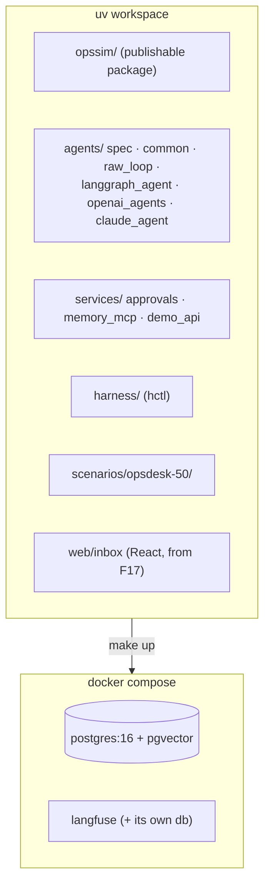
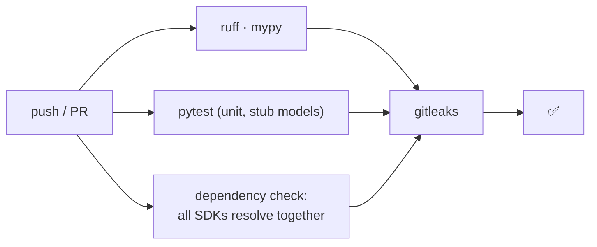

# F0: Project Foundation

| Milestone | Priority | Depends on | Effort | Unblocks |
|---|---|---|---|---|
| M1 | Must | — | 3.5 h | Everything |

**Goal:** A uv workspace where `make up` starts Postgres (with pgvector) and Langfuse, CI runs lint,
types and tests, and each SDK is proven to install side by side without dependency conflicts.

## Diagram: repository and local stack



## Diagram: CI pipeline (first version)



## Deliverables / files
```
pyproject.toml (uv workspace, Python 3.12)   uv.lock
docker-compose.yml   Makefile (up, down, test, lint, smoke)   .env.example
opssim/  agents/  services/  harness/  scenarios/  reports/  docs/notes/
config/models.yaml   config/prices.yaml       # dated model IDs, per-token prices
docs/notes/dx-diary.md                        # hours + pain points per implementation
docs/notes/spikes.md
.github/workflows/ci.yml
```

## Tasks
- [ ] uv workspace with separate packages; one lockfile
- [ ] **Dependency spike (1 h):** install `langgraph`, `langgraph-checkpoint-postgres`, `langchain-mcp-adapters`,
      `openai-agents[litellm]`, `claude-agent-sdk`, `fastmcp`, `mcp` in one environment. If they conflict, split
      the agents into separate uv packages with their own environments. The runner launches each worker in its package's venv
- [ ] Compose: Postgres 16 + pgvector, Langfuse (local) with health checks
- [ ] `models.yaml` / `prices.yaml` with the models from the [tech stack](../08-tech-stack.md#models)
- [ ] DX diary template: date, implementation, hours, what hurt, what helped
- [ ] Pin an `openai-agents` release after the April 2026 update and re-check the `interruptions`/`RunState` API in the spike *(market review)*
- [ ] CI: lint, types, unit tests, secret scanning

## Acceptance criteria
- `make up` → containers healthy; a test span appears in Langfuse
- All SDKs import in CI (or the per-package split is in place and documented)
- CI green on an empty PR

## Tests
- Import smoke test per agent package; Postgres connectivity test

**Interview talking point:** *"Before writing an agent, I checked that four agent SDKs could live in one
repo. Dependency conflicts between frameworks are a real cost teams underestimate."*
