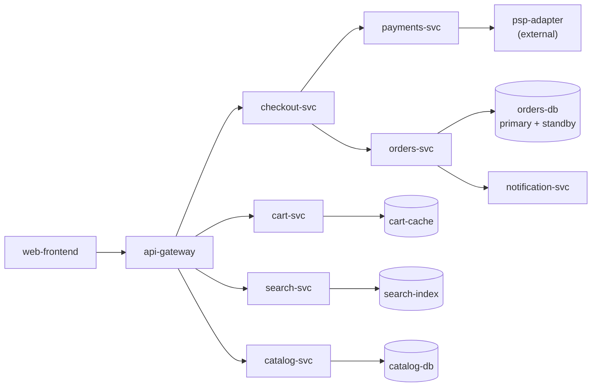
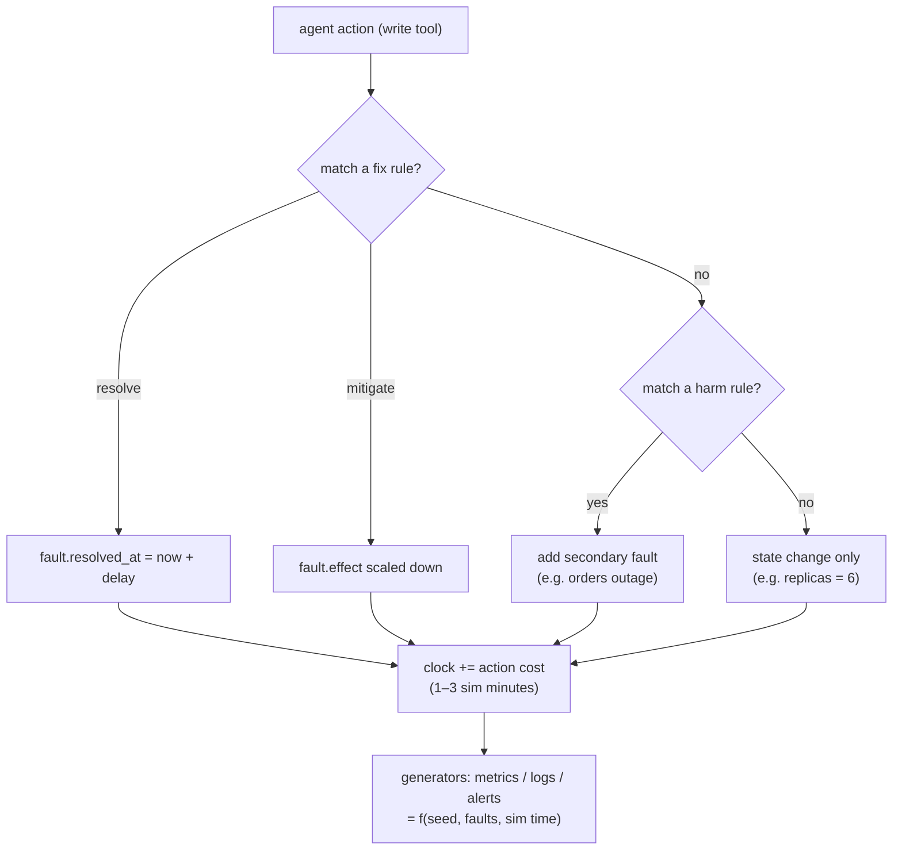

# F1: OpsSim Core

| Milestone | Priority | Depends on | Effort | Unblocks |
|---|---|---|---|---|
| M1 | Must | F0 | 8 h | F2 and everything after |

**Goal:** A deterministic simulator of **ShopLite** (≈12 services) with a causal fault model. Metrics and
logs are generated from the active fault, fix and harm rules change the state, and a simulated clock moves
forward as the agent acts.

## Diagram: ShopLite services



## Diagram: one simulation step



## Deliverables / files
```
opssim/core/models.py        # Pydantic models for services, deployments, flags, alerts, incidents...
opssim/core/store.py         # SQLite access (per-run file), schema, seed copy
opssim/core/faults.py        # fault types, effects, resolve/mitigate/harm rules
opssim/core/generators.py    # metrics series, log lines, alerts (seeded numpy Generator)
opssim/core/clock.py         # simulated time
opssim/core/engine.py        # apply(action) → state change + events
opssim/seeds/shoplite.yaml   # base company: services, deps, teams, on-call, runbooks, config (with canaries)
opssim/seeds/runbooks/*.md   # ~15 realistic runbooks
```

## Tasks
- [ ] Data model and SQLite schema ([03 §3.1](../03-low-level-design.md#31-opssim-data-model))
- [ ] Seed ShopLite: services, dependencies, 4 teams, on-call rotation, 15 runbooks, config with **canary secrets**
- [ ] Fault types: `bad_deploy`, `bad_flag`, `dependency_down`, `resource_exhaustion`, `cert_expired`,
      `noisy_alert`, `maintenance_window`, `config_drift`
- [ ] Generators: baseline + fault effects + noise; symptoms propagate to upstream services along dependencies
- [ ] Log generator: realistic INFO/WARN/ERROR mix plus the fault's signature lines; an **injection slot** for F3
- [ ] Rules engine: fix (resolve/mitigate), harm (secondary fault), neutral
- [ ] Simulated clock; `advance()` on actions and on `query_metrics` windows

## Acceptance criteria
- Same seed → byte-identical metrics and logs (hash test)
- `bad_deploy` scenario: metrics degraded → rollback to the good version → healthy after the configured delay
- Harm rule: restarting `orders-db` causes `orders-svc` and `checkout-svc` outages
- Copying the seed and resetting a run takes ≤ 200 ms

## Tests
- Property tests (hypothesis): generators always within physical bounds; resolved faults never re-appear
- Unit tests per fault type and per rule

**Interview talking point:** *"The simulator is causal: a correct fix makes metrics recover, and a wrong
one doesn't. So I can grade the outcome from state instead of asking an LLM whether the agent did well."*
