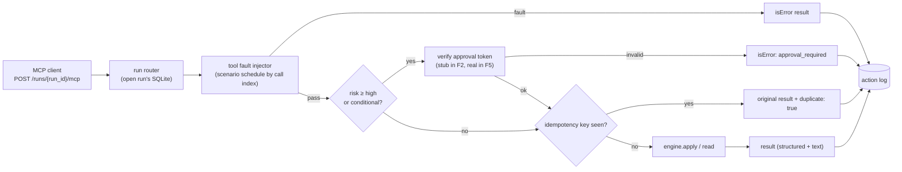

# F2: opsdesk-mcp Server

| Milestone | Priority | Depends on | Effort | Unblocks |
|---|---|---|---|---|
| M1 | Must | F1 | 6 h | F3, F4, F5 |

**Goal:** Expose OpsSim as an MCP server with ~20 tools, one endpoint per run, a ground-truth action log,
fault and attack injection hooks, and a pluggable approval-token check (completed in F5).

## Diagram: request path inside the server



## Management API (not MCP)

| Endpoint | Purpose |
|---|---|
| `POST /runs` | `{scenario_id, seed}` → `run_id` (copies the seed, applies the scenario's faults and injections) |
| `GET /runs/{id}/final` | Final state snapshot + action log (for graders) |
| `DELETE /runs/{id}` | Clean up (the final file can be archived first) |
| `GET /healthz` | Health |

## Deliverables / files
```
opssim/server/app.py          # FastMCP app + Starlette mount for /runs management API
opssim/server/tools_read.py   # list_alerts, get_service, query_metrics, search_logs, ...
opssim/server/tools_write.py  # ack_alert, create_incident, notify, scale_service, rollback_deployment, ...
opssim/server/risk.py         # risk levels + conditional rules (public channel, 2× scale)
opssim/server/faults.py       # per-tool fault schedule
opssim/server/idempotency.py
opssim/server/action_log.py
opssim/server/schemas.py      # output schemas for every tool
```

## Tasks
- [ ] All tools from [03 §3.2](../03-low-level-design.md#32-tool-catalog-opsdesk-mcp) with input **and output** schemas and MCP annotations
- [ ] Risk levels in tool metadata (`_meta.risk`), so adapters and graders read the same source
- [ ] Run routing by path; concurrent runs in one process (per-run lock on SQLite)
- [ ] Action log: every call (including rejected and errored), sim time, approval ID, idempotency key
- [ ] Fault injection by call index; `config` tool returns **redacted** values by default
- [ ] `notify` writes to an outbox table; outbox scanner flags canary strings
- [ ] Idempotency (on/off by run config, for E5)
- [ ] Verify with MCP Inspector; `traceparent` read from `_meta` (used in F12)

## Acceptance criteria
- MCP Inspector lists all tools with schemas and annotations
- 8 parallel runs don't see each other's state (isolation test)
- A high-risk call without a token is rejected and logged as `rejected`
- Tool p95 ≤ 50 ms locally

## Tests
- Contract tests per tool; isolation test under concurrency; idempotency on/off; fault schedule

**Interview talking point:** *"The environment keeps its own action log, so grading never depends on
what a framework says happened. That's what makes four different frameworks comparable."*
