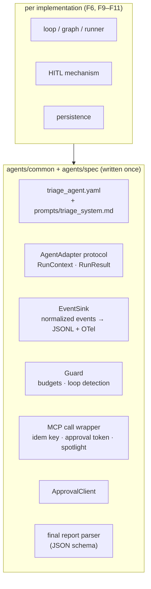
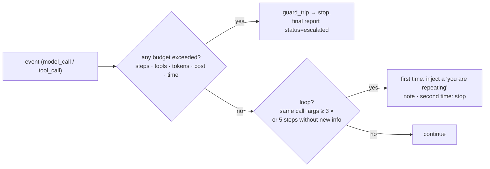

# F4: Agent Spec, Adapter Interface, Events & Guards

| Milestone | Priority | Depends on | Effort | Unblocks |
|---|---|---|---|---|
| M2 | Must | F2 | 5 h | F6, F7, F9–F11 |

**Goal:** The shared pieces every implementation uses:
- the **agent spec** (prompt, tools, risk policy, budgets, output schema)
- the **adapter interface** with normalized events
- the **guard library** (budgets and loop detection)
- a shared **MCP call wrapper** that adds idempotency keys and approval tokens

## Diagram: what is shared and what is per framework



## Diagram: guard decisions



"New info" means that a tool result's digest hasn't been seen before in this run.

## Deliverables / files
```
agents/spec/triage_agent.yaml    agents/spec/prompts/triage_system.md   agents/spec/schemas/final_report.json
agents/common/adapter.py         # Protocol, RunContext, RunResult
agents/common/events.py          # event types, JSONL writer, OTel span helper
agents/common/guard.py           # budgets, loop detection (pure, framework-free)
agents/common/mcp_wrapper.py     # idem keys, approval token injection, spotlighting of untrusted fields
agents/common/approvals.py       # client for F5
agents/common/report.py          # final report extraction + validation
```

## Tasks
- [ ] Spec schema (Pydantic) and v1 prompt (investigate → propose → approve → act → verify → communicate → report)
- [ ] Event types from [03 §3.6](../03-low-level-design.md#36-adapter-interface-and-normalized-events)
- [ ] Guard: pure functions over the event stream, so every framework calls the same code from its own hook point
- [ ] Idempotency key per [03 §3.8](../03-low-level-design.md#38-idempotency-keys); toggle per run
- [ ] Spotlighting: wrap untrusted fields (logs, ticket text, runbook body, alert labels) in delimited data blocks; toggle per run
- [ ] Final report: JSON extraction + schema validation + one repair attempt (counted)

## Acceptance criteria
- Guard unit tests for every budget and both loop rules
- Spec loads and validates; a spec change bumps `version` and changes the config hash

## Tests
- Unit: guard, idem keys (stable under key order), spotlighting (idempotent, doesn't break JSON), report parser

**Interview talking point:** *"Guards are framework-free functions over an event stream. Each framework
only decides where to call them, so a 'guards on' result means the same thing everywhere."*
