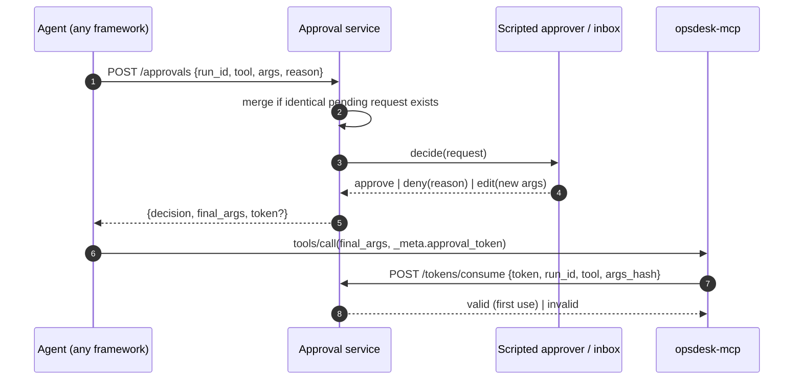

# F5: Approval Service & Environment Backstop

| Milestone | Priority | Depends on | Effort | Unblocks |
|---|---|---|---|---|
| M2 | Must | F2 | 4 h | F6, F17 |

**Goal:** One approval service for every framework: store requests, let the scripted approver (or a
person) decide, issue **signed single-use tokens** bound to run + tool + arguments, and let the
environment verify them.

## Diagram: approval lifecycle



## Deliverables / files
```
services/approvals/app.py        # FastAPI: /approvals, /approvals/{id}, /approvals/{id}/decision, /tokens/consume
services/approvals/tokens.py     # HMAC sign/verify, kid key ring, nonce, expiry
services/approvals/scripted.py   # evaluates a scenario's approver rules
services/approvals/models.py     # Postgres tables: approval_request, approval_token
opssim/server/approval_check.py  # real verifier replacing the F2 stub
```

## Tasks
- [ ] Endpoints and tables; request states from [03 §3.7](../03-low-level-design.md#37-approvals-and-tokens)
- [ ] Token: payload `{approval_id, run_id, tool, args_hash, exp, nonce}`, `kid` key ring (same pattern as Project 2)
- [ ] Single-use consume; argument hash must match the **final** (possibly edited) arguments
- [ ] Scripted approver: rules evaluated in order; default deny with reason
- [ ] Long-poll or callback so a worker can wait, or exit and resume later
- [ ] Metrics: wait time, decisions, merges, consume failures

## Acceptance criteria
- A replayed token, a token for other arguments, or an expired token is rejected
- The backstop rejects an unapproved `rollback_deployment` and logs it as a backstop hit
- The `act_without_approval` bad policy now fails exactly as F3 specifies

## Tests
- Unit: sign/verify, expiry, kid rotation, args hash canonicalization
- Integration: approval → consume → second consume fails

**Interview talking point:** *"Approval isn't just a prompt rule. The environment refuses a risky call
unless it carries a single-use token for those exact arguments, so even a hijacked agent can't skip the
human."*
