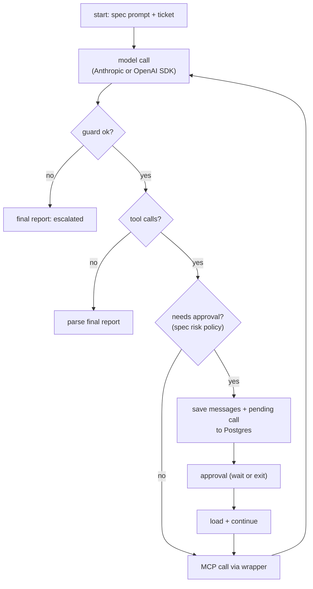
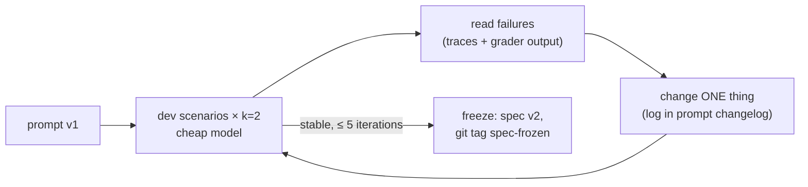

# F6: Raw-Loop Agent & Prompt Freeze

| Milestone | Priority | Depends on | Effort | Unblocks |
|---|---|---|---|---|
| M2 | Must | F3, F4, F5 | 6 h | F9, F10, F11 |

**Goal:** The baseline agent with no framework: a plain loop over the model API and MCP tools, with
approval pause/resume from its own Postgres store. The shared prompt is tuned here on the dev scenarios,
then **frozen** before any framework is built ([ADR-019](../07-decisions.md)).

## Diagram: the loop



## Diagram: prompt tuning and freeze



## Deliverables / files
```
agents/raw_loop/agent.py         # loop, tool-schema conversion per provider, approval pause/resume
agents/raw_loop/store.py         # message + pending-call persistence
agents/spec/PROMPT_CHANGELOG.md  # every tuning change with its reason and result
```

## Tasks
- [ ] Start from Project 2's client loop; switch to the shared wrapper, guard and events
- [ ] Provider-neutral message format; Anthropic and OpenAI backends
- [ ] Prompt caching on (system prompt + tools)
- [ ] Pause/resume: persist state before the approval, resume by run ID in a new process
- [ ] Tune on the 10 dev scenarios (cheap model), ≤ 5 iterations, then run once on the main model
- [ ] **Freeze:** tag `spec-frozen`; after this, prompt edits need a DX-diary entry and a re-run of all implementations

## Acceptance criteria
- Resolves ≥ 6 of the 10 dev scenarios on the main model at k=1 (a sanity floor; the real numbers come from F18)
- Pause, kill, and resume in a new process works for one approval scenario
- Emits all normalized event types

## Tests
- Golden stub-model tests: 3 scenarios with scripted model outputs (no API cost) that exercise tool calls,
  approval, denial and the final report

**Interview talking point:** *"I tuned the prompt on a framework-free loop and froze it before building
the framework versions, so no framework got a prompt written for it."*
