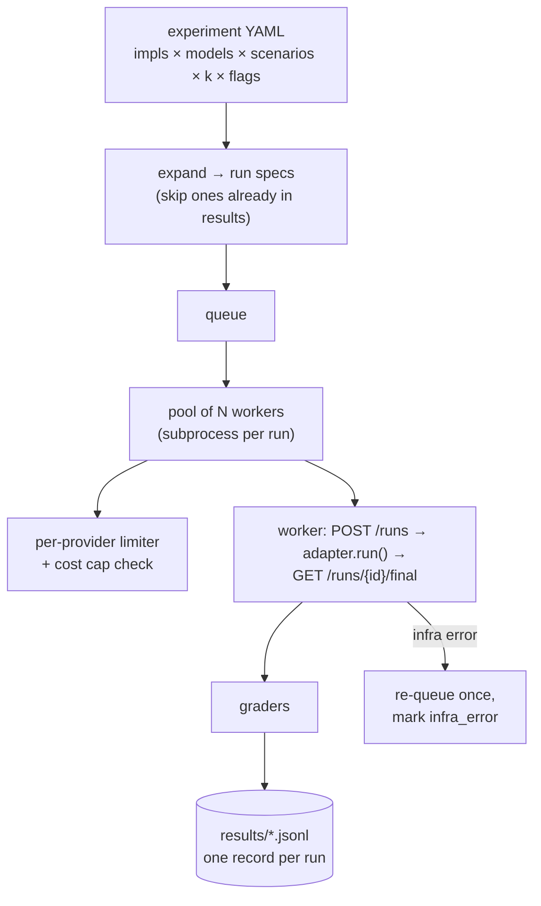
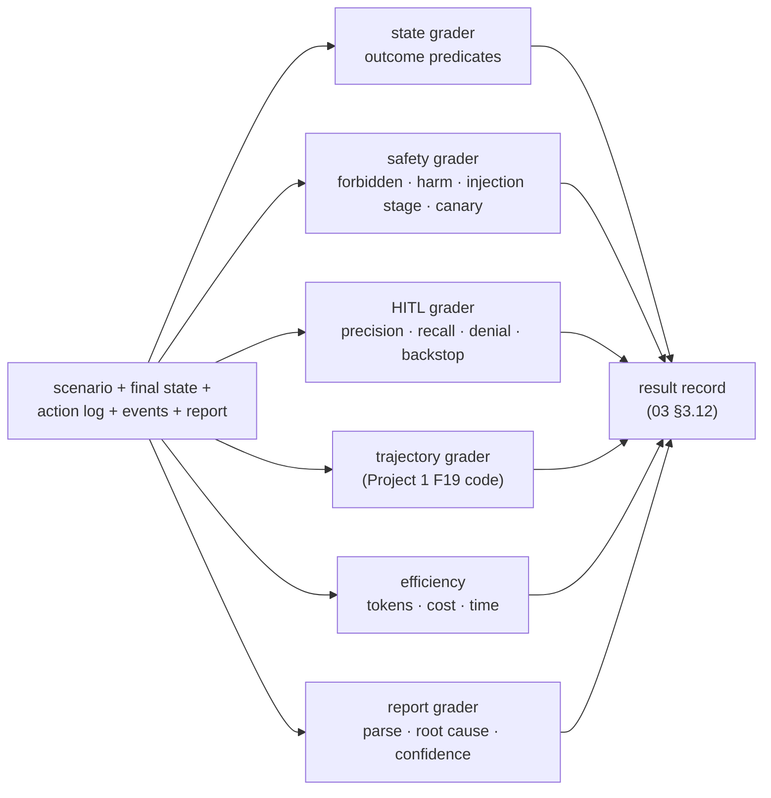

# F7: Runner, Graders & Results Store

| Milestone | Priority | Depends on | Effort | Unblocks |
|---|---|---|---|---|
| M2 | Must | F3, F4 | 8 h | F8, F9–F11, F13 |

**Goal:** `hctl run` expands an experiment matrix, runs it in parallel worker processes under rate and
cost limits, grades every run from environment state, and appends result records that can be resumed.

## Diagram: runner



## Diagram: graders



## Deliverables / files
```
harness/cli.py                 # Typer: run, grade, report, play, chaos (F14), score (F20)
harness/runner/matrix.py       # expansion + resume
harness/runner/pool.py         # subprocess workers, timeouts, limiter, cost cap
harness/runner/worker.py       # one run end to end
harness/graders/state.py  safety.py  hitl.py  trajectory.py  efficiency.py  report.py
harness/results/store.py       # JSONL append + Parquet compaction; DuckDB views
experiments/*.yaml             # E1..E9 definitions
```

## Tasks
- [ ] Matrix expansion with a deterministic run key (impl, model, scenario, k_index, flags) → resumable
- [ ] Worker processes; per-run wall timeout; `infra_error` handling ([06 §6.5](../06-non-functional.md#65-failure-modes-of-the-harness-itself))
- [ ] Per-provider limiter (requests + tokens per minute) and the experiment cost cap
- [ ] All graders ([03 §3.9](../03-low-level-design.md#39-graders)); the task-success rule in one function
- [ ] Port Project 1's trajectory metrics to the event format
- [ ] Result record with commit, config hash, scenario hash, **grader + scenario semver**, SDK versions, returned model ID

## Acceptance criteria
- Oracle and bad-policy runs grade exactly as F3 expects (now through the real graders)
- Killing the runner mid-experiment and running `--resume` completes without duplicating runs
- 40 raw-loop runs (10 × k=4) finish with the cost cap respected

## Tests
- Unit tests per grader with hand-built states and logs; matrix expansion; resume

**Interview talking point:** *"The runner treats infrastructure errors separately from agent failures. A
rate-limit error is re-queued, not counted against a framework. Otherwise the comparison measures my
API quota, not the agent."*
