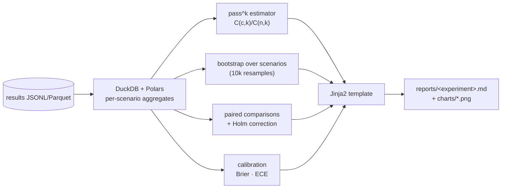

# F8: Statistics & Report v0

| Milestone | Priority | Depends on | Effort | Unblocks |
|---|---|---|---|---|
| M2 | Must | F7 | 5 h | F18, F20 |

**Goal:** Turn result records into numbers you can defend: pass@1, pass^k, violation rates, HITL metrics
and cost per resolved incident, with bootstrap CIs and paired comparisons. Then render them into a Markdown
report.

## Diagram: from records to report



## Deliverables / files
```
harness/stats/passk.py        # unbiased pass^k
harness/stats/bootstrap.py    # scenario-level (clustered) bootstrap, paired bootstrap
harness/stats/tests.py        # McNemar, Holm (statsmodels)
harness/stats/calibration.py  # Brier, ECE, reliability diagram data
harness/report/render.py      # tables, charts (matplotlib), links to traces and results
harness/report/templates/*.md.j2
reports/baseline-v0.md        # first real report: raw loop, 10 dev scenarios × k=4
```

## Tasks
- [ ] pass^k estimator; property test against brute-force enumeration for small n
- [ ] Clustered bootstrap; paired differences; Holm; effect sizes first, p-values second
- [ ] Power note generator: "with N scenarios, differences below ~X points are not detectable"
- [ ] Report header: commit, config hash, results hash, models, SDK versions; refuse mismatched hashes
- [ ] Charts: pass^k curves, violations by severity, cost per resolved, calibration diagram
- [ ] **Report v0** on the raw loop baseline

## Acceptance criteria
- Statistics tested on synthetic data with known answers
- `reports/baseline-v0.md` renders on GitHub with CIs and trace links

## Tests
- hypothesis: pass^k monotone in k, equals pass@1 at k=1; bootstrap CI covers the true value ~95% on simulated data

**Interview talking point:** *"I bootstrap over scenarios, not runs, because four runs of the same
scenario aren't independent. Treating them as independent makes the confidence intervals look tighter
than they really are."*
