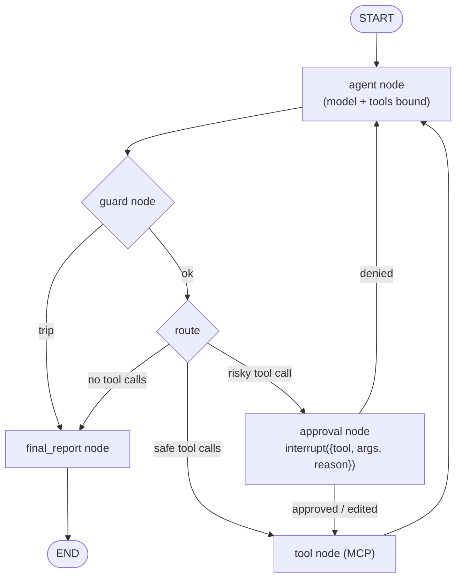
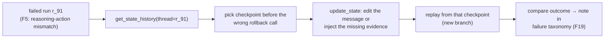

# F9: LangGraph Agent

| Milestone | Priority | Depends on | Effort | Unblocks |
|---|---|---|---|---|
| M3 | Must | F6, F7 | 7 h | F12, F14, F15, F16, F17 |

**Goal:** The Triage Agent as a LangGraph `StateGraph` with the frozen spec, MCP tools through
langchain-mcp-adapters, an approval node using `interrupt()`, the guard as a node, and the Postgres
checkpointer for pause/resume, crash recovery and time travel.

## Diagram: the graph



With the checkpointer, state is saved after every node, so an `interrupt()` pauses the run and it can
resume later in a new process with `Command(resume=decision)`.

## Diagram: time-travel debugging of a failed run



## Deliverables / files
```
agents/langgraph_agent/graph.py       # state, nodes, edges, compile(checkpointer)
agents/langgraph_agent/adapter.py     # AgentAdapter: run/resume, events, thread_id = run_id
agents/langgraph_agent/tools.py       # MCP tools via langchain-mcp-adapters + shared wrapper
agents/langgraph_agent/timetravel.py  # `hctl replay <run_id> --from <checkpoint>`
docs/notes/langgraph-store.md         # short learning note on the Store API (memory uses F15 instead)
```

## Tasks
- [ ] Graph from the frozen spec; no prompt changes (log any unavoidable ones in the DX diary)
- [ ] Approval node: `interrupt()`; resume with approve/deny/edit via `Command(resume=…)`
- [ ] Guard node calls the shared guard lib; recursion limit set above `max_steps` so the guard, not LangGraph, trips first
- [ ] Postgres checkpointer; durability mode chosen deliberately and recorded (it matters for E5)
- [ ] Events mapped from LangGraph stream updates to the normalized events
- [ ] Time-travel CLI for failure analysis
- [ ] DX diary: hours, lines of code, what was easy/hard

## Acceptance criteria
- Golden stub tests pass; dev smoke (10 scenarios × k=2, cheap model) runs through the harness
- Approve, deny and edit paths work; pause → kill → resume in a new process works
- A failed run can be replayed from a checkpoint with edited state

## Tests
- Stub-model tests for each route; resume test with a real Postgres (testcontainers)

**Interview talking point:** *"The approval is an `interrupt()` in a checkpointed graph, so a run can wait
days for a human without holding a process. I also used time travel to replay failures from the step
before the mistake."*
