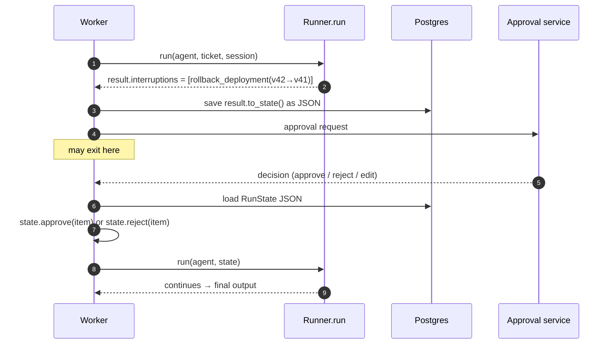

# F10: OpenAI Agents SDK Agent

| Milestone | Priority | Depends on | Effort | Unblocks |
|---|---|---|---|---|
| M3 | Must | F6, F7 | 6 h | F12, F14 |

**Goal:** The Triage Agent with the OpenAI Agents SDK:
- one `Agent` with opsdesk and memory MCP servers attached
- approval-required tools surfacing as run **interruptions**
- the paused `RunState` serialized to Postgres and resumed after the decision
- runs on **Claude through the LiteLLM adapter** for E1 and on an OpenAI model for E2

## Diagram: approval with RunState



**Edits:** check in the spike whether the SDK can change a call's arguments when approving it. If it
can't, an **edit** is sent as a rejection with the edited arguments in the reason, and the agent then
calls again with them. Either way, the approach is recorded in the DX scorecard, and E4 measures whether
it hurts.

## Deliverables / files
```
agents/openai_agents/agent.py      # Agent definition from the frozen spec; MCP servers; approval settings
agents/openai_agents/adapter.py    # run/resume, RunState persistence, events from hooks/tracing
agents/openai_agents/models.py     # model routing: OpenAI Responses model (E2) or LiteLLM → Claude (E1)
agents/openai_agents/guard_hooks.py
```

## Tasks
- [ ] **Spike first (1 h):** LiteLLM → Claude with MCP tools, prompt caching and usage reporting. If it fails, apply the
      fallback in [08 §8.6](../08-tech-stack.md#86-things-to-verify-in-the-first-week-of-building) and tell the report
- [ ] `MCPServerStreamableHttp` for opsdesk (+ memory later); approval required for the spec's risky tools,
      including conditional rules (public channel, 2× scale), implemented with a per-call approval function
- [ ] RunState serialize/resume across processes
- [ ] Guard via run hooks (`on_llm_end`, `on_tool_end`) plus `max_turns`
- [ ] Default tracing exporter to OpenAI **disabled**; events + OTel through F12
- [ ] Same model parameters as the spec where the SDK allows; differences in the DX diary

## Acceptance criteria
- Golden stub tests and dev smoke pass on both model routes (or the fallback is documented)
- Approve, deny, edit paths; resume in a new process from stored RunState

## Tests
- Stub-model tests; RunState round-trip test

**Interview talking point:** *"The OpenAI SDK pauses by returning interruptions and a serializable run
state, which is a different design from LangGraph's checkpointed graph. I measured whether that
difference changes approval behaviour."*
