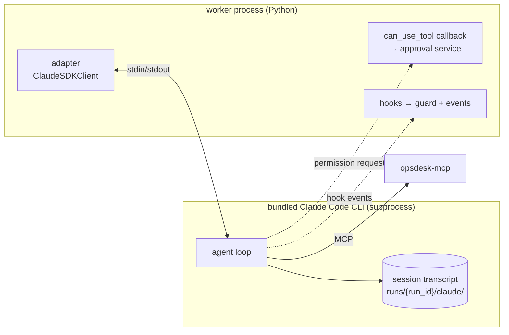
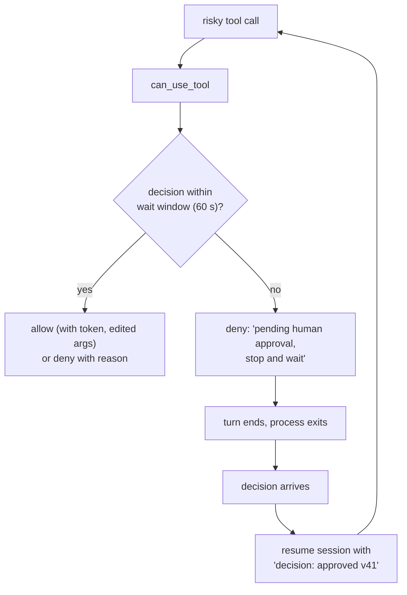

# F11: Claude Agent SDK Agent

| Milestone | Priority | Depends on | Effort | Unblocks |
|---|---|---|---|---|
| M3 | Must | F6, F7 | 6 h | F12, F14 |

**Goal:** The Triage Agent on the Claude Agent SDK, restricted to the MCP tools only:
- a `can_use_tool` callback that asks the approval service
- `PreToolUse` / `PostToolUse` hooks running the guard
- session resume after a crash

## Diagram: process model



## Diagram: long approval waits (deny-and-resume pattern)



In evals the scripted approver answers within the window. The deny-and-resume path is tested with a
delayed approver and exercised in E5.

## Deliverables / files
```
agents/claude_agent/adapter.py     # options, run/resume, events
agents/claude_agent/permissions.py # can_use_tool → approval service; edit support via updated input
agents/claude_agent/hooks.py       # guard + events
agents/claude_agent/options.py     # allowed tools = mcp__opsdesk__*, mcp__memory__*; no built-ins; no settings files
```

## Tasks
- [ ] Options: only MCP tools allowed, built-in tools disallowed, no filesystem settings loaded ([ADR-017](../07-decisions.md))
- [ ] Per-run working directory; sessions in a custom Postgres `SessionStore` (immediate flush), so resume works after `SIGKILL` on any worker
- [ ] `can_use_tool`: approve / deny with message / allow with **updated input** (the edit case)
- [ ] Hooks: guard checks and normalized events; `max_turns`
- [ ] Deny-and-resume pattern for long waits
- [ ] Kill the whole process tree (psutil) on timeout or chaos
- [ ] DX diary

## Acceptance criteria
- A test fails if any built-in tool is available (schema snapshot)
- Golden stub tests (or a recorded session if stubbing the CLI is impractical) and dev smoke pass
- Resume after kill works from the per-run session directory

## Tests
- Permission callback unit tests; process-tree kill test; resume test

**Interview talking point:** *"The Claude Agent SDK runs a CLI subprocess and asks permission through a
callback, so long human waits needed a deny-and-resume pattern. That's the kind of framework difference
you only find by building the same agent more than once."*
