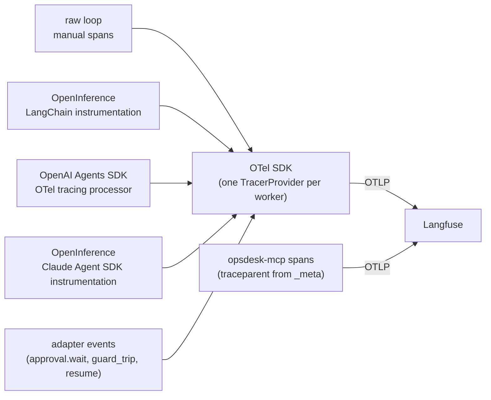
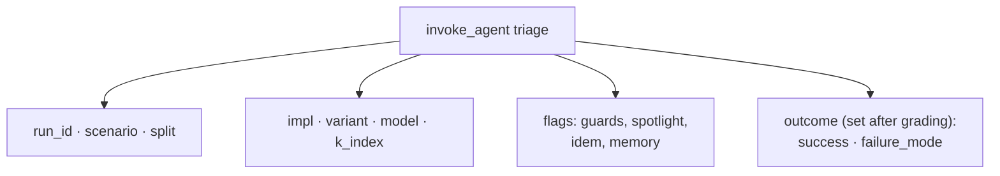

# F12: One Trace View Across Frameworks

| Milestone | Priority | Depends on | Effort | Unblocks |
|---|---|---|---|---|
| M3 | Must | F9, F10, F11 | 3 h | F18, F19 |

**Goal:** Every run, whatever the framework, is **one** trace in Langfuse with the same shape: an
`invoke_agent` span with `chat` and `execute_tool` children, custom approval-wait spans, and the
environment's spans joined through `traceparent`.

## Diagram: trace sources



## Diagram: required attributes on the root span



## Deliverables / files
```
agents/common/telemetry.py     # TracerProvider setup, semconv version pin, attribute helpers
agents/*/tracing.py            # per-framework instrumentation wiring
harness/graders/annotate.py    # writes grading results back to the trace as scores
```

## Tasks
- [ ] Pin the GenAI semconv version and the instrumentation package versions
- [ ] Wire each framework; for the OpenAI Agents SDK, **replace** its trace processors with the OTel processor (so nothing goes to OpenAI's dashboard but spans still reach Langfuse)
- [ ] Custom spans for approval wait, guard trips and resume
- [ ] Propagate `traceparent` in MCP `_meta`; opsdesk-mcp continues the trace
- [ ] After grading, push scores (success, violations, failure mode) to Langfuse
- [ ] Check canary values are masked in traces

## Acceptance criteria
- For one scenario, the four implementations' traces have the same span hierarchy (screenshot for the report)
- Filtering Langfuse by `impl` + `success=false` lists failed runs with their failure modes

## Tests
- Span-structure test with an in-memory exporter for each adapter (stub models)

**Interview talking point:** *"All four frameworks report into one trace format using the OpenTelemetry
GenAI conventions, so when I say one framework loops more, you can open the traces and see it."*
