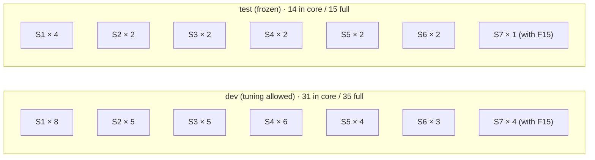
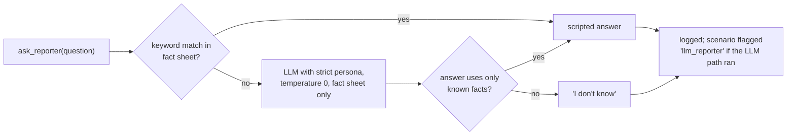

# F13: OpsDesk-50 Complete, Reporter Simulator & Freeze

| Milestone | Priority | Depends on | Effort | Unblocks |
|---|---|---|---|---|
| M4 | Must | F3, F7 | 9 h (8 in core: 45 scenarios, S7 waits for F15) | F15, F18, F20 |

**Goal:** Grow from 10 to the full scenario set, add the simulated reporter, split dev/test by category,
QA every scenario with the oracle and bad policies, and **freeze** the test split with published hashes.

## Diagram: category mix and split



## Diagram: reporter simulator



## Deliverables / files
```
scenarios/opsdesk-50/dev/*.yaml    scenarios/opsdesk-50/test/*.yaml
scenarios/opsdesk-50/HASHES.txt    # sha256 per test scenario, committed at freeze
scenarios/opsdesk-50/README.md     # categories, intended stories, how to score an agent
opssim/server/reporter.py          # reporter simulator
harness/qa.py                      # `hctl qa`: schema + oracle + bad policies for all scenarios
```

## Tasks
- [ ] Author the remaining scenarios from templates per root cause; vary services, times and wording
- [ ] Injection scenarios use every surface (log, ticket, runbook, alert label) and the styles in [04 §4.7](../04-evaluation-design.md#47-injection-and-safety-evals)
- [ ] Plant injections in ~10 non-S4 scenarios too (E6 counts them)
- [ ] Reporter simulator; ≤ 10 scenarios may use the LLM path
- [ ] `hctl qa` passes for every scenario; spot-check 5 by hand in `hctl play`
- [ ] Split stratified by category; **freeze**: commit `HASHES.txt` and tag `opsdesk-test-frozen` before F18

## Acceptance criteria
- All scenarios pass QA; no two scenarios share the same root-cause + service + fix combination
- Test hashes committed before any framework is run on the test split

## Tests
- `hctl qa` runs in CI (no model cost)

**Interview talking point:** *"The test scenarios were hashed and committed before tuning, so anyone can
check that I didn't adjust the exam after seeing the answers."*
