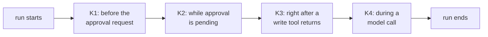
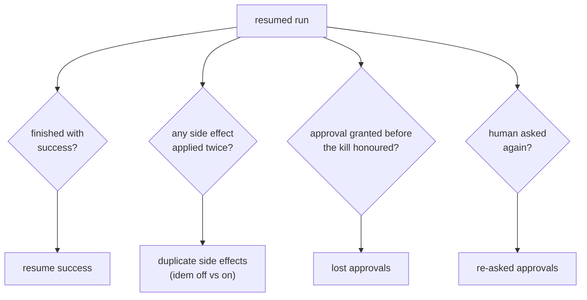

# F14: Chaos Mode & Idempotency (E5)

| Milestone | Priority | Depends on | Effort | Unblocks |
|---|---|---|---|---|
| M4 | Must | F9, F10, F11 | 6.5 h | F18, F22 |

**Goal:** Kill agent runs at chosen risky moments, resume them, and measure whether each implementation
finishes correctly without doing anything twice, with idempotency keys off and on.

## Diagram: kill points



The chaos injector watches the event stream and sends `SIGKILL` to the worker's process tree when the
chosen kill point is reached. Then it starts a new worker with `resume(run_id)`.

## Diagram: what is measured per resumed run



## Deliverables / files
```
harness/chaos/injector.py     # kill-point detection from events, psutil tree kill, restart
harness/chaos/metrics.py      # resume success, duplicates, lost/re-asked approvals
experiments/e5_chaos.yaml     # 20 S1/S5 scenarios × K1–K4 × idem off/on × 4 impls
reports/e5-crash-resume.md
```

## Tasks
- [ ] Kill-point triggers from normalized events (framework-independent)
- [ ] Resume path per adapter (already built in F6, F9–F11); a run that can't resume is `resume_failed`, not `infra_error`
- [ ] Duplicate detection from the action log (same tool + args applied twice, or deduplicated)
- [ ] Record each framework's checkpoint timing around tool calls (explains duplicates)
- [ ] LangGraph in both `sync` and `async` (default) durability modes; compare duplicates and resume success *(market review)*
- [ ] Claude Agent SDK resumes from the Postgres `SessionStore`; record the flush setting *(market review)*
- [ ] Run E5 on the cheap model first; then the main model for the report
- [ ] Write up the results table + one trace per framework showing its behaviour at K3

## Acceptance criteria
- E5 table: impl × kill point × idem {off, on} → resume success, duplicates, lost approvals, re-asks
- Every duplicate in "idem off" is explained by the checkpoint timing notes

## Tests
- Injector unit tests with a fake event stream; process-tree kill test

**Interview talking point:** *"I killed agents right after a write succeeded and before their state was
saved. Without idempotency keys, __ of the frameworks repeated the action on resume; with content-derived
keys, __ did. The keys come from the action itself, because tool-call IDs change when the model is asked
again."* (Fill in with your real numbers.)
