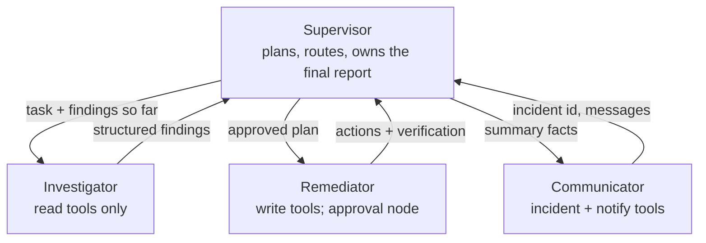

# F16: LangGraph Multi-Agent Variant (E7)

| Milestone | Priority | Depends on | Effort | Unblocks |
|---|---|---|---|---|
| M4 | Should · **deferred in the core plan** | F9 | 4 h | E7 in F18 |

**Goal:** The same task as a supervisor with three specialists, compared with the single agent on the same
scenarios, to answer "does multi-agent help here?" with numbers.

## Diagram: supervisor and specialists



**Design rules** (from MAST failure modes):
- Specialists exchange **structured** messages (findings schema), not free text.
- Only the Remediator holds write tools. This is least privilege, and it also cuts the injection blast radius.
- One owner of the final report (the supervisor).
- The total budget is shared across agents, so multi-agent can't win just by spending more.

## Deliverables / files
```
agents/langgraph_agent/multi/graph.py      # supervisor + subgraphs
agents/langgraph_agent/multi/schemas.py    # findings, plan, action results
experiments/e7_multi_agent.yaml
```

## Tasks
- [ ] Subgraphs per specialist with tool subsets; supervisor routing
- [ ] Shared budget across agents via the guard lib
- [ ] Specialist prompts derived from the frozen spec (recorded as a deliberate, logged exception)
- [ ] E7: single vs multi on all scenarios × k=4; compare pass^k, tokens, failure modes

## Acceptance criteria
- Golden stub tests for routing; dev smoke passes
- E7 table with pass^k, cost and the failure-mode mix for both variants

## Tests
- Routing unit tests with stub models; tool-subset enforcement test (Investigator can't call write tools)

**Interview talking point:** *"I measured single vs multi-agent on the same scenarios with a shared
budget. The answer depended on __, and the multi-agent version cost __× the tokens."* (Fill in.)
