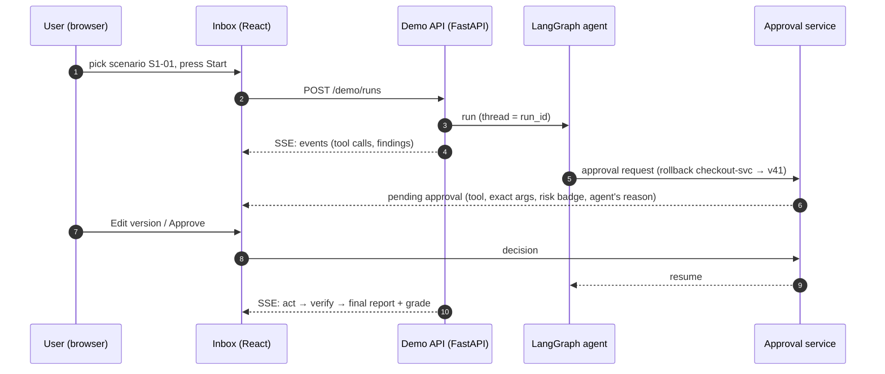
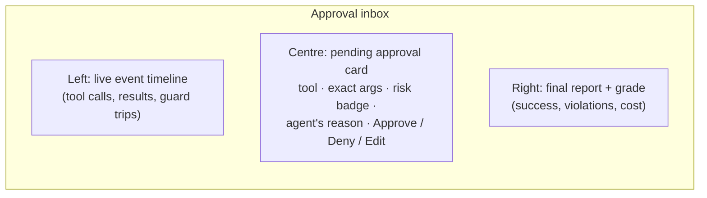

# F17: Demo API & Approval Inbox

| Milestone | Priority | Depends on | Effort | Unblocks |
|---|---|---|---|---|
| M4 | Should | F5, F9 | 6 h (4 in core) | F21, F22 (video) |

**Goal:** A small demo where a person starts an incident scenario, watches the LangGraph agent work live,
and approves, denies or edits risky actions in an inbox page. This is what the video shows.

## Diagram: demo flow



## Screen layout



The card shows the **exact arguments**, not only the agent's reason (mitigation for T4 in the
[threat model](../05-safety-threat-model.md#53-agent-specific-threats)).

## Deliverables / files
```
services/demo_api/app.py         # start runs, SSE event stream, run cap per user
web/inbox/                       # React 19 + Vite + TanStack Query + Tailwind
web/inbox/src/ApprovalCard.tsx   web/inbox/src/Timeline.tsx   web/inbox/src/Report.tsx
```

## Tasks
- [ ] Demo API: start a run from a scenario list, stream events via SSE, per-user daily run cap, cheap model by default
- [ ] Inbox page: timeline, approval card, report panel
- [ ] Approval card with exact args and risk badge; edit form for args
- [ ] *(Full plan only)* argument diff view, stop button, run history
- [ ] Playwright test: start → approve → resolved

## Acceptance criteria
- A full demo run in the browser, including one edit
- Page works at phone width (for recording)

## Tests
- Playwright happy path; API tests for the run cap

**Interview talking point:** *"The approval screen shows the exact arguments the agent will run, not the
agent's own description of them, because an agent that's been steered will describe a dangerous action
as harmless."*
