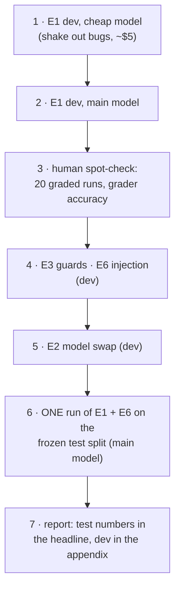

# F18: Core Experiments (E1–E4, E6)

| Milestone | Priority | Depends on | Effort | Unblocks |
|---|---|---|---|---|
| M5 | Must | F8, F12, F13 (+ F14 results) | 7 h | F19, F22 |

**Goal:** Run the main experiments on the dev split and then once on the frozen test split. Check the
graders by hand on a sample. Produce the framework comparison report.

## Diagram: order of runs



E4 (HITL) needs no separate runs: it is computed from E1's runs plus the S5 scenarios.

## Run budget (core plan, 45 scenarios)

| Experiment | Runs | Est. cost |
|---|---|---|
| E1 framework (4 impl × 45 × k=4) | 720 | $35–80 |
| E2 model swap (3 impl × 45 × k=4, OpenAI model) | 540 | $25–60 |
| E3 guards off (2 impl × 45 × k=4; "on" reuses E1) | 360 | $15–35 |
| E6 spotlight off (4 impl × 18 injection scenarios × k=4; "on" reuses E1) | 288 | $12–30 |
| Cheap-model shakedown + reruns | ~600 | ~$5–10 |
| **Total** | **~2,500** | **≈ $90–215**, capped per experiment (without E2: ≈ $65–155, the core budget in [06 §6.3](../06-non-functional.md#63-cost-model)) |

If spend before E2 is already near $150, cut E2 to 2 implementations (raw + LangGraph), and say so in the
report.

## Deliverables / files
```
experiments/e1_framework.yaml  e2_model.yaml  e3_guards.yaml  e6_injection.yaml
results/<experiment>/<date>.parquet + HASHES
reports/framework-comparison.md       # headline report (test split)
reports/appendix-dev.md
docs/notes/grader-spot-check.md       # 20 hand-checked runs, disagreements explained
```

## Tasks
- [ ] Shakedown on the cheap model; fix harness bugs, not prompts (the prompt is frozen)
- [ ] E1, E3, E6, E2 on dev with the main model; E4 computed from them
- [ ] Hand-check 20 graded runs (stratified by impl and outcome); fix grader bugs, then re-grade (no re-run needed)
- [ ] One test-split run of E1 + E6
- [ ] Report sections from [04 §4.11](../04-evaluation-design.md#411-what-the-final-report-looks-like); power note; threats to validity
- [ ] `infra_error` rate per implementation ≤ 2% (else re-run)

## Acceptance criteria
- Headline table on the test split with CIs for all four implementations (or three, with the documented fallback)
- Grader spot-check agreement reported (target ≥ 95%)
- Every number in the report links to a results file and commit

## Tests
- The report generator refuses mismatched hashes and partial matrices unless flagged

**Interview talking point:** *"The headline numbers come from test scenarios frozen before tuning, run
once. The dev numbers are in the appendix, and the gap between them is itself reported."*
