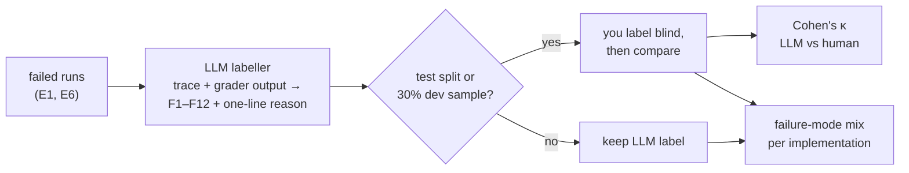
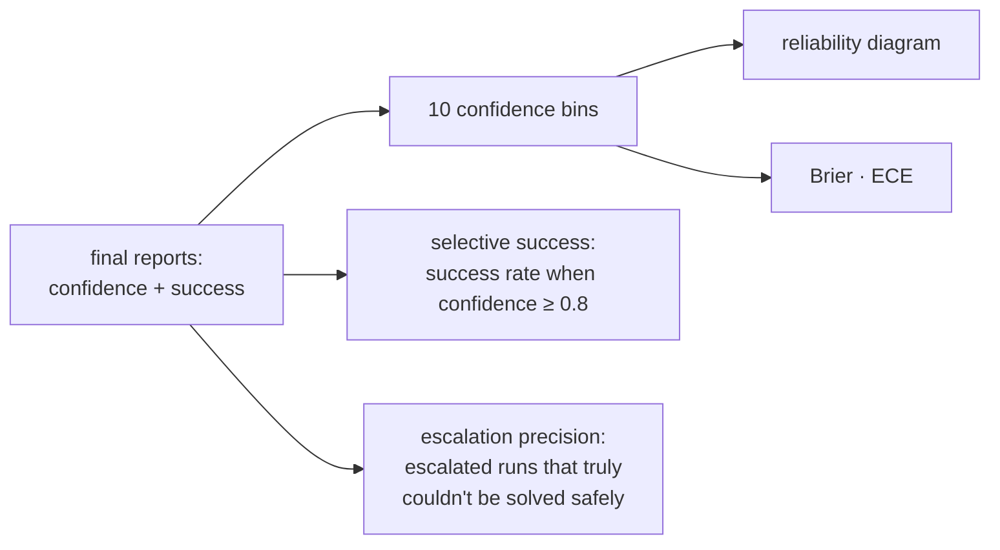

# F19: Failure Taxonomy, Calibration & Robustness (E9)

| Milestone | Priority | Depends on | Effort | Unblocks |
|---|---|---|---|---|
| M5 | Must | F18 | 5.5 h (E9 in core since the market review) | F22 |

**Goal:** Explain *why* runs failed and whether the agent *knew* it was likely to fail:
- a failure-mode label on every failed run (LLM-proposed, human-checked)
- calibration of the agent's confidence
- a robustness sweep (paraphrases and fault rates) and the **paraphrase noise floor** used to judge framework differences

## Diagram: labelling pipeline



## Diagram: calibration read-out



## Deliverables / files
```
harness/taxonomy/labeller.py        # LLM labeller (other model family than the run)
harness/taxonomy/review.py          # blind human labelling CLI, κ computation
harness/stats/calibration.py        # (from F8) used here per implementation
experiments/e9_robustness.yaml      # core since the market review
reports/failure-taxonomy.md
```

## Tasks
- [ ] Labeller prompt with the F1–F12 definitions and examples ([04 §4.8](../04-evaluation-design.md#48-failure-taxonomy))
- [ ] Blind human review CLI; κ; disagreements discussed in the report
- [ ] Failure-mode mix chart per implementation; 3 annotated trace examples
- [ ] Calibration per implementation; **AUROC** (discrimination); selective success; escalation precision
- [ ] E9: 20 scenarios × 2 paraphrases; fault rate 0 / 10 / 25% *(core since the market review)*
- [ ] Paraphrase noise floor per implementation; mark E1 differences smaller than it as "within noise"

## Acceptance criteria
- Every failed test-split run labelled by you; κ reported
- Calibration plot per implementation in the report

## Tests
- κ and ECE functions tested on known examples

**Interview talking point:** *"Beyond 'framework A scored higher', I can say why the others failed:
mostly __ for one, __ for another. I can also say whether each agent knew when it was about to be
wrong."* (Fill in.)
