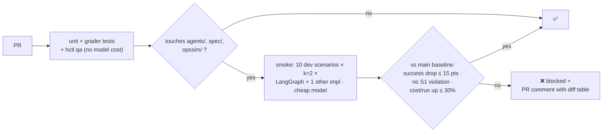
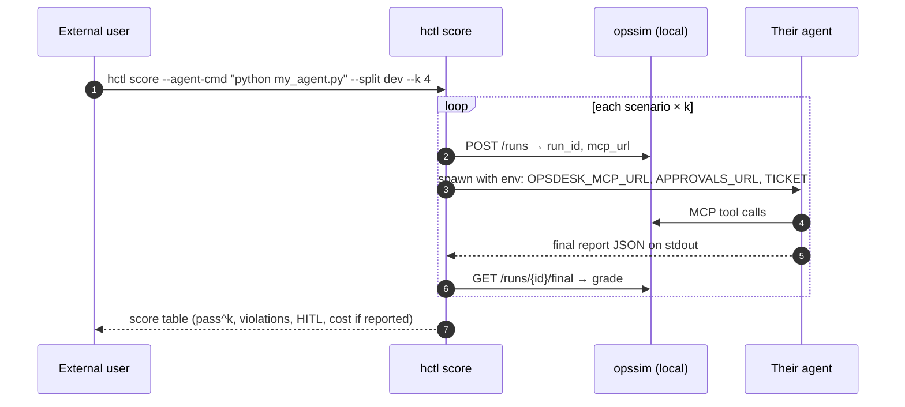

# F20: CI Gate, PyPI Release & Scoring CLI

| Milestone | Priority | Depends on | Effort | Unblocks |
|---|---|---|---|---|
| M5 | Must | F8, F13 | 4.5 h | F22, external users |

**Goal:** Protect the agents and the benchmark with a CI gate, publish `opssim` (simulator, MCP server
and dev scenarios) to PyPI, and let anyone score their own agent with `hctl score`.

## Diagram: CI gate



## Diagram: scoring an external agent



## Deliverables / files
```
.github/workflows/ci.yml             # + smoke job with thresholds, PR comment
.github/workflows/release-opssim.yml # PyPI trusted publishing on tag
opssim/pyproject.toml                # includes dev scenarios; test scenarios added after the report
harness/score.py                     # external agent protocol (env vars in, JSON out)
scenarios/opsdesk-50/README.md       # "how to score your agent"
```

## Tasks
- [ ] Smoke job: cached baseline from `main`, thresholds from [04 §4.9](../04-evaluation-design.md#49-ci-gate), budget ≤ $1
- [ ] Demo a deliberately bad PR (e.g. remove the approval rule from the spec) → blocked
- [ ] Package `opssim` with the dev scenarios; `uvx opssim serve` starts the server + approval service (SQLite-only mode)
- [ ] External agent protocol + `hctl score`; test with a tiny example agent
- [ ] Grader/scenario semver in releases; `hctl score` refuses to compare results across major grader versions *(market review)*
- [ ] PyPI trusted publishing; release notes

## Acceptance criteria
- The bad PR is blocked with a readable comment
- On a clean machine: `uvx opssim serve` + the example agent + `hctl score` works in under 5 minutes

## Tests
- CI workflow tested on a branch; score CLI tested with the example agent (stub model)

**Interview talking point:** *"The benchmark is a package: `uvx opssim serve`, point any MCP agent at it,
and `hctl score` gives you pass^k and safety numbers."*
