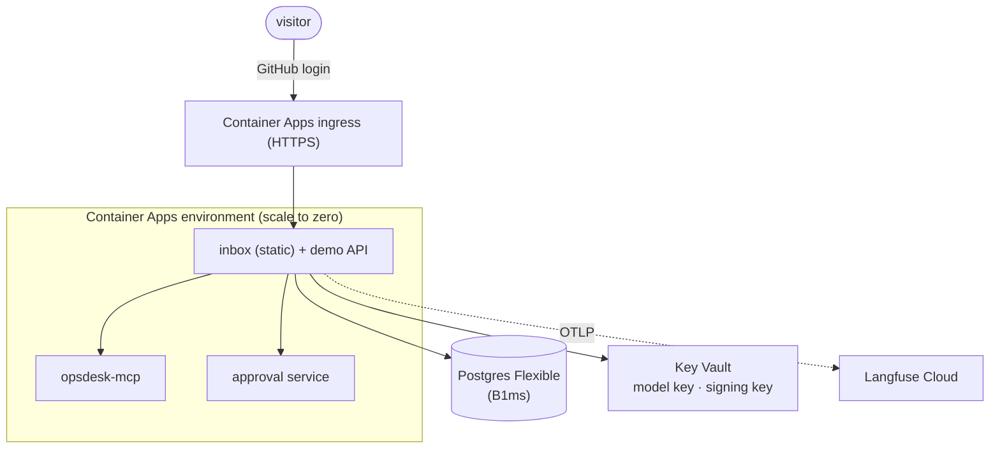

# F21: Azure Demo Deployment

| Milestone | Priority | Depends on | Effort | Unblocks |
|---|---|---|---|---|
| M6 | Could · **deferred in the core plan** | F17 | 3.5 h | Public demo link |

**Goal:** Host the demo (demo API, inbox, opsdesk-mcp, approval service) on Azure Container Apps,
reusing the Terraform modules from Projects 1 and 2, with strict cost limits.

## Diagram: deployment



## Deliverables / files
```
infra/terraform/project3/main.tf     # uses modules/container_app, modules/postgres, modules/keyvault
infra/terraform/project3/variables.tf
.github/workflows/deploy-demo.yml
```

## Tasks
- [ ] Terraform from the existing modules; managed identity for Key Vault
- [ ] Demo limits: GitHub login, 3 runs per user per day, cheap model, max 3 concurrent runs, auto-stop after 10 minutes
- [ ] Budget alert on the resource group
- [ ] Health checks; smoke test after deploy

## Acceptance criteria
- A visitor can log in, run a scenario and approve an action
- Idle cost near zero (scale to zero); budget alert configured

## Tests
- Post-deploy smoke test (one stub-model run)

**Interview talking point:** *"Every run on the public demo is simulated and capped, so a stranger can
try an approval-gated ops agent without any real system or real budget at risk."*
