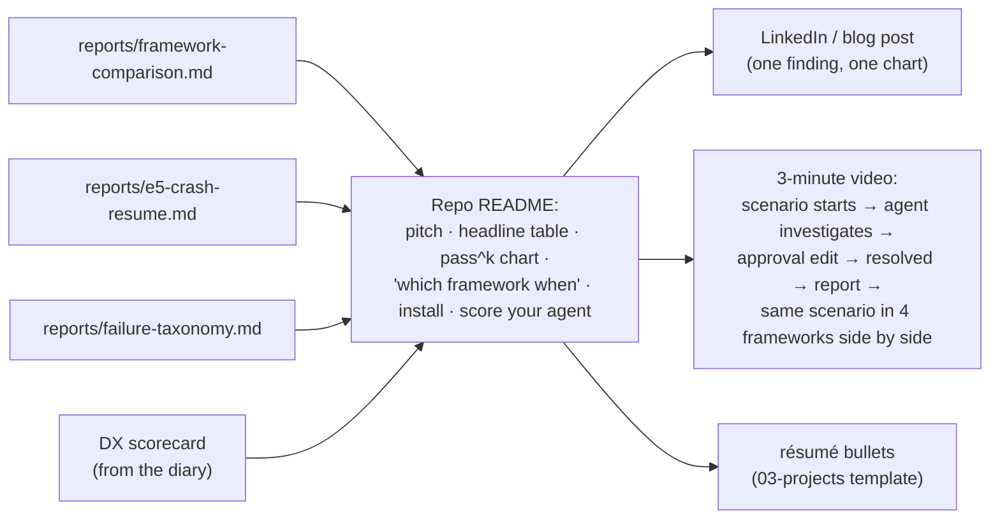
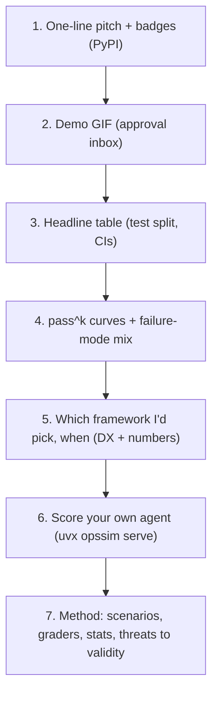

# F22: Report, Blog & Video

| Milestone | Priority | Depends on | Effort | Unblocks |
|---|---|---|---|---|
| M6 | Must | F18, F19, F20 (F21 if built) | 4 h | Job applications |

**Goal:** Turn the results into things a hiring manager reads in five minutes: a strong README, the
framework comparison report, the DX scorecard, a post and a video.

## Diagram: what gets published where

## Diagram: README structure

## Tasks
- [ ] Final report on the release commit; results hashes in the header
- [ ] DX scorecard table from the diary ([04 §4.10](../04-evaluation-design.md#410-developer-experience-dx-scorecard))
- [ ] "Which framework when" section: one paragraph per implementation, citing numbers
- [ ] README + GIF; blog/LinkedIn post with **one** finding and one chart
- [ ] 3-minute video (local recording if F21 is deferred)
- [ ] Update the résumé bullet template in `03-projects.md` with real numbers
- [ ] Publish the test scenarios with the report (hashes already committed, [ADR-016](../07-decisions.md))

## Acceptance criteria
- Every number in the README links to its report, results file and commit
- A reader can score their own agent from the README in under 5 minutes

**Interview talking point:** *"The report says where the comparison is weak: one engineer, a simulated
environment, two model families, and differences below about 8 points that it can't detect. Stating the
limits is why people trust the numbers."*
