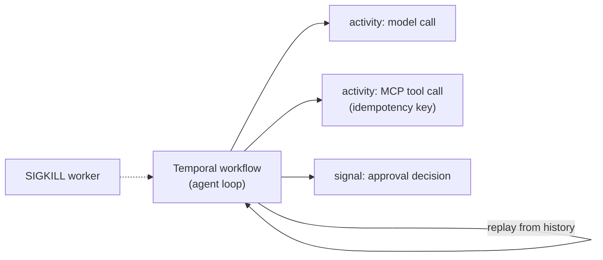

# F23–F25: Optional Extensions

Only after M6. Each extension is independent and adds one finding to the report.

## F23: Microsoft Agent Framework (fifth implementation)

| Priority | Depends on | Effort |
|---|---|---|
| Could | F9–F12 | 6 h |

- **Why:** Azure-aligned; GA with long-term support since April 2026. It adds weight to your AI-102 /
  Azure profile.
- **What:** An agent with MCP tools and the framework's approval requests and checkpointing. It joins E1 on
  the same Claude model if a supported connector exists; otherwise it joins E2 only.
- **Done when:** It passes the same bar as the other frameworks (golden stubs, dev smoke, HITL checks)
  and appears in the headline table.

## F24: Temporal durable variant

| Priority | Depends on | Effort |
|---|---|---|
| Could | F10, F14 | 4 h |

- **Why:** The Temporal + OpenAI Agents SDK integration has been GA since March 2026. The variant answers
  "what does a durable-execution engine add over framework checkpoints?"
- **What:** The OpenAI SDK agent's model and tool calls as Temporal activities, with the approval as a
  signal. Re-run E5 for this variant.

- **Done when:** An E5 row for "OpenAI SDK + Temporal" sits next to the plain OpenAI SDK row.

## F25: Adaptive injection attacks

| Priority | Depends on | Effort |
|---|---|---|
| Could | F18 | 1.5 h on top of the slim core version |

- **Why:** Static attack strings understate risk. 2026 research shows adaptive attackers beat most
  defences (see the [Project 2 market review](../../../02-mcp-hub/docs/12-market-alignment-review.md)).
- **What:** An attacker model sees the agent's response to a failed injection and rewrites it, up to 5
  attempts per S4 case. Report static ASR and adaptive ASR separately, with spotlighting off and on.
- **Core since the market review:** a slim version (3 rewrites, best and worst implementation, spotlighting on) is in F18. This extension adds 5 rewrites, all implementations and spotlighting off.
- **Done when:** The E6 table has an "adaptive" column and the report discusses which layer (approval
  backstop vs. spotlighting) held.
