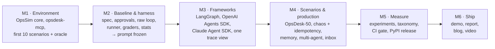
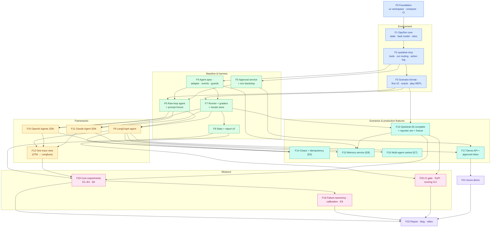
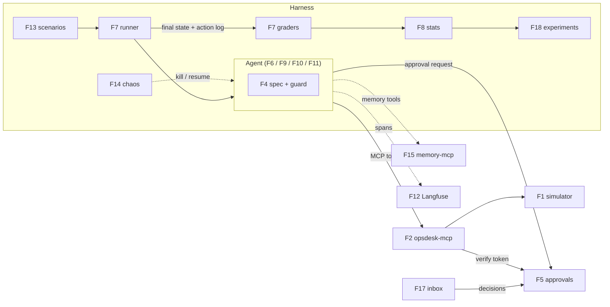
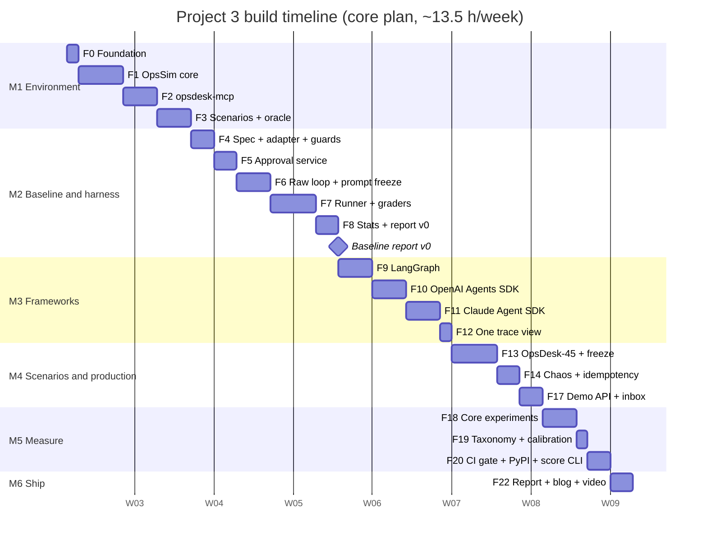

# 9. Build Plan: Feature by Feature

This plan splits Project 3 into **23 features** (F0–F22), grouped into **6 milestones**, plus 3 optional
features (F23–F25). Every feature has its own page with diagrams, files, tasks, acceptance criteria, tests,
an estimate and an interview talking point.

## 9.1 Build strategy: environment first, then the baseline and the harness, then the frameworks

Six rules:
1. **The environment and graders come before any agent framework.** If the oracle can't solve a scenario
   or a scripted bad policy isn't caught, no agent result means anything.
2. **Baseline first, prompt frozen before the frameworks** ([ADR-019](../07-decisions.md)). The raw loop is
   built and the shared prompt is tuned on it. The frameworks then start from the frozen spec.
3. **Each framework must pass the same bar.** Before it enters an experiment, it must pass the 3 golden
   stub-model scenarios, the dev smoke set, and the HITL checks.
4. **Record developer experience as you go.** A build diary (`docs/notes/dx-diary.md`) logs hours and
   pain points for each implementation. The DX scorecard can't be reconstructed afterwards.
5. **The cost cap is always on.** Every `hctl run` has `--max-cost`. Dev iterations use the cheap model
   tier.
6. **Each feature ends with a PR, green CI and a `CHANGELOG.md` entry.** From M2 on, the grader tests
   (oracle passes, bad policies fail) must stay green.

## 9.2 Master diagram: how the features connect

Arrows mean **"is required by"** (build the source first). Colours show milestones.

**Legend:** blue = M1 Environment · green = M2 Baseline & harness · amber = M3 Frameworks ·
teal = M4 Scenarios & production · pink = M5 Measure · purple = M6 Ship.
**F15, F16 and F21 are deferred in the chosen core plan** (§9.5). They stay in the diagram so their
dependencies are clear when they're added.

## 9.3 Runtime integration map: what flows between features

## 9.4 Feature index

| ID | Feature | Milestone | Priority | Depends on | Effort (h) | Page |
|---|---|---|---|---|---|---|
| F0 | Project foundation | M1 | Must | — | 3.5 | [F00](F00-foundation.md) |
| F1 | OpsSim core | M1 | Must | F0 | 8 | [F01](F01-opssim-core.md) |
| F2 | opsdesk-mcp server | M1 | Must | F1 | 6 | [F02](F02-opsdesk-mcp.md) |
| F3 | Scenario format, first 10, oracle & play REPL | M1 | Must | F2 | 6 | [F03](F03-scenarios-oracle.md) |
| F4 | Agent spec, adapter interface, events & guards | M2 | Must | F2 | 5 | [F04](F04-spec-adapter-guards.md) |
| F5 | Approval service & environment backstop | M2 | Must | F2 | 4 | [F05](F05-approval-service.md) |
| F6 | Raw-loop agent & prompt freeze | M2 | Must | F3, F4, F5 | 6 | [F06](F06-raw-loop-agent.md) |
| F7 | Runner, graders & results store | M2 | Must | F3, F4 | 8 | [F07](F07-runner-graders.md) |
| F8 | Statistics & report v0 | M2 | Must | F7 | 5 | [F08](F08-stats-report.md) |
| F9 | LangGraph agent | M3 | Must | F6, F7 | 7 | [F09](F09-langgraph-agent.md) |
| F10 | OpenAI Agents SDK agent | M3 | Must | F6, F7 | 6 | [F10](F10-openai-agents-sdk.md) |
| F11 | Claude Agent SDK agent | M3 | Must | F6, F7 | 6 | [F11](F11-claude-agent-sdk.md) |
| F12 | One trace view across frameworks | M3 | Must | F9, F10, F11 | 3 | [F12](F12-tracing.md) |
| F13 | OpsDesk-50 complete, reporter simulator & freeze | M4 | Must | F3, F7 | 9 (8 in core) | [F13](F13-opsdesk-50.md) |
| F14 | Chaos mode & idempotency (E5) | M4 | Must | F9, F10, F11 | 5 | [F14](F14-chaos-idempotency.md) |
| F15 | Memory service & memory scenarios (E8) | M4 | Should · **deferred** | F4, F9, F13 | 6 | [F15](F15-memory.md) |
| F16 | LangGraph multi-agent variant (E7) | M4 | Should · **deferred** | F9 | 4 | [F16](F16-multi-agent.md) |
| F17 | Demo API & approval inbox | M4 | Should | F5, F9 | 6 (4 in core) | [F17](F17-demo-inbox.md) |
| F18 | Core experiments (E1–E4, E6) | M5 | Must | F8, F12, F13 | 7 | [F18](F18-core-experiments.md) |
| F19 | Failure taxonomy, calibration & robustness (E9) | M5 | Must | F18 | 5 (3 in core) | [F19](F19-taxonomy-calibration.md) |
| F20 | CI gate, PyPI release & scoring CLI | M5 | Must | F8, F13 | 4 | [F20](F20-ci-release.md) |
| F21 | Azure demo deployment | M6 | Could · **deferred** | F17 | 3.5 | [F21](F21-azure-demo.md) |
| F22 | Report, blog & video | M6 | Must | F18, F19, F20 | 4 | [F22](F22-report-blog.md) |
| | **Total: full plan / core plan (chosen)** | | | | **~127 h / ~108 h** | |

**Optional features** (not in either total):

| ID | Feature | Effort (h) | Page |
|---|---|---|---|
| F23 | Microsoft Agent Framework (fifth implementation) | 6 | [F23](F23-optional-extensions.md#f23-microsoft-agent-framework-fifth-implementation) |
| F24 | Temporal durable variant of the OpenAI SDK agent | 4 | [F23](F23-optional-extensions.md#f24-temporal-durable-variant) |
| F25 | Adaptive injection attacks | 3 | [F23](F23-optional-extensions.md#f25-adaptive-injection-attacks) |

## 9.5 Timeline: Option B (core plan) chosen

The roadmap originally had **4 weeks for Projects 3 and 4 together** (weeks 16–19). The design is larger, as it was
for Projects 1 and 2:

| Option | Scope | Effort | Weeks at ~13.5 h/week |
|---|---|---|---|
| A. Full plan | All 23 features | ~127 h | ~9.5 |
| **B. Core plan ✅ chosen** | Everything that makes the comparison credible. **Deferred:** F15 memory (S7 scenarios wait with it, so 45 scenarios at first), F16 multi-agent, F21 Azure demo (the demo runs locally and is recorded). **Slimmed:** F17 inbox (one page, no diff view polish), F19 without E9 | **~108 h** | **8** |
| C. Lean | B minus the OpenAI Agents SDK (three implementations: raw, LangGraph, Claude Agent SDK), 40 scenarios, CLI approvals only (no inbox) | ~96 h | ~7 |

**Why B:** it keeps the four-way comparison, pass^k with CIs, HITL, crash/resume, injection and the public
benchmark, which together are the headline. Memory and multi-agent are good findings, but not the
headline, and they can be added while you interview (~12 h). **C** loses the most-asked vendor SDK in
JDs, and that's the gap this project exists to close.

**Roadmap impact (applied):** Projects 3 and 4 had 4 weeks. P3 now takes 8 weeks (roadmap weeks 16–23)
and P4 (A2A) follows as its own 2-week block (weeks 24–25). That adds **6 weeks**, taking the
[roadmap](../../../../04-roadmap.md) from ~31 to **~37 weeks (about 8.5 months)**. By then you'll already be applying (from week 15), so a longer P3 is not a
bottleneck for starting the job search. *(Later, Project 4's own build plan grew it to 4 weeks, so the roadmap is
now ~39 weeks.)*

**Core plan, week by week** (roadmap weeks 16–23)

| Week | Roadmap week | Milestone | Features | Exit check |
|---|---|---|---|---|
| 1 | 16 | M1 | F0 Foundation · F1 OpsSim core · F2 (start) | Seeded ShopLite; bad deploy → rollback → recovery works in unit tests |
| 2 | 17 | M1 → M2 | F2 (finish) · F3 scenarios + oracle · F4 spec + guards | **Oracle solves 10 scenarios through MCP**; bad policies fail the right checks |
| 3 | 18 | M2 | F5 approvals · F6 raw loop · F7 runner + graders (start) | Raw loop resolves a scenario with an approval; backstop blocks an unapproved rollback |
| 4 | 19 | M2 → M3 | F7 (finish) · F8 stats + report v0 · **prompt freeze** · F9 (start) | **Baseline report v0** (raw loop, 10 dev scenarios × k=4, with CIs) |
| 5 | 20 | M3 | F9 LangGraph · F10 OpenAI Agents SDK | Both pass golden stub tests + dev smoke with HITL |
| 6 | 21 | M3 → M4 | F11 Claude Agent SDK · F12 tracing · F13 scenarios (start) | Four implementations in one Langfuse view |
| 7 | 22 | M4 | F13 (finish, test split frozen) · F14 chaos · F17 inbox | OpsDesk-45 frozen with hashes; chaos results for 3 implementations |
| 8 | 23 | M5 → M6 | F18 experiments · F19 taxonomy · F20 CI + PyPI · F22 report + post | Framework comparison report on the test split; `opssim` on PyPI; post published |

*(Dates are illustrative: Project 3 starts after Project 2's 8 weeks. One "d" is one working session of
about 2–2.5 hours.)*

**Deferred in B (add later, ~19 h)**

| Feature | Effort | Value when added |
|---|---|---|
| F15 Memory service + S7 scenarios (E8) | 6 h | Memory-poisoning finding; OpsDesk grows to 50 |
| F16 LangGraph multi-agent variant (E7) | 4 h | Evidence-based "single vs multi-agent" answer |
| F21 Azure demo | 3.5 h | Public, clickable demo |
| F17 inbox polish (argument diff, live event stream) | 2 h | Nicer demo and T4 mitigation visible |
| F19 robustness sweep (E9) | 2 h | Robustness dimension fully covered |
| F13 memory scenarios' authoring (inside F15) | 1 h | — |

## 9.6 Milestone exit criteria

| Milestone | Done when |
|---|---|
| **M1 Environment** | `opsdesk-mcp` serves ~20 tools per run ID; per-run isolation holds under 8 parallel runs; the **oracle policy passes all 10 first scenarios** and each scripted bad policy fails the expected predicates; `hctl play` lets you solve a scenario by hand. |
| **M2 Baseline & harness** | The raw loop resolves scenarios with approvals and backstop checks; the runner executes a matrix with k repeats and a cost cap; graders + stats produce **report v0** with CIs; spec version frozen and tagged. |
| **M3 Frameworks** | LangGraph, OpenAI Agents SDK and Claude Agent SDK each pass the golden stub tests, the dev smoke set and HITL checks (approve, deny, edit); all four appear in one Langfuse view with the same span structure. |
| **M4 Scenarios & production** | OpsDesk (45 in core, 50 full) authored, QA'd by oracle/bad policies, **test split frozen with hashes**; chaos experiment E5 complete; approval inbox works with a running agent. |
| **M5 Measure** | E1–E4 and E6 complete on dev and test splits; failure taxonomy labelled with human-checked agreement; CI gate blocks a deliberately bad PR; `opssim` on PyPI and `hctl score` works for an external agent. |
| **M6 Ship** | Framework comparison report committed with results hashes; README with headline table; blog/LinkedIn post; 3-minute video. |

## 9.7 Definition of done (every feature)

- [ ] Code merged via PR; CI green (lint, types, tests)
- [ ] Unit tests for pure logic; integration test for anything touching the simulator, Postgres or a model SDK
      (model SDK tests use **stub models** unless marked `@live`)
- [ ] From M2: grader regression tests (oracle passes, bad policies fail) still green
- [ ] New agent behaviour emits the normalized events (§3.6 of the LLD) and OTel spans
- [ ] Cost of any live runs recorded in the DX diary
- [ ] Docs updated (this plan's checkboxes, the setup guide, `CHANGELOG.md`)

## 9.8 Risk register

| Risk | Impact | Mitigation |
|---|---|---|
| OpenAI Agents SDK + LiteLLM with Claude is unreliable (beta adapter) | E1 loses one implementation | Spike in F10's first hour; fallback: OpenAI SDK only in E2, stated in the report ([08 §8.6](../08-tech-stack.md#86-things-to-verify-in-the-first-week-of-building)) |
| Claude Agent SDK approval/resume model doesn't fit long waits | E4/E5 results for it are partial | Deny-and-resume pattern; record as a DX finding, not a failure to hide |
| Simulator feels artificial, so agents behave oddly | Results don't generalize | Realistic logs and runbooks; "intended story" review per scenario; `hctl play` by hand |
| Graders wrong (false passes/fails) | Every number is wrong | Oracle + bad-policy tests are CI-blocking; human spot-check of 20 graded runs per experiment |
| Prompt accidentally tuned toward one framework | Biased comparison | Freeze on the raw loop (ADR-019); framework-specific prompt changes forbidden and logged |
| Model API cost | Budget | Cost cap per run and per experiment; cheap models for dev; prompt caching |
| Provider rate limits slow the matrix | Timeline | Per-provider limiter; run overnight; lower parallelism |
| Model version changes mid-experiment | Mixed results | Pin dated IDs; record returned model ID; re-run baseline if it changes |
| Scope creep (more frameworks, real Kubernetes, fancier UI) | Timeline | Optional features F23–F25 only after M6; out-of-scope list in [01 §1.10](../01-requirements.md#110-scope) is binding |
| Plan longer than the roadmap assumed | Later projects slip | **Option B chosen** (8 weeks); roadmap updated; deferred features added only while interviewing |
