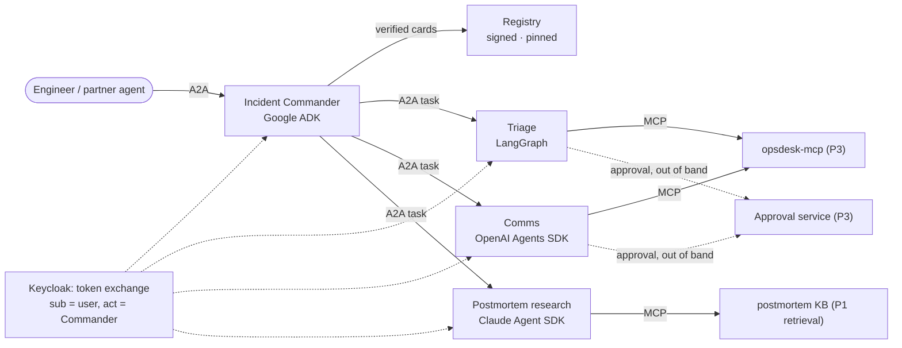

# Project 4: A2A Agent Mesh

> Four agents from **four frameworks** (Google ADK, LangGraph, OpenAI Agents SDK, Claude Agent SDK)
> handle production incidents together over **A2A 1.0**. The project shows signed and pinned Agent Cards,
> per-hop token exchange, human approvals that cross agent boundaries without leaking credentials,
> long-running tasks that survive restarts, and a **measured comparison of MCP vs A2A**.

**Target roles:** Agent Engineer (primary)
**Gaps it closes:** A2A protocol (1.0), cross-framework interop, Google ADK, agent identity and
delegation security, long-running task patterns, a numbers-backed "MCP vs A2A" answer
**Status:** 🟡 System design and tech stack done (no code yet). Build plan and setup guide come next.
**Builds on:** [Project 3](../03-agent-reliability-harness/README.md) (OpsSim, Triage Agent, approvals,
harness), [Project 2](../02-mcp-hub/README.md) (Keycloak, pinning pattern, audit chain),
[Project 1](../01-rag-eval-lab/README.md) (retrieval)

> **New here?** Start with [0 · Start here](docs/00-start-here.md): the project in plain English, one
> incident's journey, and which document to read next.

## Design documents

| # | Document | What it answers |
|---|---|---|
| 0 | [Start Here](docs/00-start-here.md) | The project in plain English, an incident's journey, reading paths, FAQ |
| 1 | [Requirements](docs/01-requirements.md) | Components, use cases, functional and non-functional requirements, cross-agent approval, scope |
| 2 | [High-Level Architecture](docs/02-architecture.md) | Context, containers, the A2A wrapper, incident flow, identity through hops, card pinning, resume, deployment |
| 3 | [Low-Level Design](docs/03-low-level-design.md) | Agent Cards and signing, skills and data contracts, task states, Commander logic, tokens, registry, push, MCP-vs-A2A setup |
| 4 | [Evaluation Design](docs/04-evaluation-design.md) | TCK + interop matrix, 15 mesh scenarios, security suite (A1–A14), resilience, MCP vs A2A, CI gate |
| 5 | [Security & Threat Model](docs/05-security-threat-model.md) | A2A-specific threats → controls → tests, OWASP ASI07 and others, audit, residual risks |
| 6 | [Non-Functional Design](docs/06-non-functional.md) | Per-hop latency budget, cost, one trace across hops, failure modes, scaling |
| 7 | [Architecture Decision Records](docs/07-decisions.md) | 13 decisions with alternatives and consequences |
| 8 | [Tech Stack](docs/08-tech-stack.md) | Every technology, why it was chosen, alternatives rejected, profile value, versions, week-1 checks (incl. Keycloak delegation caveat) |
| 11 | [Glossary](docs/11-glossary.md) | A2A, identity and orchestration terms in plain English |

Numbers 9, 10 and 12 are reserved for the build plan, setup guide and market review, matching Projects 1–3.

## The system at a glance

## Planned deliverables
1. Three remote agents and the Commander as A2A 1.0 servers, with **TCK results** published
2. The agent registry with signed-card verification, pinning and quarantine
3. The **interop matrix** (clients × servers × features) and **resilience** results
4. The **security report**: attacks A1–A14 with controls off vs on
5. The **MCP-vs-A2A report** with a rule of thumb for choosing between them
6. A 3-minute video: one incident, four frameworks, one approval, one trace

## Résumé bullet template
"Built a cross-framework A2A 1.0 agent mesh (Google ADK, LangGraph, OpenAI Agents SDK, Claude Agent SDK)
with signed Agent Cards, per-hop token exchange and cross-agent human approval; passed the A2A TCK and
blocked __/14 attack classes; measured A2A vs MCP delegation (__ ms overhead, __% success)."
