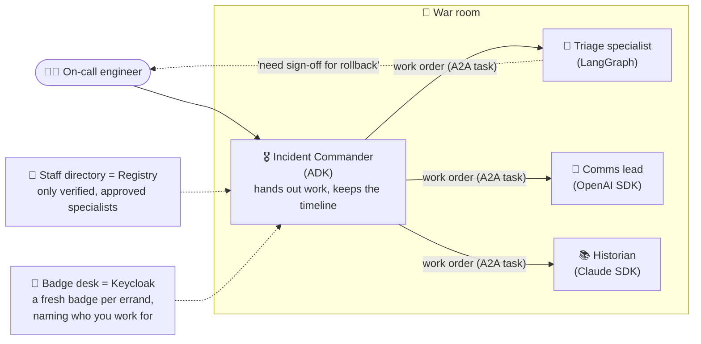

# 0. Start Here: the project in plain English

New to these docs, or preparing for an interview? Read this page first. Unfamiliar terms are explained in
the [glossary](11-glossary.md).

## 0.1 The project in three sentences

1. Four AI agents built with **four different frameworks** handle a production incident together:
   - an **Incident Commander** (Google ADK)
   - a **Triage Agent** (LangGraph, from Project 3)
   - a **Comms Agent** (OpenAI Agents SDK)
   - a **Postmortem Research Agent** (Claude Agent SDK)
2. They talk to each other only through **A2A 1.0**, the open agent-to-agent standard, and each uses
   **MCP** for its own tools.
3. The project proves the mesh is **correct** (official compatibility tests), **safe** (signed identities,
   per-hop tokens, approvals that can't be intercepted, each tested with attacks) and **worth it** (a
   measured comparison with simply calling the other agent as an MCP tool).

## 0.2 Which path should you read?

| You want to… | Read, in this order | Time |
|---|---|---|
| Explain the project in an interview | This page → [Security](05-security-threat-model.md) → [Decisions](07-decisions.md) | 30 min |
| Understand the design | [Requirements](01-requirements.md) → [Architecture](02-architecture.md) → [Low-level design](03-low-level-design.md) | 45 min |
| Understand how it's measured | [Evaluation design](04-evaluation-design.md) | 15 min |
| Understand speed, cost and failures | [Non-functional design](06-non-functional.md) | 10 min |
| Understand the technology choices | [Tech stack](08-tech-stack.md) | 15 min |
| Start building | The build plan and setup guide come next (not written yet) | — |

## 0.3 The mental model: an incident war room with badge-checked specialists

| War-room idea | Real component | Why it matters |
|---|---|---|
| Work order with a ticket number | A2A **task** (with states, streaming, cancel) | Long jobs can be tracked, resumed and cancelled |
| Staff directory with photo IDs | **Registry** with **signed, pinned Agent Cards** | An impostor can't join; a specialist who quietly changes their job description is suspended |
| A fresh badge per errand | **Token exchange** per hop (`sub` = engineer, `act` = Commander) | A badge for the triage room doesn't open the comms room |
| Sign-off goes straight to the specialist | `auth-required` + out-of-band approval | The Commander relays the request but never holds the sign-off |
| Reports are forms, not free text | Schema-validated **data parts** | A specialist's report can't smuggle orders to the Commander |

## 0.4 One incident's journey

| Step | What happens | Protocol detail |
|---|---|---|
| 1 | Engineer asks the Commander to handle alert ALR-7781 | A2A `SendStreamingMessage`, user token |
| 2 | Commander gets verified agents for this tenant from the registry | Signed, pinned cards |
| 3 | Commander gets one token per specialist | Token exchange, `aud` per agent |
| 4 | Historian and Triage start **in parallel** | Two tasks, shared `contextId` |
| 5 | Historian streams back 2 similar past incidents | `TaskArtifactUpdate`, data part |
| 6 | Triage investigates, then needs approval to roll back | Task → `auth-required`; Commander's task mirrors it |
| 7 | Engineer approves in the approval service | Token goes **directly** to Triage |
| 8 | Triage rolls back, verifies, completes | Push notification → Commander re-fetches with `GetTask` |
| 9 | Comms drafts a stakeholder update from Triage's structured result | Data part in, data part out |
| 10 | Commander returns the incident report with who-did-what provenance; one trace shows all hops | Langfuse |

## 0.5 What makes this project stand out in interviews

- **A2A 1.0 in practice** (2026 spec), with the official compatibility kit, not a demo on a pre-1.0
  version.
- **Four frameworks in one working system**, each chosen for a reason.
- **A2A security that's tested:** card spoofing, rug pulls, token replay, confused deputy, push abuse,
  inter-agent injection.
- **A measured answer to "MCP or A2A?"**, the question every agent interview asks.

## 0.6 FAQ

**Isn't A2A just "calling another agent's API"?**
The protocol adds things a plain API call doesn't have: a standard way to discover what the agent can do
and how to authenticate (the card); tasks with lifecycle, streaming, push, cancel and resume; and
standard states for "I need input" or "I need authorization". This project tests where that matters and
where it doesn't. ([04 §4.6](04-evaluation-design.md#46-mcp-vs-a2a-comparison))

**Why not make each agent an MCP tool of the Commander?**
For short, stateless work, that's often the better choice, and the comparison shows when. For
autonomous, long-running work owned by another team, with its own approvals, A2A fits better.
([ADR-010](07-decisions.md))

**Why does the Commander never see the approval token?**
If it did, a compromised orchestrator could reuse approvals. A2A 1.0 recommends delivering credentials
out of band, straight to the agent that needs them. ([ADR-005](07-decisions.md))

**Is this the code?**
Not yet. These are the design documents and the [tech-stack rationale](08-tech-stack.md), written before
any code. The build plan and setup guide come next.
