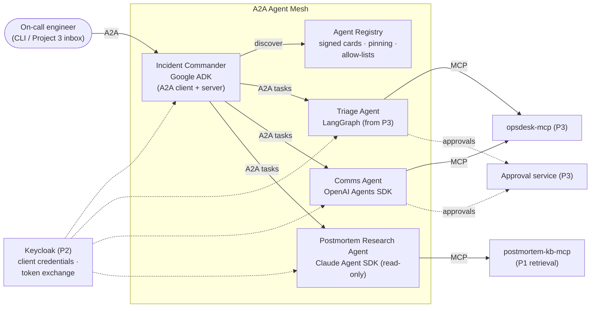
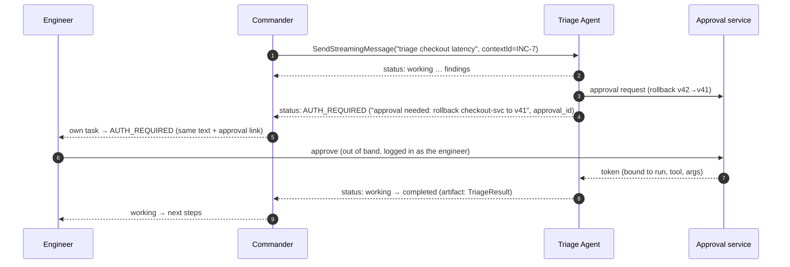

# 1. Requirements

## 1.1 Problem statement

By 2026, most companies run agents built on **different frameworks by different teams**, sometimes by
different vendors. There might be a LangGraph agent in the SRE team, an OpenAI-SDK agent in
communications and a Claude-based research agent. **MCP** connects each agent to its tools, but it doesn't
say how one agent should **delegate a long-running task to another agent**, wait for it, pass a human
approval back up the chain, or check that the other agent is who it claims to be.

**A2A (Agent2Agent)** is the open standard for that. Version **1.0** was released in 2026 under the Linux
Foundation, and it is supported in Azure AI Foundry, Amazon Bedrock AgentCore and Google's ADK. In
practice, few engineers have built a secure, multi-framework A2A system and measured it.

**Goal:** Take the agents from [Project 3](../../03-agent-reliability-harness/README.md), put them behind
A2A, and add an orchestrator that discovers and delegates to them. Then show and measure four things:
1. **Interop:** four frameworks (Google ADK, LangGraph, OpenAI Agents SDK, Claude Agent SDK) cooperate
   through one protocol, checked with the official compatibility kit.
2. **Long-running work:** streaming, push notifications, cancel, and resume after a disconnect.
3. **Human approval across agent boundaries:** an approval needed three hops down reaches a human and
   comes back, without any agent seeing a credential it shouldn't.
4. **Trust:** signed Agent Cards, pinned cards, per-agent tokens that still name the user, and remote
   agents' output treated as data. Each is tested with attacks.

Plus a measured write-up: **the same delegation done as an MCP tool call vs. an A2A task**. It answers
"when do I use MCP and when A2A?" with numbers.

## 1.2 What gets built

| # | Component | What it is |
|---|---|---|
| C1 | **Incident Commander** | Orchestrator built with **Google ADK**. It reads Agent Cards from the registry, splits an incident into delegated tasks, tracks them (streaming or push), gathers results, and reports. It is itself an A2A server, so a UI or another organization's agent can call it. |
| C2 | **Triage Agent** | Project 3's LangGraph agent wrapped as an A2A server (a2a-sdk `AgentExecutor`). Skill: `triage_incident`. It acts on OpsSim and needs approvals. |
| C3 | **Comms Agent** | New, small, **OpenAI Agents SDK**. Skills: `draft_stakeholder_update`, `publish_status_update` (approval required). |
| C4 | **Postmortem Research Agent** | New, small, **Claude Agent SDK**, read-only. Skill: `find_similar_incidents` over a corpus of past postmortems (retrieval code from Project 1 exposed as an MCP server). |
| C5 | **Agent Registry** | Stores Agent Cards, verifies **JWS signatures**, **pins** card versions (a changed card is quarantined until reviewed, the same idea as Project 2's tool pinning), and keeps per-tenant allow-lists of which agents and skills may be used. |
| C6 | **Rogue agents** (test fixtures) | Spoofed card, unsigned card, card that changes after approval, agent that returns injected instructions, agent that never finishes. Used only in security evals. |
| C7 | **Eval harness** | Interop matrix + TCK runs, end-to-end mesh scenarios, security cases, resilience tests, and the MCP-vs-A2A comparison. Reuses Project 3's harness, graders and statistics. |

**Reused, not rebuilt:**
- From Project 3: OpsSim/opsdesk-mcp, the approval service, the harness and the Triage Agent.
- From Project 2: Keycloak and the pinning/quarantine pattern.
- From Project 1: retrieval code.

## 1.3 Users & use cases

| Actor | Use case |
|---|---|
| **On-call engineer** | "Checkout is slow, handle it." The Commander delegates triage, research and comms, and asks the engineer only for approvals |
| **Approver** | Approves a rollback requested by the Triage Agent, **two hops away**, from one place |
| **Platform admin** | Registers an agent, reviews and approves its card, sets which tenants may use which agent skills |
| **Partner organization** (simulated) | Calls the Commander over A2A with its own credentials; sees only its own tasks |
| **Security reviewer** | Checks that a spoofed or changed agent can't join, and that the audit trail shows who acted for whom |
| **Developer (you)** | Decide "MCP tool or A2A agent?" for a new capability, using the comparison report |

## 1.4 Functional requirements

### Protocol (all A2A servers)

| ID | Requirement | Priority |
|---|---|---|
| FR-1 | Implement **A2A 1.0**: `SendMessage`, `SendStreamingMessage`, `GetTask`, `ListTasks`, `CancelTask`, `SubscribeToTask`; honour the `A2A-Version` header | Must |
| FR-2 | **JSON-RPC** binding on every agent; **HTTP+JSON (REST)** also on the Triage Agent, so binding selection is exercised | Must |
| FR-3 | Publish an Agent Card at `/.well-known/agent-card.json` with skills, capabilities, security schemes, `supportedInterfaces` and **JWS signatures**; `Cache-Control` and `ETag` headers | Must |
| FR-4 | **Extended Agent Card** (`GetExtendedAgentCard`) for authenticated callers: shows internal skills hidden from the public card | Should |
| FR-5 | Task lifecycle with all used states: submitted → working → (input-required / auth-required) → completed / failed / canceled / rejected | Must |
| FR-6 | Tasks persisted in Postgres, so a restarted agent still answers `GetTask` / `SubscribeToTask` | Must |
| FR-7 | **Push notifications** for long tasks (Triage), with an authenticated webhook the receiver verifies | Must |
| FR-8 | Artifacts as **structured data parts** (a Part with `data` and `mediaType: application/json`) validated against published JSON Schemas (e.g. `TriageResult`, `DraftUpdate`, `SimilarIncidents`) | Must |
| FR-9 | gRPC binding on one agent | Could |

### Orchestration (Commander)

| ID | Requirement | Priority |
|---|---|---|
| FR-10 | Discover agents from the registry only (no ad-hoc URLs), filtered by the tenant allow-list and skill tags | Must |
| FR-11 | Plan delegation: research and triage **in parallel**, comms after triage findings; a shared `contextId` per incident | Must |
| FR-12 | Track tasks by streaming, falling back to push; handle `input-required` (answer or ask the user) and `auth-required` (§1.5) | Must |
| FR-13 | Timeouts and cancellation: cancel child tasks when the incident is cancelled; escalate if an agent is down | Must |
| FR-14 | Resume after a Commander crash: re-attach to child tasks with `SubscribeToTask` / `GetTask` | Should |
| FR-15 | Final incident report combining artifacts, with provenance (which agent produced which part) | Must |

### Trust and identity

| ID | Requirement | Priority |
|---|---|---|
| FR-16 | Each agent is an OAuth **resource server** with its own audience; the Commander calls agents with tokens obtained by **token exchange** that keep the user as `sub` and add the calling agent as `act` | Must |
| FR-17 | Registry verifies card signatures against keys from trusted issuers only (JWKS per organization) | Must |
| FR-18 | Registry **pins** the approved card (hash); a changed card is **quarantined** until an admin re-approves it | Must |
| FR-19 | Every agent treats inbound messages and remote artifacts as **data**: schema validation, spotlighting of free text, no instruction-following from artifacts | Must |
| FR-20 | Tenant isolation: `ListTasks` / `GetTask` return only the caller's tenant's tasks | Must |
| FR-21 | Audit events for delegations, approvals and card changes (append-only) | Should |

### Evaluation (C7)

| ID | Requirement | Priority |
|---|---|---|
| FR-22 | Run the **A2A TCK** against every agent server; interop matrix of clients × servers | Must |
| FR-23 | 15 mesh scenarios (adapted from OpsDesk) with outcome grading from OpsSim state | Must |
| FR-24 | Security suite for the threats in [05](05-security-threat-model.md), with attack success rate per control on/off | Must |
| FR-25 | Resilience tests: agent down, slow agent, disconnect + resubscribe, Commander restart | Must |
| FR-26 | **MCP vs A2A** comparison for the same delegation (Triage as an MCP tool with the Tasks extension vs as an A2A agent) | Must |

## 1.5 Human approval across agents (the key scenario)

This follows the A2A 1.0 in-task authorization rules:
- each agent in the chain moves its own task to `auth-required`;
- the **credential goes out of band**, straight from the approval service to the agent that needs it;
- the Commander **never holds the approval token**, so a compromised orchestrator can't reuse it.

## 1.6 Non-functional requirements (targets)

| Area | Target |
|---|---|
| Delegation overhead | A2A hop adds p95 ≤ 60 ms (excluding model time) vs an in-process call |
| Time to first status | ≤ 1 s from `SendStreamingMessage` to the first `working` event |
| Recovery | Disconnect + resubscribe loses no status or artifact events (checked by sequence) |
| Card handling | Card fetch cached (ETag); signature verification ≤ 5 ms |
| Security | 0 successful attacks in the gateway-level (deterministic) security suite with controls on |
| Cost | Whole eval run ≤ $25 (reuses cheap models for most runs) |
| Portability | `docker compose up` runs the whole mesh locally |

## 1.7 Success criteria

1. Four frameworks interoperate over A2A 1.0; **TCK results are published** per agent and binding.
2. The cross-agent approval flow works end to end, and no agent other than the one acting ever sees the
   credential.
3. The security report shows each attack **succeeding with its control off and failing with it on**.
4. The **MCP-vs-A2A comparison** gives a clear, numbers-backed rule of thumb.
5. A 3-minute video of an incident handled by four agents, with one approval, visible in one trace.

## 1.8 Scope

**In scope:**
- A2A 1.0 servers and clients: JSON-RPC and REST bindings, streaming, push, cancel, resume.
- Signed cards, a registry with pinning, and token exchange.
- Mesh scenarios, security and resilience tests.
- The MCP-vs-A2A comparison.

**Out of scope:**
- gRPC as a requirement (it's a Could).
- Payments (AP2) and agentic commerce.
- Public internet agent discovery.
- A production registry product.
- A new UI: the CLI and the Project 3 inbox are reused.
- Re-running Project 3's framework comparison.

**Time box:** 2 weeks in the roadmap (weeks 24–25). The build plan will confirm what fits.
