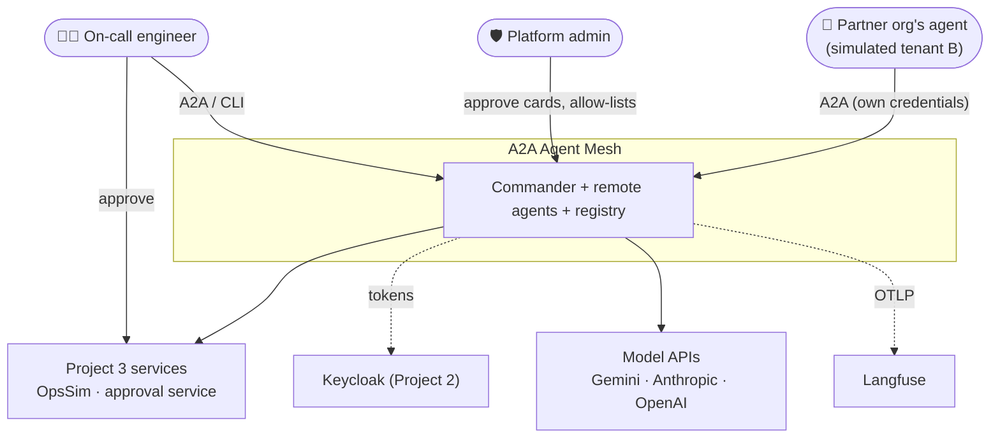
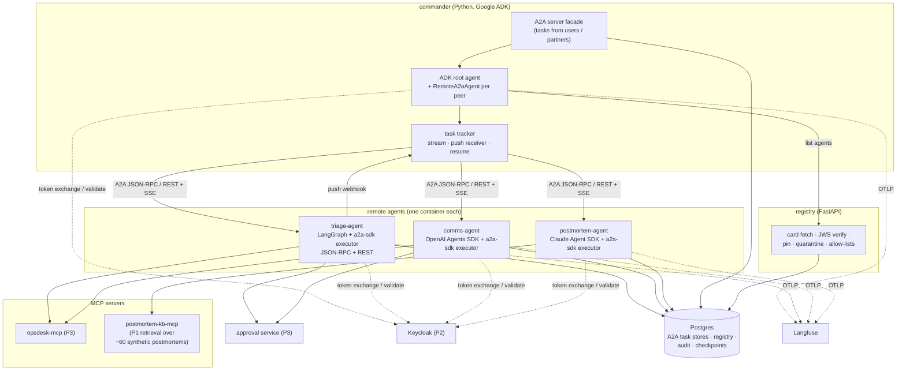
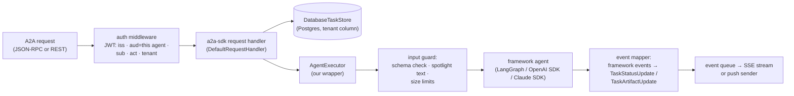
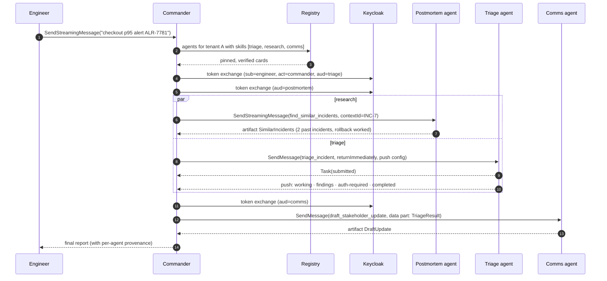
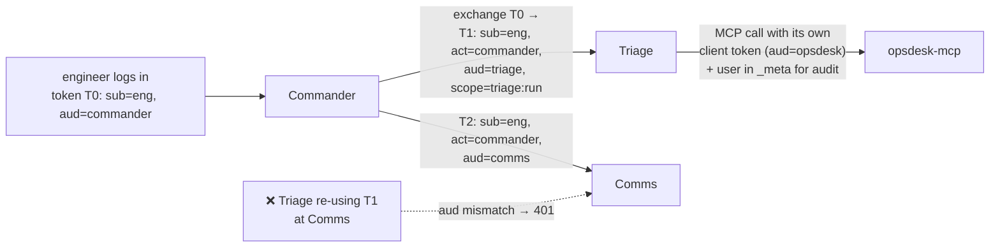
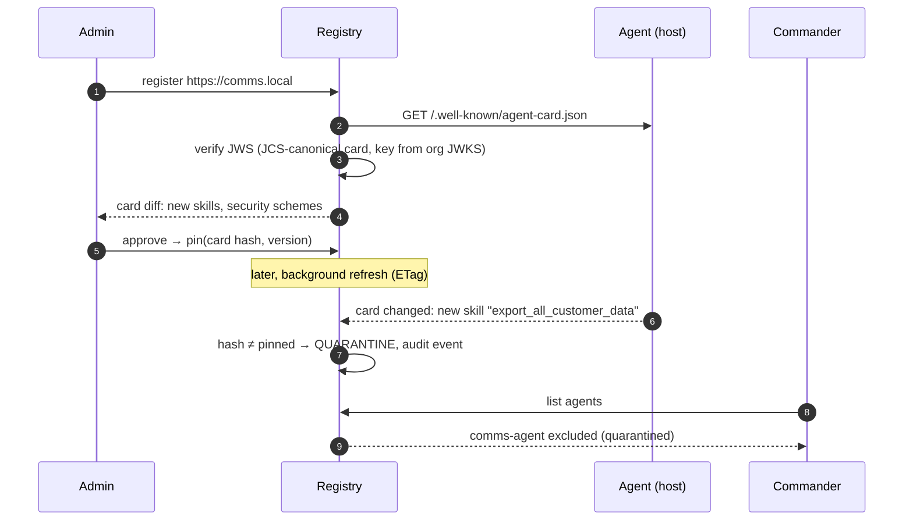
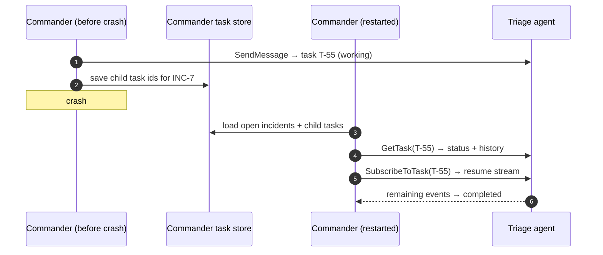
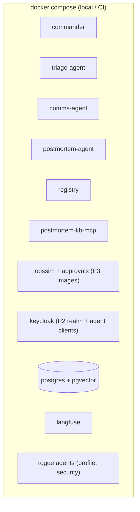

# 2. High-Level Architecture

## 2.1 Design principles

1. **Reuse the agents, add the protocol.** The agents from Project 3 keep their logic. A thin
   `AgentExecutor` wrapper turns each into an A2A server, so the interesting work is the protocol, the
   orchestration and the trust model.
2. **MCP down, A2A across.** Each agent reaches its tools through MCP. Agents reach each other only through
   A2A. No agent calls another agent's tools directly.
3. **Nothing trusted by default.** Only agents in the registry, with a signed card and a pinned version,
   can be called. Another agent's output is data, never instructions.
4. **Credentials never travel down the chain.** Each hop gets a fresh, audience-restricted token by token
   exchange. Approval credentials go straight to the agent that needs them.
5. **Long-running by default.** Every delegation is a task that can stream, push, be cancelled and be
   resumed.
6. **One trace across all hops.** W3C trace context goes through every A2A call.

## 2.2 System context (C4 level 1)



## 2.3 Containers (C4 level 2)



| Container | Responsibility |
|---|---|
| **commander** | Planning, delegation, task tracking, approval relay, final report; also an A2A server for users and partners |
| **triage-agent** | Project 3's LangGraph agent behind A2A; long tasks with push; approvals via `auth-required` |
| **comms-agent** | Drafts updates from structured findings; publishing needs approval |
| **postmortem-agent** | Read-only research over past postmortems; fast, streaming |
| **registry** | The only source of agent addresses; signature checks, pinning, quarantine, allow-lists |
| **postmortem-kb-mcp** | Hybrid search over a synthetic postmortem corpus (Project 1 code) |

## 2.4 Inside a remote agent: the A2A wrapper



The same wrapper pattern works for all three frameworks. Only the `framework agent` box and the event
mapper differ, and they reuse Project 3's adapters and normalized events.

## 2.5 Data flow A: an incident through the mesh



## 2.6 Data flow B: identity through the hops



Every hop checks `aud` (it is the intended recipient), `sub` (whom it acts for) and `act` (who is calling).
The audit log records the full chain.

## 2.7 Data flow C: card registration, pinning and a rug pull



## 2.8 Data flow D: Commander crash and resume



## 2.9 Deployment view



Each agent is its own container on its own hostname, as it would be across teams. Azure deployment is
optional (the build plan decides). If it's included, it reuses the Container Apps modules.

## 2.10 Proposed repository layout

```
a2a-agent-mesh/
├─ commander/          # ADK agent, A2A server facade, task tracker, push receiver
├─ agents/
│  ├─ common/          # AgentExecutor base, auth middleware, input guard, event mapper, card signing
│  ├─ triage/          # wraps P3 LangGraph agent (installed as a package)
│  ├─ comms/           # OpenAI Agents SDK
│  └─ postmortem/      # Claude Agent SDK
├─ registry/           # FastAPI: cards, JWS verify, pinning, quarantine, allow-lists
├─ kb/                 # postmortem corpus + postmortem-kb-mcp
├─ rogue/              # test-fixture agents for security evals
├─ evals/              # interop/TCK, mesh scenarios, security, resilience, mcp_vs_a2a
├─ keycloak/           # realm additions (agent clients, token-exchange permissions)
├─ reports/
└─ docs/
```
