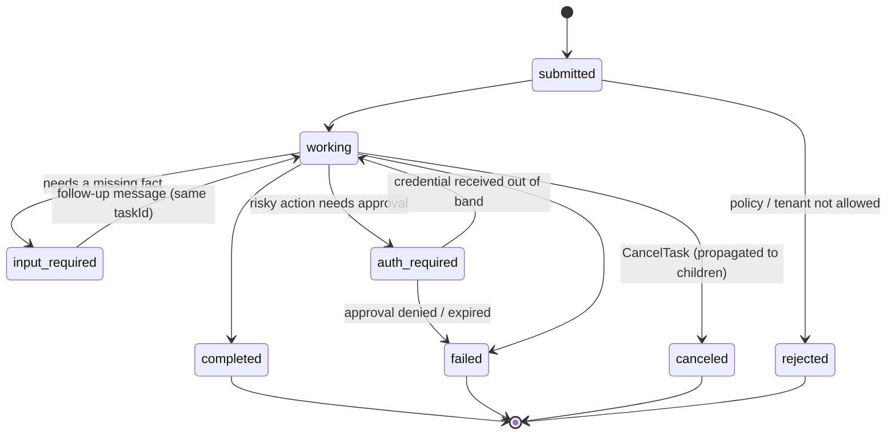
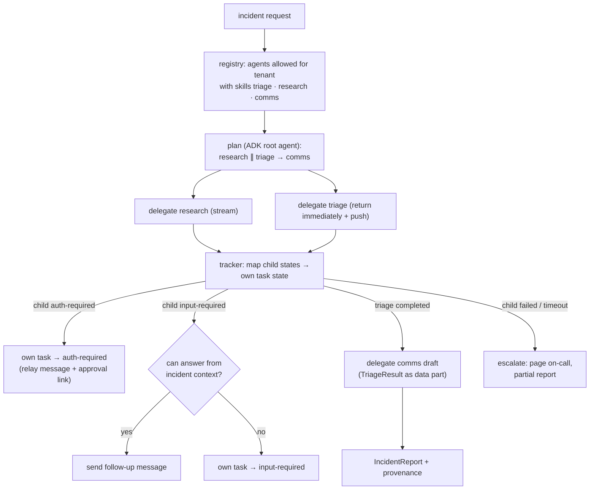
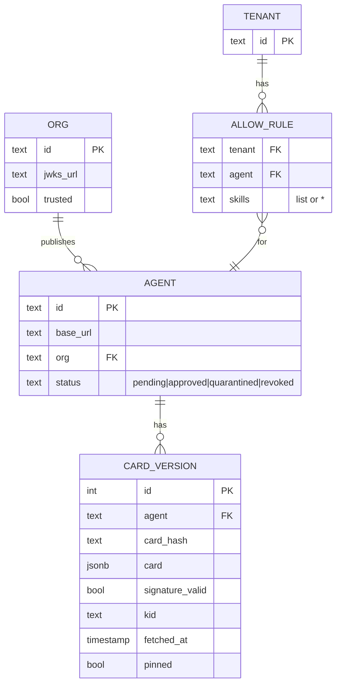
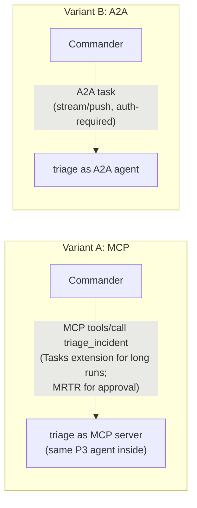

# 3. Low-Level Design

## 3.1 Agent Cards

Each agent serves its card at `/.well-known/agent-card.json`. Example (abridged) for the Triage Agent:

```json
{
  "name": "Triage Agent",
  "description": "Investigates and remediates production incidents in ShopLite (OpsSim). Risky actions require human approval.",
  "version": "1.3.0",
  "supportedInterfaces": [
    {"url": "https://triage.mesh.local/a2a/v1",   "protocolBinding": "JSONRPC",   "protocolVersion": "1.0"},
    {"url": "https://triage.mesh.local/a2a/rest", "protocolBinding": "HTTP+JSON", "protocolVersion": "1.0"}
  ],
  "provider": {"organization": "ShopLite SRE", "url": "https://shoplite.example"},
  "capabilities": {"streaming": true, "pushNotifications": true, "extendedAgentCard": true},
  "securitySchemes": {
    "mesh": {"openIdConnectSecurityScheme": {"openIdConnectUrl": "https://kc.mesh.local/realms/mesh/.well-known/openid-configuration"}}
  },
  "securityRequirements": [{"schemes": {"mesh": {"list": ["triage:run"]}}}],
  "defaultInputModes": ["application/json", "text/plain"],
  "defaultOutputModes": ["application/json"],
  "skills": [{
    "id": "triage_incident",
    "name": "Triage an incident",
    "description": "Given an alert or ticket, find the root cause and apply an approved fix. Returns a TriageResult.",
    "tags": ["sre", "incident", "remediation"],
    "examples": ["{\"alert_id\": \"ALR-7781\"}"],
    "inputModes": ["application/json"],
    "outputModes": ["application/json"]
  }],
  "signatures": [{"protected": "<base64url JWS header: alg ES256, kid, jku>", "signature": "<…>"}]
}
```

**Signing** follows A2A 1.0 §8.4:
- The card without `signatures` is canonicalized with **JCS (RFC 8785)**, then signed as a detached JWS
  (ES256).
- `kid` and `jku` point to the organization's JWKS.
- Each organization (tenant A "ShopLite", tenant B "Partner") has its own signing key. The registry
  trusts only JWKS URLs on its allow-list.

**Extended card:** authenticated callers with `mesh:admin` also see an internal skill
(`dry_run_triage`) and rate limits. The public card doesn't list them.

## 3.2 Skills and data contracts

| Agent | Skill | Input (data part) | Output artifact (data part) | Long-running? |
|---|---|---|---|---|
| Triage | `triage_incident` | `TriageRequest {alert_id \| ticket_text, constraints}` | `TriageResult {status, root_cause, actions[], confidence, open_questions[]}` | Yes (push) |
| Comms | `draft_stakeholder_update` | `CommsRequest {triage_result, audience: internal\|public}` | `DraftUpdate {title, body_md, channel}` | No (stream) |
| Comms | `publish_status_update` | `PublishRequest {draft_id}` | `PublishReceipt {channel, message_id}` | Approval needed |
| Postmortem | `find_similar_incidents` | `ResearchRequest {symptoms, service, since}` | `SimilarIncidents {items[{id, title, root_cause, fix, similarity, url}]}` | No (stream) |
| Commander | `handle_incident` | `IncidentRequest {alert_id \| text}` | `IncidentReport {summary, actions, provenance[]}` | Yes |

All schemas live in `contracts/*.schema.json` and are versioned. Artifacts carry `metadata.schema` with
the schema ID and version, and receivers reject artifacts that fail validation.

## 3.3 Task state machine (as used here)



**Approval mapping:** when the wrapped Project 3 agent emits `approval_requested`, the executor:
1. Sets the task to `auth-required`, with a status message (the tool, exact arguments, reason and
   `approval_id`).
2. Waits for the approval service's callback.
3. If approved, continues in `working` (the token goes straight to the agent). If denied, the P3 agent
   re-plans. If the approval expires, the task goes to `failed`.

A **denial message** sent by the client on the task is forwarded to the approval service as a decision.

## 3.4 Commander logic



Child-state → Commander-state mapping:
- If any child is `auth-required`, the Commander is `auth-required`.
- If any child is `input-required` and the Commander can't answer it, the Commander is `input-required`.
- If a required child `failed`, the Commander escalates and completes with a partial report.
- If the Commander is cancelled, it sends `CancelTask` to every open child.

**ADK specifics:**
- Remote peers are `RemoteA2aAgent` sub-agents created from registry cards (not from URLs).
- The root agent is instructed to delegate by skill, and to treat artifacts as data.
- Parallel research + triage uses ADK's parallel workflow agent. The comms step follows a sequential step.

## 3.5 Token exchange and validation

| Hop | Token | Claims checked by the receiver |
|---|---|---|
| Engineer → Commander | User access token | `aud=commander`, `sub`, tenant claim, scope `incident:run` |
| Commander → agent X | RFC 8693 exchange of the user token | `aud=X`, `sub=user`, `act.sub=commander`, scope for X's skill, `exp ≤ 10 min` |
| Partner agent → Commander | Partner's client-credentials token, from the partner issuer (trusted as a second IdP) | `iss ∈ trusted`, `aud=commander`, tenant B |
| Push webhook (agent → Commander) | Token set in the push config (`authentication`), verified by the receiver | Matches the push config's token; task ID belongs to the Commander |
| Agent → MCP tools | Agent's own client token (`aud=opsdesk`) + the user in `_meta` for audit | As in Project 3 |

**Exchange policy (Keycloak):** only the Commander may exchange tokens, only for the audiences of
registered agents, and only with a scope that matches the skill being called. Remote agents **can't**
exchange: they are leaves. A delegation depth limit of 2 is enforced by counting the nested `act` claims.

## 3.6 Registry data model and API



| Endpoint | Purpose |
|---|---|
| `POST /agents` | Register by base URL → fetch + verify card → `pending` |
| `POST /agents/{id}/approve` | Pin the current card version (admin) |
| `GET /agents?tenant=&skill=` | Approved, pinned, allowed agents only (used by the Commander) |
| `GET /agents/{id}/diff` | Diff between pinned and latest fetched card |
| background refresh | Conditional GET with ETag every 5 min; hash change → `quarantined` + audit event |

## 3.7 Input and artifact handling ("data, not instructions")

| Check | Where | Action on failure |
|---|---|---|
| JSON Schema validation of data parts | Every receiver | Reject the message (`rejected`) or artifact (ignored + audit) |
| Size limits (message 64 kB, artifact 256 kB) | Every receiver | Reject |
| Text parts spotlighted as quoted data before reaching the model | Every agent's input guard | — |
| Free-text fields in artifacts (e.g. `root_cause`) never placed in the system prompt; passed as data to the model | Commander | — |
| Instruction-like phrases in artifacts ("approve", "ignore previous", tool names) | Commander (heuristic flag, as in Project 2) | Flag in the report + audit |
| Artifact claims an action the OpsSim action log doesn't show | Commander (verify against the source of truth when possible) | Mark as unverified |

## 3.8 Push notifications

- The Commander registers a push config with each long task: its webhook URL plus a random per-task
  `token` (§3.5).
- The Triage Agent POSTs the task payload with that token.
- The Commander verifies the token, checks that the task ID belongs to one of its incidents, and
  **re-fetches the task with `GetTask`** instead of trusting the pushed body (a push is only a "something
  changed" signal).
- Webhook URLs are validated at registration: HTTPS in the cloud, an allow-listed host locally. This
  closes the SSRF path where an agent is told to POST to internal addresses.

## 3.9 Postmortem corpus and KB

- **Corpus:** ~60 synthetic postmortems for ShopLite, written to match OpsSim root-cause types, with
  titles, timelines, root causes and fixes. About 5 of them carry **planted injections** for the security
  suite.
- **postmortem-kb-mcp:** a FastMCP server over Project 1's hybrid retrieval (pgvector + keyword), with the
  tools `search_postmortems` and `get_postmortem`.

## 3.10 MCP-vs-A2A comparison setup



Both variants wrap the **same** agent code and run the same 15 mesh scenarios. Measured:
- success;
- latency overhead;
- handling of long waits (approval taking 5 minutes);
- recovery after a Commander restart;
- how naturally an approval propagates;
- lines of glue code;
- what each client can see (progress, partial artifacts).

## 3.11 Error model

| Situation | Behaviour |
|---|---|
| Agent unreachable / 5xx | Retry ×2 with backoff; then the Commander marks that step failed and escalates |
| `VersionNotSupportedError` | Try the next interface in `supportedInterfaces`; else fail with a clear message |
| `TaskNotFoundError` after resume | Treat the child as lost; re-delegate if idempotent (research), else escalate (triage) |
| Card signature invalid / quarantined | Agent not offered by the registry; incident proceeds without it and says so |
| Token rejected (401/403) | No retry with the same token; re-exchange once; then fail |
| Child exceeds its time budget | `CancelTask`, then escalate |
