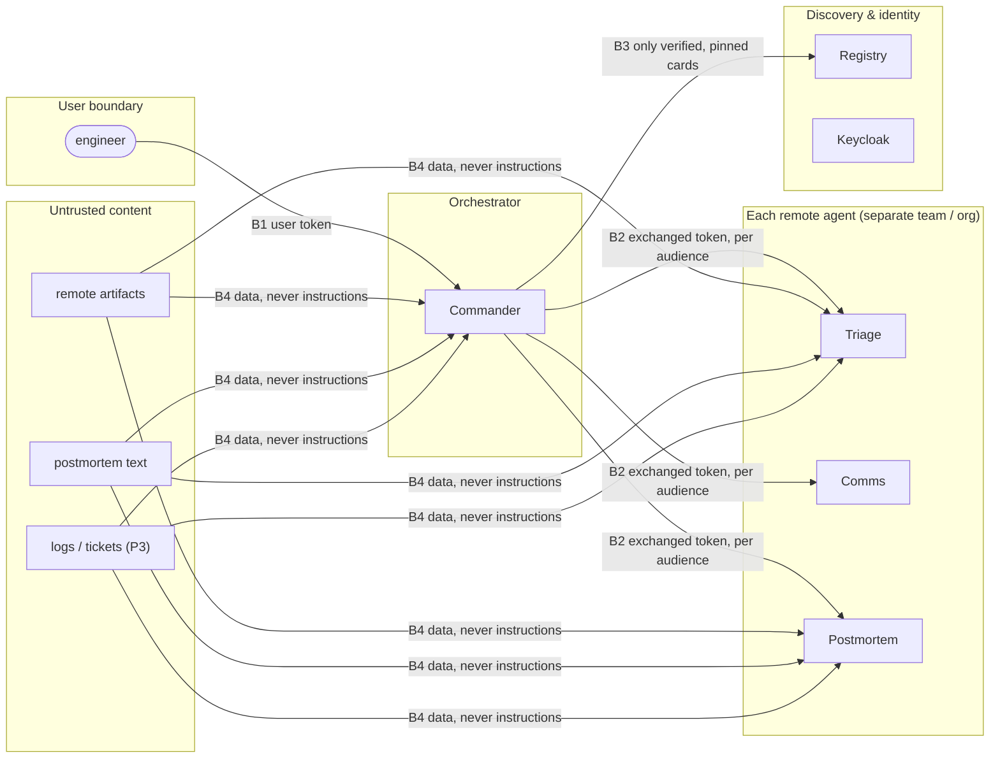

# 5. Security & Threat Model

Project 2 secured **agent → tool** traffic (MCP). Project 3 secured an agent's **own actions**. This
project secures **agent → agent** traffic: who an agent is, what it may ask another agent to do, for whom,
and what it may believe from another agent's answer.

## 5.1 Assets

| Asset | Why it matters |
|---|---|
| User identity through the chain | Actions must be attributable to the person they were done for |
| Approval credentials | If an intermediary can capture or forge one, human approval means nothing |
| Agent identity (cards, signing keys) | A fake agent can receive sensitive tasks or return poisoned results |
| Task data per tenant | Incidents of one tenant must not leak to another |
| The Commander's decisions | The Commander is steerable by whatever it reads, including other agents' output |

## 5.2 Trust boundaries

## 5.3 A2A-specific threats → controls → tests

| # | Threat | Control | Test |
|---|---|---|---|
| T1 | **Agent Card spoofing / impersonation** | Signed cards (JWS + JCS), trusted org JWKS, registry as the only discovery path | A1–A3 |
| T2 | **Card rug pull** (card changes after approval) | Pinning by hash + quarantine + admin re-approval | A4 |
| T3 | **Token passthrough / replay across agents** | Token exchange per hop, audience per agent, short expiry | A5 |
| T4 | **Confused deputy** (a remote agent uses its access to act for someone else) | Only the Commander may exchange; `act` chain recorded; depth limit | A6, A7 |
| T5 | **Cross-tenant data access** via task or context IDs | Tenant column in the task store; tenant from the token, never from the request body | A8 |
| T6 | **Push notification abuse** (spoofed callbacks, SSRF) | Per-task token, `GetTask` re-fetch, webhook URL allow-list | A9, A10 |
| T7 | **Inter-agent prompt injection** (malicious or compromised agent's artifact steers the Commander) | Schema-validated data parts; free text spotlighted; instruction-phrase flag; actions still need approval downstream | A11 |
| T8 | **Poisoned knowledge** reaches the Commander through a legitimate agent | Spotlighting; approval backstop from Project 3 | A12 |
| T9 | **Approval smuggling / forgery** | Approvals only from the approval service, bound to run + tool + args; tokens never pass through the Commander | A13 |
| T10 | **Resource exhaustion** (huge messages, never-ending tasks) | Size limits; per-child time budgets; cancel propagation | A14, resilience suite |

## 5.4 Mapping to the OWASP Top 10 for Agentic Applications (2026)

| OWASP (ASI) | Covered by |
|---|---|
| ASI01 Agent goal hijack | T7, T8 |
| ASI02 Tool misuse | Downstream: Project 3 approvals and backstop |
| ASI03 Identity & privilege abuse | T3, T4 (token exchange, `act`, depth limit) |
| ASI04 Agentic supply chain | T1, T2 (signed + pinned cards) |
| ASI06 Memory & context poisoning | T8 (knowledge base), `contextId` scoping (T5) |
| **ASI07 Insecure inter-agent communication** | The core of this project: T1–T6, T9 |
| ASI08 Cascading failures | Time budgets, cancel propagation, partial reports (resilience suite) |
| ASI09 Human-agent trust exploitation | Approval shows the acting agent, exact args and the user it acts for |
| ASI10 Rogue agents | Registry quarantine and revocation; rogue-agent fixtures |

## 5.5 Audit

Every delegation, approval relay, card change and rejection writes an append-only audit event with:
- `incident_id`
- `task_id`
- `context_id`
- the caller and callee agents
- `sub` and the `act` chain
- the skill
- the decision

The audit uses Project 2's hash-chain code, so an investigator can answer "who asked whom to do what,
for which user, and who approved it" from one query.

## 5.6 Residual risks

- **An approved agent that turns malicious without changing its card** isn't caught by pinning. The
  mitigations are the artifact checks, downstream approvals and revocation. Stronger options (remote
  attestation of agent code) are out of scope.
- **One identity provider for most of the mesh:** the partner tenant tests a second issuer, but a real
  cross-organization federation adds trust-policy complexity not covered here.
- **LLM-in-the-loop defences are probabilistic:** the report shows attack success rates, not guarantees.
  Hard guarantees come only from the deterministic controls (signatures, tokens, approvals).
