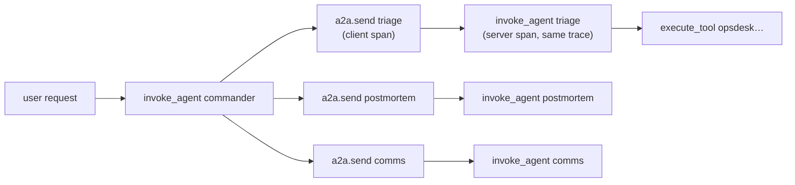

# 6. Non-Functional Design

## 6.1 Latency budget for one A2A hop (excluding model time)

| Step | Budget (p95) |
|---|---|
| Registry lookup (cached in the Commander, refreshed by ETag) | ≤ 2 ms |
| Token exchange (cached per audience + user until 60 s before expiry) | ≤ 5 ms cached · ≤ 40 ms uncached |
| HTTP request + JWT validation at the agent | ≤ 10 ms |
| Task store write (Postgres) | ≤ 10 ms |
| First `working` event over SSE | ≤ 30 ms after acceptance |
| **Total overhead per hop** | **≤ 60 ms** |

Model calls take seconds, so the protocol overhead is small. The point is to **measure** it and not
assume it (the report compares it with Project 3's in-process agent).

## 6.2 Cost model

| Item | Estimate |
|---|---|
| Deterministic suites (TCK, interop, security, resilience) | $0 (stub models) |
| Mesh scenarios: 15 × k=3, four agents per incident, mostly cheap models | ≈ $8–15 |
| MCP vs A2A: 15 × 2 variants | ≈ $4–8 |
| LLM-in-the-loop attacks: 2 cases × k=5 × on/off | ≈ $1–2 |
| **Total** | **≈ $15–25** |

**Model choice:**
- The Commander uses Gemini (ADK's native model) or Claude through ADK's LiteLLM model support. The build
  plan picks one and records it.
- The remote agents use the same model tiers as in Project 3.

## 6.3 Observability

- `traceparent` travels as an HTTP header on every A2A call and inside push payload metadata. One incident
  is one trace across five services.
- Span attributes: `a2a.method`, `a2a.task_id`, `a2a.context_id`, `a2a.skill`, `a2a.state`,
  `a2a.binding`, `a2a.version`, the callee agent, and `enduser.id` (hashed).
- The a2a-sdk telemetry extra supplies server spans. The agent spans come from Project 3's
  instrumentation. Everything goes to Langfuse.

## 6.4 Failure modes

| Failure | Effect | Handling |
|---|---|---|
| Remote agent down | Step can't run | Retry ×2 → escalate with a partial report |
| Keycloak down | No new tokens | Cached exchanged tokens until expiry; then fail closed (no unauthenticated calls) |
| Registry down | No discovery | Commander uses its last verified cache for ≤ 15 min, then fails closed |
| Postgres down | Tasks can't be stored | Agents reject new tasks (`503`), because they can't promise resumability |
| Push delivery fails | Commander misses updates | Push is only a hint; the tracker also polls `GetTask` every 30 s for open tasks |
| Long approval | Streams time out | Clients re-subscribe; push delivers the final state |

## 6.5 Scaling notes

- Agents are stateless apart from the task store, so any replica can serve `GetTask` /
  `SubscribeToTask`. Live streams need either sticky routing or a shared event bus between replicas.
  Here there is one replica per agent, and the report records this as a known limit, with Redis pub/sub
  as the path to more replicas.
- The registry is read-heavy and cached, so it scales trivially.

## 6.6 Testing strategy

| Layer | Tests |
|---|---|
| Executor wrapper | Event mapping per framework (stub models): every normalized P3 event → the right A2A update |
| Registry | Signing/verification with test keys (valid, wrong key, tampered field, JCS edge cases), pinning, quarantine |
| Tokens | Exchange policy, audience, `act` depth, tenant claim |
| Protocol | TCK + interop matrix |
| System | Mesh scenarios, security, resilience (§4) |
