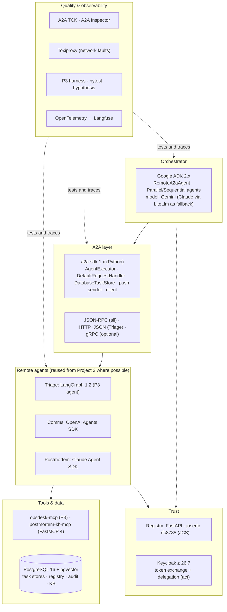

# 8. Tech Stack: What We Use and Why

For every technology in this project, this document answers five questions:
1. **What does it do in this system?**
2. **Why was it chosen?**
3. **What alternatives were considered, and why weren't they chosen?**
4. **What does it add to your profile?**
5. **When would we replace it?**

Selection criteria (same idea as Projects 1–3, adjusted for a protocol and interop project):

| # | Criterion | Meaning |
|---|---|---|
| C1 | **Spec fit** | Implements **A2A 1.0** (bindings, `A2A-Version`, task states, signed cards) and the OAuth RFCs the trust model needs |
| C2 | **Interop value** | Shows cross-framework interop, not four copies of one stack |
| C3 | **Security** | Lets each trust control be seen and tested |
| C4 | **Market value** | Appears in 2026 Agent Engineer JDs (see [01-market-analysis](../../../01-market-analysis.md)) |
| C5 | **Reuse** | Reuses Projects 1–3 wherever possible |
| C6 | **Low ops & cost** | `docker compose up`; the whole eval ≤ $25 |

---

## 8.1 The stack at a glance

## 8.2 Summary table

| Layer | Choice | One-line reason | Main alternative (not chosen) |
|---|---|---|---|
| Language | **Python 3.12** | All four frameworks and the A2A SDK are first-class in Python | TypeScript/Java/Go A2A SDKs (good, but split the codebase) |
| A2A implementation | **a2a-sdk 1.x** (official Python SDK) | Implements A2A 1.0: bindings, task store, push, client, telemetry extra | Hand-written JSON-RPC (error-prone, no TCK parity) |
| Orchestrator framework | **Google ADK 2.x** | Most native A2A support (`RemoteA2aAgent`, `to_a2a`); fourth framework for your profile | LangGraph (already covered), raw a2a-sdk client (no orchestration layer) |
| Orchestrator model | **Gemini (Flash tier) via ADK**; Claude via ADK's LiteLlm wrapper as fallback | Third model family on your profile; ADK's native model path | Claude only (simpler, less breadth) |
| Remote agents | **LangGraph 1.2** (P3 Triage), **OpenAI Agents SDK** (Comms), **Claude Agent SDK** (Postmortem) | Reuse Project 3's agents and adapters; three frameworks behind one protocol | New agents per framework (wasted effort) |
| Bindings | **JSON-RPC** everywhere, **HTTP+JSON** on Triage; gRPC optional | Widest client support; binding negotiation exercised | gRPC everywhere (less framework support) |
| HTTP server | **Starlette/FastAPI via a2a-sdk extras** + **sse-starlette** | The SDK's supported server path; SSE for streaming | Hand-rolled ASGI |
| Task persistence | **a2a-sdk `DatabaseTaskStore` on PostgreSQL 16** (asyncpg) | Resumable tasks, push configs, one database with the rest | In-memory store (loses tasks on restart), MySQL/SQLite |
| Card signing | **a2a-sdk `signing` extra** if it covers detached JWS over JCS; else **joserfc + rfc8785** | A2A 1.0 §8.4 needs JCS canonicalization + JWS | jwcrypto (fine; joserfc has cleaner JWS/JWK APIs) |
| Registry | **FastAPI + SQLAlchemy 2 + Postgres** | Small service; same stack as Projects 2–3 | Cloud agent catalogs (AgentCore, Foundry): less to learn from, harder to test attacks |
| Identity | **Keycloak ≥ 26.7** (realm from Project 2): client credentials, **token exchange with the delegation feature** for `act` | Only open-source IdP here with RFC 8693 delegation; already in the stack | Auth0/Entra (hosted), home-made STS (risky) |
| Audit | **Project 2's hash-chained audit writer** | Same tamper-evident log, now for delegations | Plain log table |
| MCP servers | **opsdesk-mcp** (P3) and **postmortem-kb-mcp** (FastMCP 4 + P1 hybrid retrieval) | Reuse; MCP for tools, A2A between agents | — |
| MCP variant for the comparison | **FastMCP 4** with the **Tasks extension** and MRTR | Same protocol generation as Project 2 | Older MCP without Tasks (unfair comparison) |
| Conformance | **A2A TCK** + **A2A Inspector** | Official compatibility kit; standard debugging UI | Own tests only |
| Network faults | **Toxiproxy** | Latency, disconnects, resets between containers for resilience tests | tc/netem (harder in Compose) |
| Harness & stats | **Project 3 harness** (runner, graders, pass^k, bootstrap) | Same statistics, no rework | New harness |
| Tracing | **OpenTelemetry** (a2a-sdk telemetry + P3 instrumentation) → **Langfuse** | One trace across all hops | Per-framework dashboards |
| Testing | **pytest, hypothesis, testcontainers, respx** | Unit, property (signing/JCS), integration with real Postgres/Keycloak | — |
| Delivery | **uv, Docker Compose, GitHub Actions**; Azure Container Apps optional | Same as Projects 1–3 | Kubernetes (overkill) |

---

## 8.3 Detailed rationale

### A2A layer

#### a2a-sdk (official Python SDK)
- **Role:**
  - **Servers:** `AgentExecutor` subclasses and `DefaultRequestHandler` behind the JSON-RPC and REST apps, with the `DatabaseTaskStore`, push config store and push sender.
  - **Clients:** the harness and the TCK-adjacent tests.
  - **Telemetry extra:** server spans.
- **Why:** It is maintained by the A2A project, it releases in step with the spec (1.1.x in September 2026),
  and it supports all three bindings (C1). Writing JSON-RPC by hand would test our code, not the protocol.
- **Not chosen:** Framework-hosted A2A servers (LangGraph's lives in the LangSmith Agent Server
  platform; OpenAI and Claude SDKs have none), because they'd be uneven across agents ([ADR-004](07-decisions.md)).
- **Profile:** "Built A2A 1.0 servers and clients with the official SDK, TCK-verified."
- **Revisit:** If an SDK minor release changes executor APIs, pin it and keep the wrapper as the only place
  that touches them.

#### Bindings: JSON-RPC everywhere, HTTP+JSON on Triage, gRPC optional
- **Why:** JSON-RPC is the binding every framework client supports. Adding REST on one agent forces the
  client to choose from `supportedInterfaces`, which is a real interop path worth testing
  ([ADR-002](07-decisions.md)).
- **Revisit:** Add gRPC to the Triage Agent (the SDK's `grpc` extra) if the build finishes early. The TCK
  can then test all three bindings.

### Orchestrator

#### Google ADK 2.x
- **Role:**
  - The Commander's root agent.
  - `RemoteA2aAgent` sub-agents built from **registry-verified card objects**, never from raw URLs.
  - Parallel and sequential workflow agents for research ∥ triage → comms.
  - `to_a2a` (or the a2a-sdk app) to expose the Commander itself.
- **Why:** ADK has the deepest native A2A support of the major frameworks. It is the fourth framework in
  your portfolio after LangGraph, the OpenAI Agents SDK and the Claude Agent SDK (C2, C4). It depends on
  a2a-sdk `<2`, so it shares the protocol library with the remote agents.
- **Watch:** Check in week 1 that ADK's A2A client handles 1.0 features used here: the `auth-required`
  state, push configs and `SubscribeToTask`. **Fallback:** the Commander calls a thin tool that uses the
  a2a-sdk client directly for anything ADK doesn't expose. Record this in the report.
- **Not chosen:** A LangGraph orchestrator (no new framework); the raw a2a-sdk client alone (you'd write
  your own orchestration instead of showing ADK's).
- **Profile:** Google ADK, and Gemini as a third model family.

#### Orchestrator model: Gemini (Flash tier), Claude as fallback
- **Why:** It is ADK's native path and adds a third model family to your experience. The Commander mostly
  plans and routes, so a fast tier is enough.
- **Fallback:** Claude through ADK's LiteLlm wrapper, if Gemini's tool-calling or the account setup gets
  in the way. The model ID is pinned in `models.yaml`, as in Project 3.

### Remote agents (reuse)

| Agent | Framework | What's reused | What's new |
|---|---|---|---|
| Triage | LangGraph 1.2 | The whole P3 agent, checkpointer, approval flow, events | A2A executor + event mapper |
| Comms | OpenAI Agents SDK | P3 adapter, guard, telemetry wiring | Small agent: 2 skills, prompt, output schema |
| Postmortem | Claude Agent SDK | P3 adapter (built-in tools disabled), telemetry | Small read-only agent over postmortem-kb-mcp |

The executor base (`agents/common`) holds the auth middleware, the input guard (schema, size,
spotlighting) and the mapping from Project 3's normalized events to A2A status/artifact updates. That
keeps each framework-specific part small (C5).

### Trust layer

#### Registry: FastAPI + joserfc + rfc8785
- **Role:**
  - Register agents: fetch the card, verify the detached JWS over its JCS form against the organization's JWKS.
  - Pin by hash, refresh with ETag, quarantine on change.
  - Serve per-tenant allow-lists to the Commander.
- **Why:** A2A 1.0 lets cards be signed but leaves verification and registries to implementers. The
  registry is where this project's trust story lives ([ADR-007](07-decisions.md), [ADR-011](07-decisions.md)).
- **Library choice:**
  - Prefer the a2a-sdk `signing` extra if it produces and verifies spec-compliant signatures, because matching the SDK matters for interop.
  - Otherwise use **joserfc** for JWS/JWK and **rfc8785** for canonicalization.
  - Property tests check that key order, Unicode and number formats don't change the signature result.
- **Revisit:** If a standard A2A registry API appears, add a compatible read endpoint.

#### Keycloak ≥ 26.7: token exchange with delegation
- **Role:** One client per agent. The Commander exchanges the user token for a per-agent token (RFC 8693)
  and passes its own client token as the `actor_token`, so the issued token carries `sub` = user and
  `act` = Commander.
- **Why:** It is already in the stack from Project 2 (C5). It is one of the few open-source identity
  providers with RFC 8693 delegation.
- **Watch (important, from 2026 Keycloak issues):**
  - `act`-carrying tokens come from Keycloak's separate **Token Exchange Delegation** feature. It is still **experimental/preview in 26.7** and needs `--features=token-exchange-delegation,parameterized-scopes`.
  - A September 2026 issue showed that a token carrying `may_act`/`act` could be sent through **standard** exchange and come out without delegation markers. The fix makes standard exchange reject such tokens.
  - **Pin a Keycloak version that includes that fix,** and add a test for exactly this (attack A6 variant).
- **Fallback:** If delegation is unusable, use standard exchange with a custom protocol mapper that adds a
  signed `act` claim for the Commander client. This is weaker, and the report must say so.
- **Not chosen:** API keys between agents (no user identity); mTLS alone (proves the agent, not whom it
  acts for).

### Tools and data

- **PostgreSQL 16 + pgvector** holds everything stateful: each agent's A2A task store (own schema, tenant
  column), the registry, the audit chain, and the postmortem KB's vectors. It's one database to run, as
  in Projects 1–3.
- **postmortem-kb-mcp** is a FastMCP 4 server over Project 1's hybrid retrieval, with ~60 synthetic
  postmortems (a few with planted injections).
- **FastMCP 4 with the Tasks extension** exposes the same Triage Agent as an MCP server for the
  MCP-vs-A2A comparison ([ADR-010](07-decisions.md)). It is the same protocol generation as Project 2, so
  the comparison is against current MCP, not a 2025 version.

### Quality and observability

- **A2A TCK:** runs per agent and binding in CI and publishes compatibility reports. **A2A Inspector**
  is used for manual debugging and screenshots.
- **Toxiproxy:** sits between the Commander and each agent in the resilience profile, to inject latency,
  cut streams and reset connections. It makes the disconnect → `SubscribeToTask` tests deterministic.
- **Project 3 harness:** the runner, graders and pass^k/bootstrap statistics are reused for mesh
  scenarios. Only the "agent under test" changes (the Commander endpoint).
- **OpenTelemetry → Langfuse:**
  - `traceparent` rides on every A2A request and in push metadata.
  - a2a-sdk's telemetry extra provides server spans; Project 3's instrumentation covers the agents.
  - A2A-specific span attributes are listed in [06 §6.3](06-non-functional.md#63-observability).
- **pytest, hypothesis, testcontainers, respx:**
  - hypothesis for JCS/signing properties.
  - testcontainers for real Postgres and Keycloak.
  - respx to fake card hosts in registry tests.

### Delivery

uv workspace, Docker Compose (one container per agent, with separate hostnames), GitHub Actions (unit +
TCK + deterministic security and resilience suites), and optionally Azure Container Apps using the existing
Terraform modules.

---

## 8.4 What this stack adds to your profile

| New on your profile after this project | Evidence produced |
|---|---|
| A2A 1.0: servers, clients, streaming, push, `auth-required`, bindings | TCK reports, interop matrix |
| Google ADK and Gemini (a fourth framework, a third model family) | Commander implementation |
| Cross-framework interop (ADK ↔ LangGraph ↔ OpenAI SDK ↔ Claude SDK) | Mesh scenarios, one trace across hops |
| Agent identity and delegation: RFC 8693 with `act`, per-hop audiences | Token tests A5–A7 |
| Signed Agent Cards (JWS + JCS), registry pinning and quarantine | Registry + attacks A1–A4 |
| Inter-agent security (OWASP ASI07) | Security report |
| Resilience engineering with fault injection | Toxiproxy-driven resilience results |
| Protocol trade-off judgement: MCP vs A2A, measured | Comparison report |

**Deliberately not in this project:** AP2/agentic payments, gRPC as a requirement, public agent
discovery, cloud agent registries (named as build-vs-buy alternatives in the report), a new UI.

## 8.5 Version baseline

| Component | Minimum | Needed for |
|---|---|---|
| A2A protocol | 1.0 | Bindings, `A2A-Version`, `auth-required`, signed cards, `ListTasks`, `SubscribeToTask` |
| a2a-sdk | 1.1.x | A2A 1.0 servers/clients, `DatabaseTaskStore`, push, telemetry, signing extras |
| google-adk | 2.10 | `RemoteA2aAgent`, workflow agents, a2a-sdk < 2 |
| LangGraph / OpenAI Agents SDK / Claude Agent SDK | As pinned in Project 3 | Reused agents |
| FastMCP | 4.x | postmortem-kb-mcp; Tasks extension for the comparison |
| Keycloak | ≥ 26.7, **with the fix for standard-exchange/delegation routing** | Token exchange delegation (`act`) |
| PostgreSQL + pgvector | 16 + 0.8 | Task stores, registry, KB |
| joserfc / rfc8785 | current | JWS, JWK, JCS |
| Toxiproxy | 2.x | Network fault injection |

## 8.6 Things to verify in the first week of building

| Item | Why | Fallback |
|---|---|---|
| ADK's A2A client supports `auth-required`, push configs and `SubscribeToTask` on 1.0 | Cross-agent approvals, resume | Commander tool using the a2a-sdk client directly for those calls |
| a2a-sdk `signing` extra produces spec-compliant detached JWS over JCS | Interop of signed cards | joserfc + rfc8785 |
| Keycloak delegation exchange issues `act`, and standard exchange rejects `act`-carrying tokens | Identity through hops | Custom mapper (weaker; stated in the report) |
| TCK runs against JSON-RPC and REST on the a2a-sdk server | Conformance claims | Report which TCK tests couldn't run, and why |
| The Project 3 agents run inside an executor without event-loop or process conflicts (Claude SDK subprocess) | Wrapper design | One process per agent container (already the plan) |
| Gemini account and quota for the Commander | Model access | Claude via LiteLlm |
