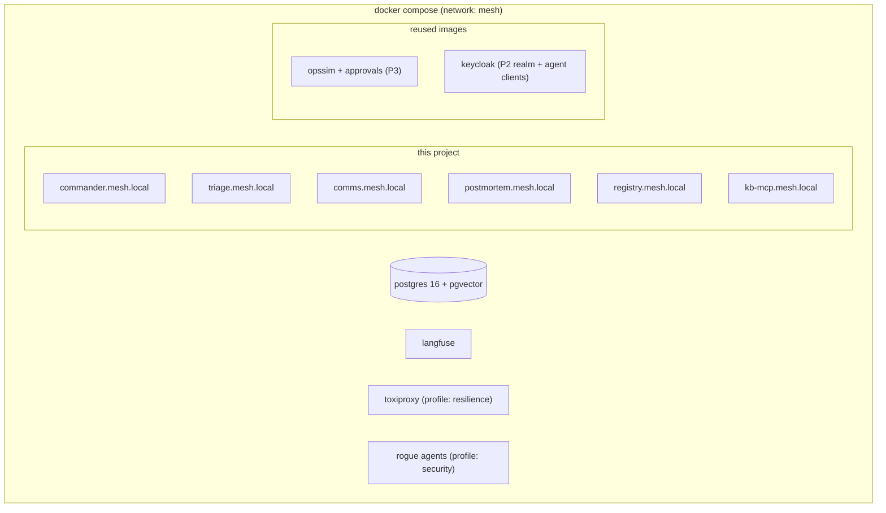
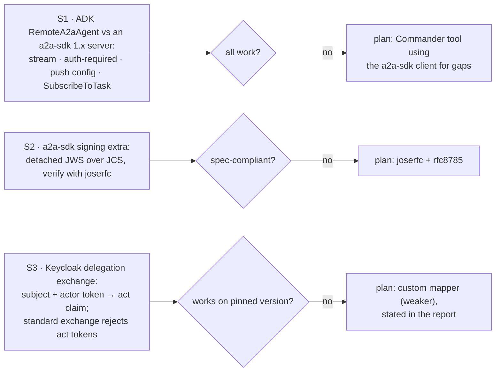

# F0: Foundation & Spikes

| Milestone | Priority | Depends on | Effort | Unblocks |
|---|---|---|---|---|
| M1 | Must | — (Project 3 M1–M2 done) | 3.5 h | Everything |

**Goal:** A uv workspace and Compose stack that runs Project 3's services and Project 2's Keycloak next to
the new agents, each on its own hostname. Three spikes settle the risky assumptions before anything is
built on them.

## Diagram: local stack



## Diagram: spikes (1 hour each, results in `docs/notes/spikes.md`)



## Deliverables / files
```
pyproject.toml (uv workspace)  docker-compose.yml  Makefile (up, down, test, tck, security, resilience)
.env.example   config/models.yaml   config/agents.yaml (hostnames, audiences)
keycloak/realm-mesh.json         # agent clients, token-exchange permissions, delegation feature flags
docs/notes/spikes.md
.github/workflows/ci.yml
```

## Tasks
- [ ] Workspace packages: `commander`, `agents/*`, `registry`, `kb`, `rogue`, `evals`; Project 3 packages installed as dependencies
- [ ] Compose with per-service hostnames (TLS optional locally; HTTPS in the cloud)
- [ ] Keycloak: realm import with one client per agent; delegation + parameterized-scopes features enabled; pinned version
- [ ] Spikes S1–S3 with written outcomes and chosen fallbacks
- [ ] CI: lint, types, unit tests

## Acceptance criteria
- `make up` → all containers healthy; P3's OpsSim and approval service reachable from the agent containers
- Spike notes committed with a decision for each

## Tests
- Smoke test: each hostname answers `/healthz`; Keycloak issues a client-credentials token for each agent

**Interview talking point:** *"I spent the first three hours proving the three riskiest assumptions: ADK's
A2A 1.0 client, spec-compliant card signing and Keycloak's delegation tokens. Each one had a fallback
decided before I built anything on it."*
