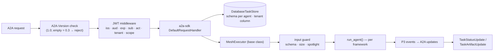

# F1: A2A Executor Base & Signed Cards

| Milestone | Priority | Depends on | Effort | Unblocks |
|---|---|---|---|---|
| M1 | Must | F0 | 5 h | F2, F3, F4, F5 |

**Goal:** One shared base that turns any Project 3-style agent into an A2A 1.0 server. It covers auth
middleware, input guard, event mapping, the Postgres task store, and serving a **signed** Agent Card with
caching headers.

## Diagram: the shared base



## Event mapping (Project 3 normalized events → A2A)

| P3 event | A2A update |
|---|---|
| run start | status `working` |
| `tool_call` (read) | status message "checked metrics for checkout-svc" (throttled) |
| `approval_requested` | status `auth-required` + message (tool, exact args, reason, `approval_id`) |
| `approval_answered` (approved) | status `working` |
| `approval_answered` (denied) | status `working` (agent re-plans) |
| approval expired | status `failed` |
| `ask_reporter` needed | status `input-required` + question |
| `final` | artifact (data part + schema id) → status `completed` |
| `guard_trip` / error | status `failed` with reason |

## Deliverables / files
```
agents/common/executor.py     # MeshExecutor base: run, cancel, resume hooks
agents/common/auth.py         # JWT validation middleware, tenant extraction
agents/common/guard.py        # schema/size checks, spotlighting
agents/common/mapper.py       # P3 events → A2A updates
agents/common/card.py         # build card from config, sign (JCS + JWS), serve with ETag/Cache-Control
contracts/*.schema.json       # TriageRequest/Result, CommsRequest, DraftUpdate, ResearchRequest, SimilarIncidents
```

## Tasks
- [ ] Base executor with cancel support (propagates to the inner agent)
- [ ] Auth middleware; tenant taken from the token only
- [ ] Task store per agent schema; `ListTasks` filtered by tenant
- [ ] Card builder + signer (S2 outcome); JWKS served for the org; `ETag` from card hash
- [ ] Contracts as JSON Schemas; validation helper for inbound data parts and outbound artifacts

## Acceptance criteria
- A toy "echo" agent built on the base passes the TCK's JSON-RPC core tests
- A tampered card fails signature verification in a unit test

## Tests
- hypothesis: JCS canonicalization is stable under key order and whitespace; any field change breaks the signature
- Mapper unit tests for every row of the table

**Interview talking point:** *"All three frameworks share one A2A wrapper. The only framework-specific
code is a `run_agent()` function and an event mapping, so protocol fixes happen in one place."*
